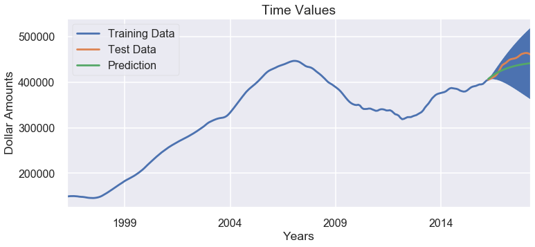

# Mod 4 Project: Time Series

John Lemaster

# Business Case Summary

Project to find the top 5 zip codes to invest in the Chicago housing market.  The metrics using for this project's top investments are (1.) ROI and (2.) risks.  ROI has the highest determining factor.  One of the best methods to manage risks are by avoiding those investments that have the sharpest declines during market crashes and consolidations.  Other investment considerations include:  (1) Those neighborhoods with Chicago’s tier 1 classifications as well as having some of the lowest violent crime percentages.  (2) More established neighborhoods that still have high past growth rates
(3.) A time horizon of at least 10 years to minimize liquids and market risks

You will have these results as part of this technical notebook for you review. In addition, there will be a summary of observations of the data and our recommendations of top 5 zip codes.

# Library Imports


```python
# Imports & Setups

import pandas as pd
import pandas.tseries

import matplotlib.pyplot as plt

import scipy.stats as stats
import statsmodels.api as sm
import statsmodels.formula.api as smf

from sklearn.model_selection import train_test_split
from sklearn.metrics import r2_score

from statsmodels.tsa.arima_model import ARIMA
from statsmodels.graphics.tsaplots import plot_acf
from statsmodels.graphics.tsaplots import plot_pacf
from statsmodels.tsa.stattools import adfuller
import matplotlib.pyplot as plt
import seaborn as sns
sns.set()

```


```python
#!pip install -U fsds_100719
from fsds_100719.imports import *


import warnings
warnings.filterwarnings('ignore')

plt.style.use('seaborn-poster')
```

    fsds_1007219  v0.6.4 loaded.  Read the docs: https://fsds.readthedocs.io/en/latest/ 


<style  type="text/css" >
</style><table id="T_4a98e186_3fb3_11ea_91ed_acde48001122" ><caption>Loaded Packages and Handles</caption><thead>    <tr>        <th class="col_heading level0 col0" >Handle</th>        <th class="col_heading level0 col1" >Package</th>        <th class="col_heading level0 col2" >Description</th>    </tr></thead><tbody>
                <tr>
                                <td id="T_4a98e186_3fb3_11ea_91ed_acde48001122row0_col0" class="data row0 col0" >dp</td>
                        <td id="T_4a98e186_3fb3_11ea_91ed_acde48001122row0_col1" class="data row0 col1" >IPython.display</td>
                        <td id="T_4a98e186_3fb3_11ea_91ed_acde48001122row0_col2" class="data row0 col2" >Display modules with helpful display and clearing commands.</td>
            </tr>
            <tr>
                                <td id="T_4a98e186_3fb3_11ea_91ed_acde48001122row1_col0" class="data row1 col0" >fs</td>
                        <td id="T_4a98e186_3fb3_11ea_91ed_acde48001122row1_col1" class="data row1 col1" >fsds_100719</td>
                        <td id="T_4a98e186_3fb3_11ea_91ed_acde48001122row1_col2" class="data row1 col2" >Custom data science bootcamp student package</td>
            </tr>
            <tr>
                                <td id="T_4a98e186_3fb3_11ea_91ed_acde48001122row2_col0" class="data row2 col0" >mpl</td>
                        <td id="T_4a98e186_3fb3_11ea_91ed_acde48001122row2_col1" class="data row2 col1" >matplotlib</td>
                        <td id="T_4a98e186_3fb3_11ea_91ed_acde48001122row2_col2" class="data row2 col2" >Matplotlib's base OOP module with formatting artists</td>
            </tr>
            <tr>
                                <td id="T_4a98e186_3fb3_11ea_91ed_acde48001122row3_col0" class="data row3 col0" >plt</td>
                        <td id="T_4a98e186_3fb3_11ea_91ed_acde48001122row3_col1" class="data row3 col1" >matplotlib.pyplot</td>
                        <td id="T_4a98e186_3fb3_11ea_91ed_acde48001122row3_col2" class="data row3 col2" >Matplotlib's matlab-like plotting module</td>
            </tr>
            <tr>
                                <td id="T_4a98e186_3fb3_11ea_91ed_acde48001122row4_col0" class="data row4 col0" >np</td>
                        <td id="T_4a98e186_3fb3_11ea_91ed_acde48001122row4_col1" class="data row4 col1" >numpy</td>
                        <td id="T_4a98e186_3fb3_11ea_91ed_acde48001122row4_col2" class="data row4 col2" >scientific computing with Python</td>
            </tr>
            <tr>
                                <td id="T_4a98e186_3fb3_11ea_91ed_acde48001122row5_col0" class="data row5 col0" >pd</td>
                        <td id="T_4a98e186_3fb3_11ea_91ed_acde48001122row5_col1" class="data row5 col1" >pandas</td>
                        <td id="T_4a98e186_3fb3_11ea_91ed_acde48001122row5_col2" class="data row5 col2" >High performance data structures and tools</td>
            </tr>
            <tr>
                                <td id="T_4a98e186_3fb3_11ea_91ed_acde48001122row6_col0" class="data row6 col0" >sns</td>
                        <td id="T_4a98e186_3fb3_11ea_91ed_acde48001122row6_col1" class="data row6 col1" >seaborn</td>
                        <td id="T_4a98e186_3fb3_11ea_91ed_acde48001122row6_col2" class="data row6 col2" >High-level data visualization library based on matplotlib</td>
            </tr>
    </tbody></table>


## Data/File Import


```python
# Import Data

df=pd.read_csv('https://raw.githubusercontent.com/learn-co-students/dsc-mod-4-project-online-ds-ft-100719/master/zillow_data.csv')#'zillow_data.csv')
df.head().style.set_caption("ORIGINAL WIDE FORMAT")
```


<style  type="text/css" >
</style><table id="T_4e279668_3fb3_11ea_940d_acde48001122" ><caption>ORIGINAL WIDE FORMAT</caption><thead>    <tr>        <th class="blank level0" ></th>        <th class="col_heading level0 col0" >RegionID</th>        <th class="col_heading level0 col1" >RegionName</th>        <th class="col_heading level0 col2" >City</th>        <th class="col_heading level0 col3" >State</th>        <th class="col_heading level0 col4" >Metro</th>        <th class="col_heading level0 col5" >CountyName</th>        <th class="col_heading level0 col6" >SizeRank</th>        <th class="col_heading level0 col7" >1996-04</th>        <th class="col_heading level0 col8" >1996-05</th>        <th class="col_heading level0 col9" >1996-06</th>        <th class="col_heading level0 col10" >1996-07</th>        <th class="col_heading level0 col11" >1996-08</th>        <th class="col_heading level0 col12" >1996-09</th>        <th class="col_heading level0 col13" >1996-10</th>        <th class="col_heading level0 col14" >1996-11</th>        <th class="col_heading level0 col15" >1996-12</th>        <th class="col_heading level0 col16" >1997-01</th>        <th class="col_heading level0 col17" >1997-02</th>        <th class="col_heading level0 col18" >1997-03</th>        <th class="col_heading level0 col19" >1997-04</th>        <th class="col_heading level0 col20" >1997-05</th>        <th class="col_heading level0 col21" >1997-06</th>        <th class="col_heading level0 col22" >1997-07</th>        <th class="col_heading level0 col23" >1997-08</th>        <th class="col_heading level0 col24" >1997-09</th>        <th class="col_heading level0 col25" >1997-10</th>        <th class="col_heading level0 col26" >1997-11</th>        <th class="col_heading level0 col27" >1997-12</th>        <th class="col_heading level0 col28" >1998-01</th>        <th class="col_heading level0 col29" >1998-02</th>        <th class="col_heading level0 col30" >1998-03</th>        <th class="col_heading level0 col31" >1998-04</th>        <th class="col_heading level0 col32" >1998-05</th>        <th class="col_heading level0 col33" >1998-06</th>        <th class="col_heading level0 col34" >1998-07</th>        <th class="col_heading level0 col35" >1998-08</th>        <th class="col_heading level0 col36" >1998-09</th>        <th class="col_heading level0 col37" >1998-10</th>        <th class="col_heading level0 col38" >1998-11</th>        <th class="col_heading level0 col39" >1998-12</th>        <th class="col_heading level0 col40" >1999-01</th>        <th class="col_heading level0 col41" >1999-02</th>        <th class="col_heading level0 col42" >1999-03</th>        <th class="col_heading level0 col43" >1999-04</th>        <th class="col_heading level0 col44" >1999-05</th>        <th class="col_heading level0 col45" >1999-06</th>        <th class="col_heading level0 col46" >1999-07</th>        <th class="col_heading level0 col47" >1999-08</th>        <th class="col_heading level0 col48" >1999-09</th>        <th class="col_heading level0 col49" >1999-10</th>        <th class="col_heading level0 col50" >1999-11</th>        <th class="col_heading level0 col51" >1999-12</th>        <th class="col_heading level0 col52" >2000-01</th>        <th class="col_heading level0 col53" >2000-02</th>        <th class="col_heading level0 col54" >2000-03</th>        <th class="col_heading level0 col55" >2000-04</th>        <th class="col_heading level0 col56" >2000-05</th>        <th class="col_heading level0 col57" >2000-06</th>        <th class="col_heading level0 col58" >2000-07</th>        <th class="col_heading level0 col59" >2000-08</th>        <th class="col_heading level0 col60" >2000-09</th>        <th class="col_heading level0 col61" >2000-10</th>        <th class="col_heading level0 col62" >2000-11</th>        <th class="col_heading level0 col63" >2000-12</th>        <th class="col_heading level0 col64" >2001-01</th>        <th class="col_heading level0 col65" >2001-02</th>        <th class="col_heading level0 col66" >2001-03</th>        <th class="col_heading level0 col67" >2001-04</th>        <th class="col_heading level0 col68" >2001-05</th>        <th class="col_heading level0 col69" >2001-06</th>        <th class="col_heading level0 col70" >2001-07</th>        <th class="col_heading level0 col71" >2001-08</th>        <th class="col_heading level0 col72" >2001-09</th>        <th class="col_heading level0 col73" >2001-10</th>        <th class="col_heading level0 col74" >2001-11</th>        <th class="col_heading level0 col75" >2001-12</th>        <th class="col_heading level0 col76" >2002-01</th>        <th class="col_heading level0 col77" >2002-02</th>        <th class="col_heading level0 col78" >2002-03</th>        <th class="col_heading level0 col79" >2002-04</th>        <th class="col_heading level0 col80" >2002-05</th>        <th class="col_heading level0 col81" >2002-06</th>        <th class="col_heading level0 col82" >2002-07</th>        <th class="col_heading level0 col83" >2002-08</th>        <th class="col_heading level0 col84" >2002-09</th>        <th class="col_heading level0 col85" >2002-10</th>        <th class="col_heading level0 col86" >2002-11</th>        <th class="col_heading level0 col87" >2002-12</th>        <th class="col_heading level0 col88" >2003-01</th>        <th class="col_heading level0 col89" >2003-02</th>        <th class="col_heading level0 col90" >2003-03</th>        <th class="col_heading level0 col91" >2003-04</th>        <th class="col_heading level0 col92" >2003-05</th>        <th class="col_heading level0 col93" >2003-06</th>        <th class="col_heading level0 col94" >2003-07</th>        <th class="col_heading level0 col95" >2003-08</th>        <th class="col_heading level0 col96" >2003-09</th>        <th class="col_heading level0 col97" >2003-10</th>        <th class="col_heading level0 col98" >2003-11</th>        <th class="col_heading level0 col99" >2003-12</th>        <th class="col_heading level0 col100" >2004-01</th>        <th class="col_heading level0 col101" >2004-02</th>        <th class="col_heading level0 col102" >2004-03</th>        <th class="col_heading level0 col103" >2004-04</th>        <th class="col_heading level0 col104" >2004-05</th>        <th class="col_heading level0 col105" >2004-06</th>        <th class="col_heading level0 col106" >2004-07</th>        <th class="col_heading level0 col107" >2004-08</th>        <th class="col_heading level0 col108" >2004-09</th>        <th class="col_heading level0 col109" >2004-10</th>        <th class="col_heading level0 col110" >2004-11</th>        <th class="col_heading level0 col111" >2004-12</th>        <th class="col_heading level0 col112" >2005-01</th>        <th class="col_heading level0 col113" >2005-02</th>        <th class="col_heading level0 col114" >2005-03</th>        <th class="col_heading level0 col115" >2005-04</th>        <th class="col_heading level0 col116" >2005-05</th>        <th class="col_heading level0 col117" >2005-06</th>        <th class="col_heading level0 col118" >2005-07</th>        <th class="col_heading level0 col119" >2005-08</th>        <th class="col_heading level0 col120" >2005-09</th>        <th class="col_heading level0 col121" >2005-10</th>        <th class="col_heading level0 col122" >2005-11</th>        <th class="col_heading level0 col123" >2005-12</th>        <th class="col_heading level0 col124" >2006-01</th>        <th class="col_heading level0 col125" >2006-02</th>        <th class="col_heading level0 col126" >2006-03</th>        <th class="col_heading level0 col127" >2006-04</th>        <th class="col_heading level0 col128" >2006-05</th>        <th class="col_heading level0 col129" >2006-06</th>        <th class="col_heading level0 col130" >2006-07</th>        <th class="col_heading level0 col131" >2006-08</th>        <th class="col_heading level0 col132" >2006-09</th>        <th class="col_heading level0 col133" >2006-10</th>        <th class="col_heading level0 col134" >2006-11</th>        <th class="col_heading level0 col135" >2006-12</th>        <th class="col_heading level0 col136" >2007-01</th>        <th class="col_heading level0 col137" >2007-02</th>        <th class="col_heading level0 col138" >2007-03</th>        <th class="col_heading level0 col139" >2007-04</th>        <th class="col_heading level0 col140" >2007-05</th>        <th class="col_heading level0 col141" >2007-06</th>        <th class="col_heading level0 col142" >2007-07</th>        <th class="col_heading level0 col143" >2007-08</th>        <th class="col_heading level0 col144" >2007-09</th>        <th class="col_heading level0 col145" >2007-10</th>        <th class="col_heading level0 col146" >2007-11</th>        <th class="col_heading level0 col147" >2007-12</th>        <th class="col_heading level0 col148" >2008-01</th>        <th class="col_heading level0 col149" >2008-02</th>        <th class="col_heading level0 col150" >2008-03</th>        <th class="col_heading level0 col151" >2008-04</th>        <th class="col_heading level0 col152" >2008-05</th>        <th class="col_heading level0 col153" >2008-06</th>        <th class="col_heading level0 col154" >2008-07</th>        <th class="col_heading level0 col155" >2008-08</th>        <th class="col_heading level0 col156" >2008-09</th>        <th class="col_heading level0 col157" >2008-10</th>        <th class="col_heading level0 col158" >2008-11</th>        <th class="col_heading level0 col159" >2008-12</th>        <th class="col_heading level0 col160" >2009-01</th>        <th class="col_heading level0 col161" >2009-02</th>        <th class="col_heading level0 col162" >2009-03</th>        <th class="col_heading level0 col163" >2009-04</th>        <th class="col_heading level0 col164" >2009-05</th>        <th class="col_heading level0 col165" >2009-06</th>        <th class="col_heading level0 col166" >2009-07</th>        <th class="col_heading level0 col167" >2009-08</th>        <th class="col_heading level0 col168" >2009-09</th>        <th class="col_heading level0 col169" >2009-10</th>        <th class="col_heading level0 col170" >2009-11</th>        <th class="col_heading level0 col171" >2009-12</th>        <th class="col_heading level0 col172" >2010-01</th>        <th class="col_heading level0 col173" >2010-02</th>        <th class="col_heading level0 col174" >2010-03</th>        <th class="col_heading level0 col175" >2010-04</th>        <th class="col_heading level0 col176" >2010-05</th>        <th class="col_heading level0 col177" >2010-06</th>        <th class="col_heading level0 col178" >2010-07</th>        <th class="col_heading level0 col179" >2010-08</th>        <th class="col_heading level0 col180" >2010-09</th>        <th class="col_heading level0 col181" >2010-10</th>        <th class="col_heading level0 col182" >2010-11</th>        <th class="col_heading level0 col183" >2010-12</th>        <th class="col_heading level0 col184" >2011-01</th>        <th class="col_heading level0 col185" >2011-02</th>        <th class="col_heading level0 col186" >2011-03</th>        <th class="col_heading level0 col187" >2011-04</th>        <th class="col_heading level0 col188" >2011-05</th>        <th class="col_heading level0 col189" >2011-06</th>        <th class="col_heading level0 col190" >2011-07</th>        <th class="col_heading level0 col191" >2011-08</th>        <th class="col_heading level0 col192" >2011-09</th>        <th class="col_heading level0 col193" >2011-10</th>        <th class="col_heading level0 col194" >2011-11</th>        <th class="col_heading level0 col195" >2011-12</th>        <th class="col_heading level0 col196" >2012-01</th>        <th class="col_heading level0 col197" >2012-02</th>        <th class="col_heading level0 col198" >2012-03</th>        <th class="col_heading level0 col199" >2012-04</th>        <th class="col_heading level0 col200" >2012-05</th>        <th class="col_heading level0 col201" >2012-06</th>        <th class="col_heading level0 col202" >2012-07</th>        <th class="col_heading level0 col203" >2012-08</th>        <th class="col_heading level0 col204" >2012-09</th>        <th class="col_heading level0 col205" >2012-10</th>        <th class="col_heading level0 col206" >2012-11</th>        <th class="col_heading level0 col207" >2012-12</th>        <th class="col_heading level0 col208" >2013-01</th>        <th class="col_heading level0 col209" >2013-02</th>        <th class="col_heading level0 col210" >2013-03</th>        <th class="col_heading level0 col211" >2013-04</th>        <th class="col_heading level0 col212" >2013-05</th>        <th class="col_heading level0 col213" >2013-06</th>        <th class="col_heading level0 col214" >2013-07</th>        <th class="col_heading level0 col215" >2013-08</th>        <th class="col_heading level0 col216" >2013-09</th>        <th class="col_heading level0 col217" >2013-10</th>        <th class="col_heading level0 col218" >2013-11</th>        <th class="col_heading level0 col219" >2013-12</th>        <th class="col_heading level0 col220" >2014-01</th>        <th class="col_heading level0 col221" >2014-02</th>        <th class="col_heading level0 col222" >2014-03</th>        <th class="col_heading level0 col223" >2014-04</th>        <th class="col_heading level0 col224" >2014-05</th>        <th class="col_heading level0 col225" >2014-06</th>        <th class="col_heading level0 col226" >2014-07</th>        <th class="col_heading level0 col227" >2014-08</th>        <th class="col_heading level0 col228" >2014-09</th>        <th class="col_heading level0 col229" >2014-10</th>        <th class="col_heading level0 col230" >2014-11</th>        <th class="col_heading level0 col231" >2014-12</th>        <th class="col_heading level0 col232" >2015-01</th>        <th class="col_heading level0 col233" >2015-02</th>        <th class="col_heading level0 col234" >2015-03</th>        <th class="col_heading level0 col235" >2015-04</th>        <th class="col_heading level0 col236" >2015-05</th>        <th class="col_heading level0 col237" >2015-06</th>        <th class="col_heading level0 col238" >2015-07</th>        <th class="col_heading level0 col239" >2015-08</th>        <th class="col_heading level0 col240" >2015-09</th>        <th class="col_heading level0 col241" >2015-10</th>        <th class="col_heading level0 col242" >2015-11</th>        <th class="col_heading level0 col243" >2015-12</th>        <th class="col_heading level0 col244" >2016-01</th>        <th class="col_heading level0 col245" >2016-02</th>        <th class="col_heading level0 col246" >2016-03</th>        <th class="col_heading level0 col247" >2016-04</th>        <th class="col_heading level0 col248" >2016-05</th>        <th class="col_heading level0 col249" >2016-06</th>        <th class="col_heading level0 col250" >2016-07</th>        <th class="col_heading level0 col251" >2016-08</th>        <th class="col_heading level0 col252" >2016-09</th>        <th class="col_heading level0 col253" >2016-10</th>        <th class="col_heading level0 col254" >2016-11</th>        <th class="col_heading level0 col255" >2016-12</th>        <th class="col_heading level0 col256" >2017-01</th>        <th class="col_heading level0 col257" >2017-02</th>        <th class="col_heading level0 col258" >2017-03</th>        <th class="col_heading level0 col259" >2017-04</th>        <th class="col_heading level0 col260" >2017-05</th>        <th class="col_heading level0 col261" >2017-06</th>        <th class="col_heading level0 col262" >2017-07</th>        <th class="col_heading level0 col263" >2017-08</th>        <th class="col_heading level0 col264" >2017-09</th>        <th class="col_heading level0 col265" >2017-10</th>        <th class="col_heading level0 col266" >2017-11</th>        <th class="col_heading level0 col267" >2017-12</th>        <th class="col_heading level0 col268" >2018-01</th>        <th class="col_heading level0 col269" >2018-02</th>        <th class="col_heading level0 col270" >2018-03</th>        <th class="col_heading level0 col271" >2018-04</th>    </tr></thead><tbody>
                <tr>
                        <th id="T_4e279668_3fb3_11ea_940d_acde48001122level0_row0" class="row_heading level0 row0" >0</th>
                        <td id="T_4e279668_3fb3_11ea_940d_acde48001122row0_col0" class="data row0 col0" >84654</td>
                        <td id="T_4e279668_3fb3_11ea_940d_acde48001122row0_col1" class="data row0 col1" >60657</td>
                        <td id="T_4e279668_3fb3_11ea_940d_acde48001122row0_col2" class="data row0 col2" >Chicago</td>
                        <td id="T_4e279668_3fb3_11ea_940d_acde48001122row0_col3" class="data row0 col3" >IL</td>
                        <td id="T_4e279668_3fb3_11ea_940d_acde48001122row0_col4" class="data row0 col4" >Chicago</td>
                        <td id="T_4e279668_3fb3_11ea_940d_acde48001122row0_col5" class="data row0 col5" >Cook</td>
                        <td id="T_4e279668_3fb3_11ea_940d_acde48001122row0_col6" class="data row0 col6" >1</td>
                        <td id="T_4e279668_3fb3_11ea_940d_acde48001122row0_col7" class="data row0 col7" >334200</td>
                        <td id="T_4e279668_3fb3_11ea_940d_acde48001122row0_col8" class="data row0 col8" >335400</td>
                        <td id="T_4e279668_3fb3_11ea_940d_acde48001122row0_col9" class="data row0 col9" >336500</td>
                        <td id="T_4e279668_3fb3_11ea_940d_acde48001122row0_col10" class="data row0 col10" >337600</td>
                        <td id="T_4e279668_3fb3_11ea_940d_acde48001122row0_col11" class="data row0 col11" >338500</td>
                        <td id="T_4e279668_3fb3_11ea_940d_acde48001122row0_col12" class="data row0 col12" >339500</td>
                        <td id="T_4e279668_3fb3_11ea_940d_acde48001122row0_col13" class="data row0 col13" >340400</td>
                        <td id="T_4e279668_3fb3_11ea_940d_acde48001122row0_col14" class="data row0 col14" >341300</td>
                        <td id="T_4e279668_3fb3_11ea_940d_acde48001122row0_col15" class="data row0 col15" >342600</td>
                        <td id="T_4e279668_3fb3_11ea_940d_acde48001122row0_col16" class="data row0 col16" >344400</td>
                        <td id="T_4e279668_3fb3_11ea_940d_acde48001122row0_col17" class="data row0 col17" >345700</td>
                        <td id="T_4e279668_3fb3_11ea_940d_acde48001122row0_col18" class="data row0 col18" >346700</td>
                        <td id="T_4e279668_3fb3_11ea_940d_acde48001122row0_col19" class="data row0 col19" >347800</td>
                        <td id="T_4e279668_3fb3_11ea_940d_acde48001122row0_col20" class="data row0 col20" >349000</td>
                        <td id="T_4e279668_3fb3_11ea_940d_acde48001122row0_col21" class="data row0 col21" >350400</td>
                        <td id="T_4e279668_3fb3_11ea_940d_acde48001122row0_col22" class="data row0 col22" >352000</td>
                        <td id="T_4e279668_3fb3_11ea_940d_acde48001122row0_col23" class="data row0 col23" >353900</td>
                        <td id="T_4e279668_3fb3_11ea_940d_acde48001122row0_col24" class="data row0 col24" >356200</td>
                        <td id="T_4e279668_3fb3_11ea_940d_acde48001122row0_col25" class="data row0 col25" >358800</td>
                        <td id="T_4e279668_3fb3_11ea_940d_acde48001122row0_col26" class="data row0 col26" >361800</td>
                        <td id="T_4e279668_3fb3_11ea_940d_acde48001122row0_col27" class="data row0 col27" >365700</td>
                        <td id="T_4e279668_3fb3_11ea_940d_acde48001122row0_col28" class="data row0 col28" >370200</td>
                        <td id="T_4e279668_3fb3_11ea_940d_acde48001122row0_col29" class="data row0 col29" >374700</td>
                        <td id="T_4e279668_3fb3_11ea_940d_acde48001122row0_col30" class="data row0 col30" >378900</td>
                        <td id="T_4e279668_3fb3_11ea_940d_acde48001122row0_col31" class="data row0 col31" >383500</td>
                        <td id="T_4e279668_3fb3_11ea_940d_acde48001122row0_col32" class="data row0 col32" >388300</td>
                        <td id="T_4e279668_3fb3_11ea_940d_acde48001122row0_col33" class="data row0 col33" >393300</td>
                        <td id="T_4e279668_3fb3_11ea_940d_acde48001122row0_col34" class="data row0 col34" >398500</td>
                        <td id="T_4e279668_3fb3_11ea_940d_acde48001122row0_col35" class="data row0 col35" >403800</td>
                        <td id="T_4e279668_3fb3_11ea_940d_acde48001122row0_col36" class="data row0 col36" >409100</td>
                        <td id="T_4e279668_3fb3_11ea_940d_acde48001122row0_col37" class="data row0 col37" >414600</td>
                        <td id="T_4e279668_3fb3_11ea_940d_acde48001122row0_col38" class="data row0 col38" >420100</td>
                        <td id="T_4e279668_3fb3_11ea_940d_acde48001122row0_col39" class="data row0 col39" >426200</td>
                        <td id="T_4e279668_3fb3_11ea_940d_acde48001122row0_col40" class="data row0 col40" >432600</td>
                        <td id="T_4e279668_3fb3_11ea_940d_acde48001122row0_col41" class="data row0 col41" >438600</td>
                        <td id="T_4e279668_3fb3_11ea_940d_acde48001122row0_col42" class="data row0 col42" >444200</td>
                        <td id="T_4e279668_3fb3_11ea_940d_acde48001122row0_col43" class="data row0 col43" >450000</td>
                        <td id="T_4e279668_3fb3_11ea_940d_acde48001122row0_col44" class="data row0 col44" >455900</td>
                        <td id="T_4e279668_3fb3_11ea_940d_acde48001122row0_col45" class="data row0 col45" >462100</td>
                        <td id="T_4e279668_3fb3_11ea_940d_acde48001122row0_col46" class="data row0 col46" >468500</td>
                        <td id="T_4e279668_3fb3_11ea_940d_acde48001122row0_col47" class="data row0 col47" >475300</td>
                        <td id="T_4e279668_3fb3_11ea_940d_acde48001122row0_col48" class="data row0 col48" >482500</td>
                        <td id="T_4e279668_3fb3_11ea_940d_acde48001122row0_col49" class="data row0 col49" >490200</td>
                        <td id="T_4e279668_3fb3_11ea_940d_acde48001122row0_col50" class="data row0 col50" >498200</td>
                        <td id="T_4e279668_3fb3_11ea_940d_acde48001122row0_col51" class="data row0 col51" >507200</td>
                        <td id="T_4e279668_3fb3_11ea_940d_acde48001122row0_col52" class="data row0 col52" >516800</td>
                        <td id="T_4e279668_3fb3_11ea_940d_acde48001122row0_col53" class="data row0 col53" >526300</td>
                        <td id="T_4e279668_3fb3_11ea_940d_acde48001122row0_col54" class="data row0 col54" >535300</td>
                        <td id="T_4e279668_3fb3_11ea_940d_acde48001122row0_col55" class="data row0 col55" >544500</td>
                        <td id="T_4e279668_3fb3_11ea_940d_acde48001122row0_col56" class="data row0 col56" >553500</td>
                        <td id="T_4e279668_3fb3_11ea_940d_acde48001122row0_col57" class="data row0 col57" >562400</td>
                        <td id="T_4e279668_3fb3_11ea_940d_acde48001122row0_col58" class="data row0 col58" >571200</td>
                        <td id="T_4e279668_3fb3_11ea_940d_acde48001122row0_col59" class="data row0 col59" >579800</td>
                        <td id="T_4e279668_3fb3_11ea_940d_acde48001122row0_col60" class="data row0 col60" >588100</td>
                        <td id="T_4e279668_3fb3_11ea_940d_acde48001122row0_col61" class="data row0 col61" >596300</td>
                        <td id="T_4e279668_3fb3_11ea_940d_acde48001122row0_col62" class="data row0 col62" >604200</td>
                        <td id="T_4e279668_3fb3_11ea_940d_acde48001122row0_col63" class="data row0 col63" >612200</td>
                        <td id="T_4e279668_3fb3_11ea_940d_acde48001122row0_col64" class="data row0 col64" >620200</td>
                        <td id="T_4e279668_3fb3_11ea_940d_acde48001122row0_col65" class="data row0 col65" >627700</td>
                        <td id="T_4e279668_3fb3_11ea_940d_acde48001122row0_col66" class="data row0 col66" >634500</td>
                        <td id="T_4e279668_3fb3_11ea_940d_acde48001122row0_col67" class="data row0 col67" >641000</td>
                        <td id="T_4e279668_3fb3_11ea_940d_acde48001122row0_col68" class="data row0 col68" >647000</td>
                        <td id="T_4e279668_3fb3_11ea_940d_acde48001122row0_col69" class="data row0 col69" >652700</td>
                        <td id="T_4e279668_3fb3_11ea_940d_acde48001122row0_col70" class="data row0 col70" >658100</td>
                        <td id="T_4e279668_3fb3_11ea_940d_acde48001122row0_col71" class="data row0 col71" >663300</td>
                        <td id="T_4e279668_3fb3_11ea_940d_acde48001122row0_col72" class="data row0 col72" >668400</td>
                        <td id="T_4e279668_3fb3_11ea_940d_acde48001122row0_col73" class="data row0 col73" >673400</td>
                        <td id="T_4e279668_3fb3_11ea_940d_acde48001122row0_col74" class="data row0 col74" >678300</td>
                        <td id="T_4e279668_3fb3_11ea_940d_acde48001122row0_col75" class="data row0 col75" >683200</td>
                        <td id="T_4e279668_3fb3_11ea_940d_acde48001122row0_col76" class="data row0 col76" >688300</td>
                        <td id="T_4e279668_3fb3_11ea_940d_acde48001122row0_col77" class="data row0 col77" >693300</td>
                        <td id="T_4e279668_3fb3_11ea_940d_acde48001122row0_col78" class="data row0 col78" >698000</td>
                        <td id="T_4e279668_3fb3_11ea_940d_acde48001122row0_col79" class="data row0 col79" >702400</td>
                        <td id="T_4e279668_3fb3_11ea_940d_acde48001122row0_col80" class="data row0 col80" >706400</td>
                        <td id="T_4e279668_3fb3_11ea_940d_acde48001122row0_col81" class="data row0 col81" >710200</td>
                        <td id="T_4e279668_3fb3_11ea_940d_acde48001122row0_col82" class="data row0 col82" >714000</td>
                        <td id="T_4e279668_3fb3_11ea_940d_acde48001122row0_col83" class="data row0 col83" >717800</td>
                        <td id="T_4e279668_3fb3_11ea_940d_acde48001122row0_col84" class="data row0 col84" >721700</td>
                        <td id="T_4e279668_3fb3_11ea_940d_acde48001122row0_col85" class="data row0 col85" >725700</td>
                        <td id="T_4e279668_3fb3_11ea_940d_acde48001122row0_col86" class="data row0 col86" >729900</td>
                        <td id="T_4e279668_3fb3_11ea_940d_acde48001122row0_col87" class="data row0 col87" >733400</td>
                        <td id="T_4e279668_3fb3_11ea_940d_acde48001122row0_col88" class="data row0 col88" >735600</td>
                        <td id="T_4e279668_3fb3_11ea_940d_acde48001122row0_col89" class="data row0 col89" >737200</td>
                        <td id="T_4e279668_3fb3_11ea_940d_acde48001122row0_col90" class="data row0 col90" >739000</td>
                        <td id="T_4e279668_3fb3_11ea_940d_acde48001122row0_col91" class="data row0 col91" >740900</td>
                        <td id="T_4e279668_3fb3_11ea_940d_acde48001122row0_col92" class="data row0 col92" >742700</td>
                        <td id="T_4e279668_3fb3_11ea_940d_acde48001122row0_col93" class="data row0 col93" >744400</td>
                        <td id="T_4e279668_3fb3_11ea_940d_acde48001122row0_col94" class="data row0 col94" >746000</td>
                        <td id="T_4e279668_3fb3_11ea_940d_acde48001122row0_col95" class="data row0 col95" >747200</td>
                        <td id="T_4e279668_3fb3_11ea_940d_acde48001122row0_col96" class="data row0 col96" >748000</td>
                        <td id="T_4e279668_3fb3_11ea_940d_acde48001122row0_col97" class="data row0 col97" >749000</td>
                        <td id="T_4e279668_3fb3_11ea_940d_acde48001122row0_col98" class="data row0 col98" >750200</td>
                        <td id="T_4e279668_3fb3_11ea_940d_acde48001122row0_col99" class="data row0 col99" >752300</td>
                        <td id="T_4e279668_3fb3_11ea_940d_acde48001122row0_col100" class="data row0 col100" >755300</td>
                        <td id="T_4e279668_3fb3_11ea_940d_acde48001122row0_col101" class="data row0 col101" >759200</td>
                        <td id="T_4e279668_3fb3_11ea_940d_acde48001122row0_col102" class="data row0 col102" >764000</td>
                        <td id="T_4e279668_3fb3_11ea_940d_acde48001122row0_col103" class="data row0 col103" >769600</td>
                        <td id="T_4e279668_3fb3_11ea_940d_acde48001122row0_col104" class="data row0 col104" >775600</td>
                        <td id="T_4e279668_3fb3_11ea_940d_acde48001122row0_col105" class="data row0 col105" >781900</td>
                        <td id="T_4e279668_3fb3_11ea_940d_acde48001122row0_col106" class="data row0 col106" >787900</td>
                        <td id="T_4e279668_3fb3_11ea_940d_acde48001122row0_col107" class="data row0 col107" >793200</td>
                        <td id="T_4e279668_3fb3_11ea_940d_acde48001122row0_col108" class="data row0 col108" >798200</td>
                        <td id="T_4e279668_3fb3_11ea_940d_acde48001122row0_col109" class="data row0 col109" >803100</td>
                        <td id="T_4e279668_3fb3_11ea_940d_acde48001122row0_col110" class="data row0 col110" >807900</td>
                        <td id="T_4e279668_3fb3_11ea_940d_acde48001122row0_col111" class="data row0 col111" >812900</td>
                        <td id="T_4e279668_3fb3_11ea_940d_acde48001122row0_col112" class="data row0 col112" >818100</td>
                        <td id="T_4e279668_3fb3_11ea_940d_acde48001122row0_col113" class="data row0 col113" >823100</td>
                        <td id="T_4e279668_3fb3_11ea_940d_acde48001122row0_col114" class="data row0 col114" >828300</td>
                        <td id="T_4e279668_3fb3_11ea_940d_acde48001122row0_col115" class="data row0 col115" >834100</td>
                        <td id="T_4e279668_3fb3_11ea_940d_acde48001122row0_col116" class="data row0 col116" >839800</td>
                        <td id="T_4e279668_3fb3_11ea_940d_acde48001122row0_col117" class="data row0 col117" >845600</td>
                        <td id="T_4e279668_3fb3_11ea_940d_acde48001122row0_col118" class="data row0 col118" >851800</td>
                        <td id="T_4e279668_3fb3_11ea_940d_acde48001122row0_col119" class="data row0 col119" >858000</td>
                        <td id="T_4e279668_3fb3_11ea_940d_acde48001122row0_col120" class="data row0 col120" >864400</td>
                        <td id="T_4e279668_3fb3_11ea_940d_acde48001122row0_col121" class="data row0 col121" >870700</td>
                        <td id="T_4e279668_3fb3_11ea_940d_acde48001122row0_col122" class="data row0 col122" >876200</td>
                        <td id="T_4e279668_3fb3_11ea_940d_acde48001122row0_col123" class="data row0 col123" >880700</td>
                        <td id="T_4e279668_3fb3_11ea_940d_acde48001122row0_col124" class="data row0 col124" >884400</td>
                        <td id="T_4e279668_3fb3_11ea_940d_acde48001122row0_col125" class="data row0 col125" >887600</td>
                        <td id="T_4e279668_3fb3_11ea_940d_acde48001122row0_col126" class="data row0 col126" >890500</td>
                        <td id="T_4e279668_3fb3_11ea_940d_acde48001122row0_col127" class="data row0 col127" >893300</td>
                        <td id="T_4e279668_3fb3_11ea_940d_acde48001122row0_col128" class="data row0 col128" >895500</td>
                        <td id="T_4e279668_3fb3_11ea_940d_acde48001122row0_col129" class="data row0 col129" >897300</td>
                        <td id="T_4e279668_3fb3_11ea_940d_acde48001122row0_col130" class="data row0 col130" >899000</td>
                        <td id="T_4e279668_3fb3_11ea_940d_acde48001122row0_col131" class="data row0 col131" >900400</td>
                        <td id="T_4e279668_3fb3_11ea_940d_acde48001122row0_col132" class="data row0 col132" >902000</td>
                        <td id="T_4e279668_3fb3_11ea_940d_acde48001122row0_col133" class="data row0 col133" >904400</td>
                        <td id="T_4e279668_3fb3_11ea_940d_acde48001122row0_col134" class="data row0 col134" >907100</td>
                        <td id="T_4e279668_3fb3_11ea_940d_acde48001122row0_col135" class="data row0 col135" >909700</td>
                        <td id="T_4e279668_3fb3_11ea_940d_acde48001122row0_col136" class="data row0 col136" >911900</td>
                        <td id="T_4e279668_3fb3_11ea_940d_acde48001122row0_col137" class="data row0 col137" >913000</td>
                        <td id="T_4e279668_3fb3_11ea_940d_acde48001122row0_col138" class="data row0 col138" >913000</td>
                        <td id="T_4e279668_3fb3_11ea_940d_acde48001122row0_col139" class="data row0 col139" >912000</td>
                        <td id="T_4e279668_3fb3_11ea_940d_acde48001122row0_col140" class="data row0 col140" >909300</td>
                        <td id="T_4e279668_3fb3_11ea_940d_acde48001122row0_col141" class="data row0 col141" >905300</td>
                        <td id="T_4e279668_3fb3_11ea_940d_acde48001122row0_col142" class="data row0 col142" >901400</td>
                        <td id="T_4e279668_3fb3_11ea_940d_acde48001122row0_col143" class="data row0 col143" >897900</td>
                        <td id="T_4e279668_3fb3_11ea_940d_acde48001122row0_col144" class="data row0 col144" >895400</td>
                        <td id="T_4e279668_3fb3_11ea_940d_acde48001122row0_col145" class="data row0 col145" >893600</td>
                        <td id="T_4e279668_3fb3_11ea_940d_acde48001122row0_col146" class="data row0 col146" >891100</td>
                        <td id="T_4e279668_3fb3_11ea_940d_acde48001122row0_col147" class="data row0 col147" >887000</td>
                        <td id="T_4e279668_3fb3_11ea_940d_acde48001122row0_col148" class="data row0 col148" >881700</td>
                        <td id="T_4e279668_3fb3_11ea_940d_acde48001122row0_col149" class="data row0 col149" >875900</td>
                        <td id="T_4e279668_3fb3_11ea_940d_acde48001122row0_col150" class="data row0 col150" >870300</td>
                        <td id="T_4e279668_3fb3_11ea_940d_acde48001122row0_col151" class="data row0 col151" >865100</td>
                        <td id="T_4e279668_3fb3_11ea_940d_acde48001122row0_col152" class="data row0 col152" >859000</td>
                        <td id="T_4e279668_3fb3_11ea_940d_acde48001122row0_col153" class="data row0 col153" >851500</td>
                        <td id="T_4e279668_3fb3_11ea_940d_acde48001122row0_col154" class="data row0 col154" >843800</td>
                        <td id="T_4e279668_3fb3_11ea_940d_acde48001122row0_col155" class="data row0 col155" >836400</td>
                        <td id="T_4e279668_3fb3_11ea_940d_acde48001122row0_col156" class="data row0 col156" >830700</td>
                        <td id="T_4e279668_3fb3_11ea_940d_acde48001122row0_col157" class="data row0 col157" >827300</td>
                        <td id="T_4e279668_3fb3_11ea_940d_acde48001122row0_col158" class="data row0 col158" >824800</td>
                        <td id="T_4e279668_3fb3_11ea_940d_acde48001122row0_col159" class="data row0 col159" >821600</td>
                        <td id="T_4e279668_3fb3_11ea_940d_acde48001122row0_col160" class="data row0 col160" >818300</td>
                        <td id="T_4e279668_3fb3_11ea_940d_acde48001122row0_col161" class="data row0 col161" >814600</td>
                        <td id="T_4e279668_3fb3_11ea_940d_acde48001122row0_col162" class="data row0 col162" >809800</td>
                        <td id="T_4e279668_3fb3_11ea_940d_acde48001122row0_col163" class="data row0 col163" >803600</td>
                        <td id="T_4e279668_3fb3_11ea_940d_acde48001122row0_col164" class="data row0 col164" >795500</td>
                        <td id="T_4e279668_3fb3_11ea_940d_acde48001122row0_col165" class="data row0 col165" >786900</td>
                        <td id="T_4e279668_3fb3_11ea_940d_acde48001122row0_col166" class="data row0 col166" >780700</td>
                        <td id="T_4e279668_3fb3_11ea_940d_acde48001122row0_col167" class="data row0 col167" >776900</td>
                        <td id="T_4e279668_3fb3_11ea_940d_acde48001122row0_col168" class="data row0 col168" >774700</td>
                        <td id="T_4e279668_3fb3_11ea_940d_acde48001122row0_col169" class="data row0 col169" >774200</td>
                        <td id="T_4e279668_3fb3_11ea_940d_acde48001122row0_col170" class="data row0 col170" >774400</td>
                        <td id="T_4e279668_3fb3_11ea_940d_acde48001122row0_col171" class="data row0 col171" >774600</td>
                        <td id="T_4e279668_3fb3_11ea_940d_acde48001122row0_col172" class="data row0 col172" >775600</td>
                        <td id="T_4e279668_3fb3_11ea_940d_acde48001122row0_col173" class="data row0 col173" >777800</td>
                        <td id="T_4e279668_3fb3_11ea_940d_acde48001122row0_col174" class="data row0 col174" >775200</td>
                        <td id="T_4e279668_3fb3_11ea_940d_acde48001122row0_col175" class="data row0 col175" >767900</td>
                        <td id="T_4e279668_3fb3_11ea_940d_acde48001122row0_col176" class="data row0 col176" >764700</td>
                        <td id="T_4e279668_3fb3_11ea_940d_acde48001122row0_col177" class="data row0 col177" >766100</td>
                        <td id="T_4e279668_3fb3_11ea_940d_acde48001122row0_col178" class="data row0 col178" >764100</td>
                        <td id="T_4e279668_3fb3_11ea_940d_acde48001122row0_col179" class="data row0 col179" >759700</td>
                        <td id="T_4e279668_3fb3_11ea_940d_acde48001122row0_col180" class="data row0 col180" >754900</td>
                        <td id="T_4e279668_3fb3_11ea_940d_acde48001122row0_col181" class="data row0 col181" >746200</td>
                        <td id="T_4e279668_3fb3_11ea_940d_acde48001122row0_col182" class="data row0 col182" >737300</td>
                        <td id="T_4e279668_3fb3_11ea_940d_acde48001122row0_col183" class="data row0 col183" >730800</td>
                        <td id="T_4e279668_3fb3_11ea_940d_acde48001122row0_col184" class="data row0 col184" >729300</td>
                        <td id="T_4e279668_3fb3_11ea_940d_acde48001122row0_col185" class="data row0 col185" >730200</td>
                        <td id="T_4e279668_3fb3_11ea_940d_acde48001122row0_col186" class="data row0 col186" >730700</td>
                        <td id="T_4e279668_3fb3_11ea_940d_acde48001122row0_col187" class="data row0 col187" >730000</td>
                        <td id="T_4e279668_3fb3_11ea_940d_acde48001122row0_col188" class="data row0 col188" >730100</td>
                        <td id="T_4e279668_3fb3_11ea_940d_acde48001122row0_col189" class="data row0 col189" >730100</td>
                        <td id="T_4e279668_3fb3_11ea_940d_acde48001122row0_col190" class="data row0 col190" >731200</td>
                        <td id="T_4e279668_3fb3_11ea_940d_acde48001122row0_col191" class="data row0 col191" >733900</td>
                        <td id="T_4e279668_3fb3_11ea_940d_acde48001122row0_col192" class="data row0 col192" >735500</td>
                        <td id="T_4e279668_3fb3_11ea_940d_acde48001122row0_col193" class="data row0 col193" >735400</td>
                        <td id="T_4e279668_3fb3_11ea_940d_acde48001122row0_col194" class="data row0 col194" >734400</td>
                        <td id="T_4e279668_3fb3_11ea_940d_acde48001122row0_col195" class="data row0 col195" >737500</td>
                        <td id="T_4e279668_3fb3_11ea_940d_acde48001122row0_col196" class="data row0 col196" >737700</td>
                        <td id="T_4e279668_3fb3_11ea_940d_acde48001122row0_col197" class="data row0 col197" >733700</td>
                        <td id="T_4e279668_3fb3_11ea_940d_acde48001122row0_col198" class="data row0 col198" >734000</td>
                        <td id="T_4e279668_3fb3_11ea_940d_acde48001122row0_col199" class="data row0 col199" >740300</td>
                        <td id="T_4e279668_3fb3_11ea_940d_acde48001122row0_col200" class="data row0 col200" >744600</td>
                        <td id="T_4e279668_3fb3_11ea_940d_acde48001122row0_col201" class="data row0 col201" >750500</td>
                        <td id="T_4e279668_3fb3_11ea_940d_acde48001122row0_col202" class="data row0 col202" >760400</td>
                        <td id="T_4e279668_3fb3_11ea_940d_acde48001122row0_col203" class="data row0 col203" >771800</td>
                        <td id="T_4e279668_3fb3_11ea_940d_acde48001122row0_col204" class="data row0 col204" >780600</td>
                        <td id="T_4e279668_3fb3_11ea_940d_acde48001122row0_col205" class="data row0 col205" >787900</td>
                        <td id="T_4e279668_3fb3_11ea_940d_acde48001122row0_col206" class="data row0 col206" >794100</td>
                        <td id="T_4e279668_3fb3_11ea_940d_acde48001122row0_col207" class="data row0 col207" >798900</td>
                        <td id="T_4e279668_3fb3_11ea_940d_acde48001122row0_col208" class="data row0 col208" >802300</td>
                        <td id="T_4e279668_3fb3_11ea_940d_acde48001122row0_col209" class="data row0 col209" >806100</td>
                        <td id="T_4e279668_3fb3_11ea_940d_acde48001122row0_col210" class="data row0 col210" >810900</td>
                        <td id="T_4e279668_3fb3_11ea_940d_acde48001122row0_col211" class="data row0 col211" >817400</td>
                        <td id="T_4e279668_3fb3_11ea_940d_acde48001122row0_col212" class="data row0 col212" >826800</td>
                        <td id="T_4e279668_3fb3_11ea_940d_acde48001122row0_col213" class="data row0 col213" >837900</td>
                        <td id="T_4e279668_3fb3_11ea_940d_acde48001122row0_col214" class="data row0 col214" >848100</td>
                        <td id="T_4e279668_3fb3_11ea_940d_acde48001122row0_col215" class="data row0 col215" >853800</td>
                        <td id="T_4e279668_3fb3_11ea_940d_acde48001122row0_col216" class="data row0 col216" >856700</td>
                        <td id="T_4e279668_3fb3_11ea_940d_acde48001122row0_col217" class="data row0 col217" >856600</td>
                        <td id="T_4e279668_3fb3_11ea_940d_acde48001122row0_col218" class="data row0 col218" >854400</td>
                        <td id="T_4e279668_3fb3_11ea_940d_acde48001122row0_col219" class="data row0 col219" >853000</td>
                        <td id="T_4e279668_3fb3_11ea_940d_acde48001122row0_col220" class="data row0 col220" >856200</td>
                        <td id="T_4e279668_3fb3_11ea_940d_acde48001122row0_col221" class="data row0 col221" >859700</td>
                        <td id="T_4e279668_3fb3_11ea_940d_acde48001122row0_col222" class="data row0 col222" >863900</td>
                        <td id="T_4e279668_3fb3_11ea_940d_acde48001122row0_col223" class="data row0 col223" >872900</td>
                        <td id="T_4e279668_3fb3_11ea_940d_acde48001122row0_col224" class="data row0 col224" >883300</td>
                        <td id="T_4e279668_3fb3_11ea_940d_acde48001122row0_col225" class="data row0 col225" >889500</td>
                        <td id="T_4e279668_3fb3_11ea_940d_acde48001122row0_col226" class="data row0 col226" >892800</td>
                        <td id="T_4e279668_3fb3_11ea_940d_acde48001122row0_col227" class="data row0 col227" >893600</td>
                        <td id="T_4e279668_3fb3_11ea_940d_acde48001122row0_col228" class="data row0 col228" >891300</td>
                        <td id="T_4e279668_3fb3_11ea_940d_acde48001122row0_col229" class="data row0 col229" >889900</td>
                        <td id="T_4e279668_3fb3_11ea_940d_acde48001122row0_col230" class="data row0 col230" >891500</td>
                        <td id="T_4e279668_3fb3_11ea_940d_acde48001122row0_col231" class="data row0 col231" >893000</td>
                        <td id="T_4e279668_3fb3_11ea_940d_acde48001122row0_col232" class="data row0 col232" >893000</td>
                        <td id="T_4e279668_3fb3_11ea_940d_acde48001122row0_col233" class="data row0 col233" >895000</td>
                        <td id="T_4e279668_3fb3_11ea_940d_acde48001122row0_col234" class="data row0 col234" >901200</td>
                        <td id="T_4e279668_3fb3_11ea_940d_acde48001122row0_col235" class="data row0 col235" >909400</td>
                        <td id="T_4e279668_3fb3_11ea_940d_acde48001122row0_col236" class="data row0 col236" >915000</td>
                        <td id="T_4e279668_3fb3_11ea_940d_acde48001122row0_col237" class="data row0 col237" >916700</td>
                        <td id="T_4e279668_3fb3_11ea_940d_acde48001122row0_col238" class="data row0 col238" >917700</td>
                        <td id="T_4e279668_3fb3_11ea_940d_acde48001122row0_col239" class="data row0 col239" >919800</td>
                        <td id="T_4e279668_3fb3_11ea_940d_acde48001122row0_col240" class="data row0 col240" >925800</td>
                        <td id="T_4e279668_3fb3_11ea_940d_acde48001122row0_col241" class="data row0 col241" >937100</td>
                        <td id="T_4e279668_3fb3_11ea_940d_acde48001122row0_col242" class="data row0 col242" >948200</td>
                        <td id="T_4e279668_3fb3_11ea_940d_acde48001122row0_col243" class="data row0 col243" >951000</td>
                        <td id="T_4e279668_3fb3_11ea_940d_acde48001122row0_col244" class="data row0 col244" >952500</td>
                        <td id="T_4e279668_3fb3_11ea_940d_acde48001122row0_col245" class="data row0 col245" >958600</td>
                        <td id="T_4e279668_3fb3_11ea_940d_acde48001122row0_col246" class="data row0 col246" >966200</td>
                        <td id="T_4e279668_3fb3_11ea_940d_acde48001122row0_col247" class="data row0 col247" >970400</td>
                        <td id="T_4e279668_3fb3_11ea_940d_acde48001122row0_col248" class="data row0 col248" >973900</td>
                        <td id="T_4e279668_3fb3_11ea_940d_acde48001122row0_col249" class="data row0 col249" >974700</td>
                        <td id="T_4e279668_3fb3_11ea_940d_acde48001122row0_col250" class="data row0 col250" >972600</td>
                        <td id="T_4e279668_3fb3_11ea_940d_acde48001122row0_col251" class="data row0 col251" >974300</td>
                        <td id="T_4e279668_3fb3_11ea_940d_acde48001122row0_col252" class="data row0 col252" >980800</td>
                        <td id="T_4e279668_3fb3_11ea_940d_acde48001122row0_col253" class="data row0 col253" >988000</td>
                        <td id="T_4e279668_3fb3_11ea_940d_acde48001122row0_col254" class="data row0 col254" >994700</td>
                        <td id="T_4e279668_3fb3_11ea_940d_acde48001122row0_col255" class="data row0 col255" >998700</td>
                        <td id="T_4e279668_3fb3_11ea_940d_acde48001122row0_col256" class="data row0 col256" >997000</td>
                        <td id="T_4e279668_3fb3_11ea_940d_acde48001122row0_col257" class="data row0 col257" >993700</td>
                        <td id="T_4e279668_3fb3_11ea_940d_acde48001122row0_col258" class="data row0 col258" >991300</td>
                        <td id="T_4e279668_3fb3_11ea_940d_acde48001122row0_col259" class="data row0 col259" >989200</td>
                        <td id="T_4e279668_3fb3_11ea_940d_acde48001122row0_col260" class="data row0 col260" >991300</td>
                        <td id="T_4e279668_3fb3_11ea_940d_acde48001122row0_col261" class="data row0 col261" >999100</td>
                        <td id="T_4e279668_3fb3_11ea_940d_acde48001122row0_col262" class="data row0 col262" >1005500</td>
                        <td id="T_4e279668_3fb3_11ea_940d_acde48001122row0_col263" class="data row0 col263" >1007500</td>
                        <td id="T_4e279668_3fb3_11ea_940d_acde48001122row0_col264" class="data row0 col264" >1007800</td>
                        <td id="T_4e279668_3fb3_11ea_940d_acde48001122row0_col265" class="data row0 col265" >1009600</td>
                        <td id="T_4e279668_3fb3_11ea_940d_acde48001122row0_col266" class="data row0 col266" >1013300</td>
                        <td id="T_4e279668_3fb3_11ea_940d_acde48001122row0_col267" class="data row0 col267" >1018700</td>
                        <td id="T_4e279668_3fb3_11ea_940d_acde48001122row0_col268" class="data row0 col268" >1024400</td>
                        <td id="T_4e279668_3fb3_11ea_940d_acde48001122row0_col269" class="data row0 col269" >1030700</td>
                        <td id="T_4e279668_3fb3_11ea_940d_acde48001122row0_col270" class="data row0 col270" >1033800</td>
                        <td id="T_4e279668_3fb3_11ea_940d_acde48001122row0_col271" class="data row0 col271" >1030600</td>
            </tr>
            <tr>
                        <th id="T_4e279668_3fb3_11ea_940d_acde48001122level0_row1" class="row_heading level0 row1" >1</th>
                        <td id="T_4e279668_3fb3_11ea_940d_acde48001122row1_col0" class="data row1 col0" >90668</td>
                        <td id="T_4e279668_3fb3_11ea_940d_acde48001122row1_col1" class="data row1 col1" >75070</td>
                        <td id="T_4e279668_3fb3_11ea_940d_acde48001122row1_col2" class="data row1 col2" >McKinney</td>
                        <td id="T_4e279668_3fb3_11ea_940d_acde48001122row1_col3" class="data row1 col3" >TX</td>
                        <td id="T_4e279668_3fb3_11ea_940d_acde48001122row1_col4" class="data row1 col4" >Dallas-Fort Worth</td>
                        <td id="T_4e279668_3fb3_11ea_940d_acde48001122row1_col5" class="data row1 col5" >Collin</td>
                        <td id="T_4e279668_3fb3_11ea_940d_acde48001122row1_col6" class="data row1 col6" >2</td>
                        <td id="T_4e279668_3fb3_11ea_940d_acde48001122row1_col7" class="data row1 col7" >235700</td>
                        <td id="T_4e279668_3fb3_11ea_940d_acde48001122row1_col8" class="data row1 col8" >236900</td>
                        <td id="T_4e279668_3fb3_11ea_940d_acde48001122row1_col9" class="data row1 col9" >236700</td>
                        <td id="T_4e279668_3fb3_11ea_940d_acde48001122row1_col10" class="data row1 col10" >235400</td>
                        <td id="T_4e279668_3fb3_11ea_940d_acde48001122row1_col11" class="data row1 col11" >233300</td>
                        <td id="T_4e279668_3fb3_11ea_940d_acde48001122row1_col12" class="data row1 col12" >230600</td>
                        <td id="T_4e279668_3fb3_11ea_940d_acde48001122row1_col13" class="data row1 col13" >227300</td>
                        <td id="T_4e279668_3fb3_11ea_940d_acde48001122row1_col14" class="data row1 col14" >223400</td>
                        <td id="T_4e279668_3fb3_11ea_940d_acde48001122row1_col15" class="data row1 col15" >219600</td>
                        <td id="T_4e279668_3fb3_11ea_940d_acde48001122row1_col16" class="data row1 col16" >215800</td>
                        <td id="T_4e279668_3fb3_11ea_940d_acde48001122row1_col17" class="data row1 col17" >211100</td>
                        <td id="T_4e279668_3fb3_11ea_940d_acde48001122row1_col18" class="data row1 col18" >205700</td>
                        <td id="T_4e279668_3fb3_11ea_940d_acde48001122row1_col19" class="data row1 col19" >200900</td>
                        <td id="T_4e279668_3fb3_11ea_940d_acde48001122row1_col20" class="data row1 col20" >196800</td>
                        <td id="T_4e279668_3fb3_11ea_940d_acde48001122row1_col21" class="data row1 col21" >193600</td>
                        <td id="T_4e279668_3fb3_11ea_940d_acde48001122row1_col22" class="data row1 col22" >191400</td>
                        <td id="T_4e279668_3fb3_11ea_940d_acde48001122row1_col23" class="data row1 col23" >190400</td>
                        <td id="T_4e279668_3fb3_11ea_940d_acde48001122row1_col24" class="data row1 col24" >190800</td>
                        <td id="T_4e279668_3fb3_11ea_940d_acde48001122row1_col25" class="data row1 col25" >192700</td>
                        <td id="T_4e279668_3fb3_11ea_940d_acde48001122row1_col26" class="data row1 col26" >196000</td>
                        <td id="T_4e279668_3fb3_11ea_940d_acde48001122row1_col27" class="data row1 col27" >201300</td>
                        <td id="T_4e279668_3fb3_11ea_940d_acde48001122row1_col28" class="data row1 col28" >207400</td>
                        <td id="T_4e279668_3fb3_11ea_940d_acde48001122row1_col29" class="data row1 col29" >212200</td>
                        <td id="T_4e279668_3fb3_11ea_940d_acde48001122row1_col30" class="data row1 col30" >214600</td>
                        <td id="T_4e279668_3fb3_11ea_940d_acde48001122row1_col31" class="data row1 col31" >215100</td>
                        <td id="T_4e279668_3fb3_11ea_940d_acde48001122row1_col32" class="data row1 col32" >213400</td>
                        <td id="T_4e279668_3fb3_11ea_940d_acde48001122row1_col33" class="data row1 col33" >210200</td>
                        <td id="T_4e279668_3fb3_11ea_940d_acde48001122row1_col34" class="data row1 col34" >206100</td>
                        <td id="T_4e279668_3fb3_11ea_940d_acde48001122row1_col35" class="data row1 col35" >202100</td>
                        <td id="T_4e279668_3fb3_11ea_940d_acde48001122row1_col36" class="data row1 col36" >198800</td>
                        <td id="T_4e279668_3fb3_11ea_940d_acde48001122row1_col37" class="data row1 col37" >196100</td>
                        <td id="T_4e279668_3fb3_11ea_940d_acde48001122row1_col38" class="data row1 col38" >194100</td>
                        <td id="T_4e279668_3fb3_11ea_940d_acde48001122row1_col39" class="data row1 col39" >193400</td>
                        <td id="T_4e279668_3fb3_11ea_940d_acde48001122row1_col40" class="data row1 col40" >193400</td>
                        <td id="T_4e279668_3fb3_11ea_940d_acde48001122row1_col41" class="data row1 col41" >193100</td>
                        <td id="T_4e279668_3fb3_11ea_940d_acde48001122row1_col42" class="data row1 col42" >192700</td>
                        <td id="T_4e279668_3fb3_11ea_940d_acde48001122row1_col43" class="data row1 col43" >193000</td>
                        <td id="T_4e279668_3fb3_11ea_940d_acde48001122row1_col44" class="data row1 col44" >193700</td>
                        <td id="T_4e279668_3fb3_11ea_940d_acde48001122row1_col45" class="data row1 col45" >194800</td>
                        <td id="T_4e279668_3fb3_11ea_940d_acde48001122row1_col46" class="data row1 col46" >196100</td>
                        <td id="T_4e279668_3fb3_11ea_940d_acde48001122row1_col47" class="data row1 col47" >197800</td>
                        <td id="T_4e279668_3fb3_11ea_940d_acde48001122row1_col48" class="data row1 col48" >199700</td>
                        <td id="T_4e279668_3fb3_11ea_940d_acde48001122row1_col49" class="data row1 col49" >201900</td>
                        <td id="T_4e279668_3fb3_11ea_940d_acde48001122row1_col50" class="data row1 col50" >204500</td>
                        <td id="T_4e279668_3fb3_11ea_940d_acde48001122row1_col51" class="data row1 col51" >207800</td>
                        <td id="T_4e279668_3fb3_11ea_940d_acde48001122row1_col52" class="data row1 col52" >211500</td>
                        <td id="T_4e279668_3fb3_11ea_940d_acde48001122row1_col53" class="data row1 col53" >214900</td>
                        <td id="T_4e279668_3fb3_11ea_940d_acde48001122row1_col54" class="data row1 col54" >217800</td>
                        <td id="T_4e279668_3fb3_11ea_940d_acde48001122row1_col55" class="data row1 col55" >221100</td>
                        <td id="T_4e279668_3fb3_11ea_940d_acde48001122row1_col56" class="data row1 col56" >224100</td>
                        <td id="T_4e279668_3fb3_11ea_940d_acde48001122row1_col57" class="data row1 col57" >226700</td>
                        <td id="T_4e279668_3fb3_11ea_940d_acde48001122row1_col58" class="data row1 col58" >228200</td>
                        <td id="T_4e279668_3fb3_11ea_940d_acde48001122row1_col59" class="data row1 col59" >228500</td>
                        <td id="T_4e279668_3fb3_11ea_940d_acde48001122row1_col60" class="data row1 col60" >227200</td>
                        <td id="T_4e279668_3fb3_11ea_940d_acde48001122row1_col61" class="data row1 col61" >224900</td>
                        <td id="T_4e279668_3fb3_11ea_940d_acde48001122row1_col62" class="data row1 col62" >221900</td>
                        <td id="T_4e279668_3fb3_11ea_940d_acde48001122row1_col63" class="data row1 col63" >219100</td>
                        <td id="T_4e279668_3fb3_11ea_940d_acde48001122row1_col64" class="data row1 col64" >216900</td>
                        <td id="T_4e279668_3fb3_11ea_940d_acde48001122row1_col65" class="data row1 col65" >215400</td>
                        <td id="T_4e279668_3fb3_11ea_940d_acde48001122row1_col66" class="data row1 col66" >214500</td>
                        <td id="T_4e279668_3fb3_11ea_940d_acde48001122row1_col67" class="data row1 col67" >214600</td>
                        <td id="T_4e279668_3fb3_11ea_940d_acde48001122row1_col68" class="data row1 col68" >215600</td>
                        <td id="T_4e279668_3fb3_11ea_940d_acde48001122row1_col69" class="data row1 col69" >217000</td>
                        <td id="T_4e279668_3fb3_11ea_940d_acde48001122row1_col70" class="data row1 col70" >218400</td>
                        <td id="T_4e279668_3fb3_11ea_940d_acde48001122row1_col71" class="data row1 col71" >219600</td>
                        <td id="T_4e279668_3fb3_11ea_940d_acde48001122row1_col72" class="data row1 col72" >220000</td>
                        <td id="T_4e279668_3fb3_11ea_940d_acde48001122row1_col73" class="data row1 col73" >219100</td>
                        <td id="T_4e279668_3fb3_11ea_940d_acde48001122row1_col74" class="data row1 col74" >216800</td>
                        <td id="T_4e279668_3fb3_11ea_940d_acde48001122row1_col75" class="data row1 col75" >213100</td>
                        <td id="T_4e279668_3fb3_11ea_940d_acde48001122row1_col76" class="data row1 col76" >208700</td>
                        <td id="T_4e279668_3fb3_11ea_940d_acde48001122row1_col77" class="data row1 col77" >204000</td>
                        <td id="T_4e279668_3fb3_11ea_940d_acde48001122row1_col78" class="data row1 col78" >199600</td>
                        <td id="T_4e279668_3fb3_11ea_940d_acde48001122row1_col79" class="data row1 col79" >195700</td>
                        <td id="T_4e279668_3fb3_11ea_940d_acde48001122row1_col80" class="data row1 col80" >192800</td>
                        <td id="T_4e279668_3fb3_11ea_940d_acde48001122row1_col81" class="data row1 col81" >190800</td>
                        <td id="T_4e279668_3fb3_11ea_940d_acde48001122row1_col82" class="data row1 col82" >189600</td>
                        <td id="T_4e279668_3fb3_11ea_940d_acde48001122row1_col83" class="data row1 col83" >189200</td>
                        <td id="T_4e279668_3fb3_11ea_940d_acde48001122row1_col84" class="data row1 col84" >189200</td>
                        <td id="T_4e279668_3fb3_11ea_940d_acde48001122row1_col85" class="data row1 col85" >189600</td>
                        <td id="T_4e279668_3fb3_11ea_940d_acde48001122row1_col86" class="data row1 col86" >190300</td>
                        <td id="T_4e279668_3fb3_11ea_940d_acde48001122row1_col87" class="data row1 col87" >190800</td>
                        <td id="T_4e279668_3fb3_11ea_940d_acde48001122row1_col88" class="data row1 col88" >191000</td>
                        <td id="T_4e279668_3fb3_11ea_940d_acde48001122row1_col89" class="data row1 col89" >190700</td>
                        <td id="T_4e279668_3fb3_11ea_940d_acde48001122row1_col90" class="data row1 col90" >190300</td>
                        <td id="T_4e279668_3fb3_11ea_940d_acde48001122row1_col91" class="data row1 col91" >189800</td>
                        <td id="T_4e279668_3fb3_11ea_940d_acde48001122row1_col92" class="data row1 col92" >189200</td>
                        <td id="T_4e279668_3fb3_11ea_940d_acde48001122row1_col93" class="data row1 col93" >188600</td>
                        <td id="T_4e279668_3fb3_11ea_940d_acde48001122row1_col94" class="data row1 col94" >188000</td>
                        <td id="T_4e279668_3fb3_11ea_940d_acde48001122row1_col95" class="data row1 col95" >187500</td>
                        <td id="T_4e279668_3fb3_11ea_940d_acde48001122row1_col96" class="data row1 col96" >187200</td>
                        <td id="T_4e279668_3fb3_11ea_940d_acde48001122row1_col97" class="data row1 col97" >187000</td>
                        <td id="T_4e279668_3fb3_11ea_940d_acde48001122row1_col98" class="data row1 col98" >186900</td>
                        <td id="T_4e279668_3fb3_11ea_940d_acde48001122row1_col99" class="data row1 col99" >187100</td>
                        <td id="T_4e279668_3fb3_11ea_940d_acde48001122row1_col100" class="data row1 col100" >187700</td>
                        <td id="T_4e279668_3fb3_11ea_940d_acde48001122row1_col101" class="data row1 col101" >188800</td>
                        <td id="T_4e279668_3fb3_11ea_940d_acde48001122row1_col102" class="data row1 col102" >190300</td>
                        <td id="T_4e279668_3fb3_11ea_940d_acde48001122row1_col103" class="data row1 col103" >191800</td>
                        <td id="T_4e279668_3fb3_11ea_940d_acde48001122row1_col104" class="data row1 col104" >193000</td>
                        <td id="T_4e279668_3fb3_11ea_940d_acde48001122row1_col105" class="data row1 col105" >193900</td>
                        <td id="T_4e279668_3fb3_11ea_940d_acde48001122row1_col106" class="data row1 col106" >194500</td>
                        <td id="T_4e279668_3fb3_11ea_940d_acde48001122row1_col107" class="data row1 col107" >195100</td>
                        <td id="T_4e279668_3fb3_11ea_940d_acde48001122row1_col108" class="data row1 col108" >195700</td>
                        <td id="T_4e279668_3fb3_11ea_940d_acde48001122row1_col109" class="data row1 col109" >196400</td>
                        <td id="T_4e279668_3fb3_11ea_940d_acde48001122row1_col110" class="data row1 col110" >197400</td>
                        <td id="T_4e279668_3fb3_11ea_940d_acde48001122row1_col111" class="data row1 col111" >198500</td>
                        <td id="T_4e279668_3fb3_11ea_940d_acde48001122row1_col112" class="data row1 col112" >199600</td>
                        <td id="T_4e279668_3fb3_11ea_940d_acde48001122row1_col113" class="data row1 col113" >200300</td>
                        <td id="T_4e279668_3fb3_11ea_940d_acde48001122row1_col114" class="data row1 col114" >200800</td>
                        <td id="T_4e279668_3fb3_11ea_940d_acde48001122row1_col115" class="data row1 col115" >201000</td>
                        <td id="T_4e279668_3fb3_11ea_940d_acde48001122row1_col116" class="data row1 col116" >201000</td>
                        <td id="T_4e279668_3fb3_11ea_940d_acde48001122row1_col117" class="data row1 col117" >201000</td>
                        <td id="T_4e279668_3fb3_11ea_940d_acde48001122row1_col118" class="data row1 col118" >200900</td>
                        <td id="T_4e279668_3fb3_11ea_940d_acde48001122row1_col119" class="data row1 col119" >200900</td>
                        <td id="T_4e279668_3fb3_11ea_940d_acde48001122row1_col120" class="data row1 col120" >200900</td>
                        <td id="T_4e279668_3fb3_11ea_940d_acde48001122row1_col121" class="data row1 col121" >201200</td>
                        <td id="T_4e279668_3fb3_11ea_940d_acde48001122row1_col122" class="data row1 col122" >201600</td>
                        <td id="T_4e279668_3fb3_11ea_940d_acde48001122row1_col123" class="data row1 col123" >202200</td>
                        <td id="T_4e279668_3fb3_11ea_940d_acde48001122row1_col124" class="data row1 col124" >202700</td>
                        <td id="T_4e279668_3fb3_11ea_940d_acde48001122row1_col125" class="data row1 col125" >203300</td>
                        <td id="T_4e279668_3fb3_11ea_940d_acde48001122row1_col126" class="data row1 col126" >203900</td>
                        <td id="T_4e279668_3fb3_11ea_940d_acde48001122row1_col127" class="data row1 col127" >204500</td>
                        <td id="T_4e279668_3fb3_11ea_940d_acde48001122row1_col128" class="data row1 col128" >205100</td>
                        <td id="T_4e279668_3fb3_11ea_940d_acde48001122row1_col129" class="data row1 col129" >205800</td>
                        <td id="T_4e279668_3fb3_11ea_940d_acde48001122row1_col130" class="data row1 col130" >206500</td>
                        <td id="T_4e279668_3fb3_11ea_940d_acde48001122row1_col131" class="data row1 col131" >207200</td>
                        <td id="T_4e279668_3fb3_11ea_940d_acde48001122row1_col132" class="data row1 col132" >207800</td>
                        <td id="T_4e279668_3fb3_11ea_940d_acde48001122row1_col133" class="data row1 col133" >208400</td>
                        <td id="T_4e279668_3fb3_11ea_940d_acde48001122row1_col134" class="data row1 col134" >208900</td>
                        <td id="T_4e279668_3fb3_11ea_940d_acde48001122row1_col135" class="data row1 col135" >209400</td>
                        <td id="T_4e279668_3fb3_11ea_940d_acde48001122row1_col136" class="data row1 col136" >209700</td>
                        <td id="T_4e279668_3fb3_11ea_940d_acde48001122row1_col137" class="data row1 col137" >210000</td>
                        <td id="T_4e279668_3fb3_11ea_940d_acde48001122row1_col138" class="data row1 col138" >210400</td>
                        <td id="T_4e279668_3fb3_11ea_940d_acde48001122row1_col139" class="data row1 col139" >211000</td>
                        <td id="T_4e279668_3fb3_11ea_940d_acde48001122row1_col140" class="data row1 col140" >211600</td>
                        <td id="T_4e279668_3fb3_11ea_940d_acde48001122row1_col141" class="data row1 col141" >212400</td>
                        <td id="T_4e279668_3fb3_11ea_940d_acde48001122row1_col142" class="data row1 col142" >213000</td>
                        <td id="T_4e279668_3fb3_11ea_940d_acde48001122row1_col143" class="data row1 col143" >213400</td>
                        <td id="T_4e279668_3fb3_11ea_940d_acde48001122row1_col144" class="data row1 col144" >213600</td>
                        <td id="T_4e279668_3fb3_11ea_940d_acde48001122row1_col145" class="data row1 col145" >213800</td>
                        <td id="T_4e279668_3fb3_11ea_940d_acde48001122row1_col146" class="data row1 col146" >213900</td>
                        <td id="T_4e279668_3fb3_11ea_940d_acde48001122row1_col147" class="data row1 col147" >214100</td>
                        <td id="T_4e279668_3fb3_11ea_940d_acde48001122row1_col148" class="data row1 col148" >213900</td>
                        <td id="T_4e279668_3fb3_11ea_940d_acde48001122row1_col149" class="data row1 col149" >213500</td>
                        <td id="T_4e279668_3fb3_11ea_940d_acde48001122row1_col150" class="data row1 col150" >212600</td>
                        <td id="T_4e279668_3fb3_11ea_940d_acde48001122row1_col151" class="data row1 col151" >211200</td>
                        <td id="T_4e279668_3fb3_11ea_940d_acde48001122row1_col152" class="data row1 col152" >209500</td>
                        <td id="T_4e279668_3fb3_11ea_940d_acde48001122row1_col153" class="data row1 col153" >207900</td>
                        <td id="T_4e279668_3fb3_11ea_940d_acde48001122row1_col154" class="data row1 col154" >206700</td>
                        <td id="T_4e279668_3fb3_11ea_940d_acde48001122row1_col155" class="data row1 col155" >205900</td>
                        <td id="T_4e279668_3fb3_11ea_940d_acde48001122row1_col156" class="data row1 col156" >205300</td>
                        <td id="T_4e279668_3fb3_11ea_940d_acde48001122row1_col157" class="data row1 col157" >204600</td>
                        <td id="T_4e279668_3fb3_11ea_940d_acde48001122row1_col158" class="data row1 col158" >203800</td>
                        <td id="T_4e279668_3fb3_11ea_940d_acde48001122row1_col159" class="data row1 col159" >203200</td>
                        <td id="T_4e279668_3fb3_11ea_940d_acde48001122row1_col160" class="data row1 col160" >202400</td>
                        <td id="T_4e279668_3fb3_11ea_940d_acde48001122row1_col161" class="data row1 col161" >201700</td>
                        <td id="T_4e279668_3fb3_11ea_940d_acde48001122row1_col162" class="data row1 col162" >201200</td>
                        <td id="T_4e279668_3fb3_11ea_940d_acde48001122row1_col163" class="data row1 col163" >200700</td>
                        <td id="T_4e279668_3fb3_11ea_940d_acde48001122row1_col164" class="data row1 col164" >200000</td>
                        <td id="T_4e279668_3fb3_11ea_940d_acde48001122row1_col165" class="data row1 col165" >199700</td>
                        <td id="T_4e279668_3fb3_11ea_940d_acde48001122row1_col166" class="data row1 col166" >199700</td>
                        <td id="T_4e279668_3fb3_11ea_940d_acde48001122row1_col167" class="data row1 col167" >199900</td>
                        <td id="T_4e279668_3fb3_11ea_940d_acde48001122row1_col168" class="data row1 col168" >200100</td>
                        <td id="T_4e279668_3fb3_11ea_940d_acde48001122row1_col169" class="data row1 col169" >200200</td>
                        <td id="T_4e279668_3fb3_11ea_940d_acde48001122row1_col170" class="data row1 col170" >200200</td>
                        <td id="T_4e279668_3fb3_11ea_940d_acde48001122row1_col171" class="data row1 col171" >200100</td>
                        <td id="T_4e279668_3fb3_11ea_940d_acde48001122row1_col172" class="data row1 col172" >201300</td>
                        <td id="T_4e279668_3fb3_11ea_940d_acde48001122row1_col173" class="data row1 col173" >202000</td>
                        <td id="T_4e279668_3fb3_11ea_940d_acde48001122row1_col174" class="data row1 col174" >202100</td>
                        <td id="T_4e279668_3fb3_11ea_940d_acde48001122row1_col175" class="data row1 col175" >202700</td>
                        <td id="T_4e279668_3fb3_11ea_940d_acde48001122row1_col176" class="data row1 col176" >203700</td>
                        <td id="T_4e279668_3fb3_11ea_940d_acde48001122row1_col177" class="data row1 col177" >203300</td>
                        <td id="T_4e279668_3fb3_11ea_940d_acde48001122row1_col178" class="data row1 col178" >203100</td>
                        <td id="T_4e279668_3fb3_11ea_940d_acde48001122row1_col179" class="data row1 col179" >202900</td>
                        <td id="T_4e279668_3fb3_11ea_940d_acde48001122row1_col180" class="data row1 col180" >202400</td>
                        <td id="T_4e279668_3fb3_11ea_940d_acde48001122row1_col181" class="data row1 col181" >202400</td>
                        <td id="T_4e279668_3fb3_11ea_940d_acde48001122row1_col182" class="data row1 col182" >202500</td>
                        <td id="T_4e279668_3fb3_11ea_940d_acde48001122row1_col183" class="data row1 col183" >202500</td>
                        <td id="T_4e279668_3fb3_11ea_940d_acde48001122row1_col184" class="data row1 col184" >202400</td>
                        <td id="T_4e279668_3fb3_11ea_940d_acde48001122row1_col185" class="data row1 col185" >202500</td>
                        <td id="T_4e279668_3fb3_11ea_940d_acde48001122row1_col186" class="data row1 col186" >202100</td>
                        <td id="T_4e279668_3fb3_11ea_940d_acde48001122row1_col187" class="data row1 col187" >201300</td>
                        <td id="T_4e279668_3fb3_11ea_940d_acde48001122row1_col188" class="data row1 col188" >200700</td>
                        <td id="T_4e279668_3fb3_11ea_940d_acde48001122row1_col189" class="data row1 col189" >200500</td>
                        <td id="T_4e279668_3fb3_11ea_940d_acde48001122row1_col190" class="data row1 col190" >200000</td>
                        <td id="T_4e279668_3fb3_11ea_940d_acde48001122row1_col191" class="data row1 col191" >199300</td>
                        <td id="T_4e279668_3fb3_11ea_940d_acde48001122row1_col192" class="data row1 col192" >199100</td>
                        <td id="T_4e279668_3fb3_11ea_940d_acde48001122row1_col193" class="data row1 col193" >199200</td>
                        <td id="T_4e279668_3fb3_11ea_940d_acde48001122row1_col194" class="data row1 col194" >199400</td>
                        <td id="T_4e279668_3fb3_11ea_940d_acde48001122row1_col195" class="data row1 col195" >199500</td>
                        <td id="T_4e279668_3fb3_11ea_940d_acde48001122row1_col196" class="data row1 col196" >199600</td>
                        <td id="T_4e279668_3fb3_11ea_940d_acde48001122row1_col197" class="data row1 col197" >200100</td>
                        <td id="T_4e279668_3fb3_11ea_940d_acde48001122row1_col198" class="data row1 col198" >200700</td>
                        <td id="T_4e279668_3fb3_11ea_940d_acde48001122row1_col199" class="data row1 col199" >201800</td>
                        <td id="T_4e279668_3fb3_11ea_940d_acde48001122row1_col200" class="data row1 col200" >202700</td>
                        <td id="T_4e279668_3fb3_11ea_940d_acde48001122row1_col201" class="data row1 col201" >203000</td>
                        <td id="T_4e279668_3fb3_11ea_940d_acde48001122row1_col202" class="data row1 col202" >203000</td>
                        <td id="T_4e279668_3fb3_11ea_940d_acde48001122row1_col203" class="data row1 col203" >203000</td>
                        <td id="T_4e279668_3fb3_11ea_940d_acde48001122row1_col204" class="data row1 col204" >203100</td>
                        <td id="T_4e279668_3fb3_11ea_940d_acde48001122row1_col205" class="data row1 col205" >203500</td>
                        <td id="T_4e279668_3fb3_11ea_940d_acde48001122row1_col206" class="data row1 col206" >204600</td>
                        <td id="T_4e279668_3fb3_11ea_940d_acde48001122row1_col207" class="data row1 col207" >205600</td>
                        <td id="T_4e279668_3fb3_11ea_940d_acde48001122row1_col208" class="data row1 col208" >205900</td>
                        <td id="T_4e279668_3fb3_11ea_940d_acde48001122row1_col209" class="data row1 col209" >206900</td>
                        <td id="T_4e279668_3fb3_11ea_940d_acde48001122row1_col210" class="data row1 col210" >208500</td>
                        <td id="T_4e279668_3fb3_11ea_940d_acde48001122row1_col211" class="data row1 col211" >209800</td>
                        <td id="T_4e279668_3fb3_11ea_940d_acde48001122row1_col212" class="data row1 col212" >211300</td>
                        <td id="T_4e279668_3fb3_11ea_940d_acde48001122row1_col213" class="data row1 col213" >214000</td>
                        <td id="T_4e279668_3fb3_11ea_940d_acde48001122row1_col214" class="data row1 col214" >217200</td>
                        <td id="T_4e279668_3fb3_11ea_940d_acde48001122row1_col215" class="data row1 col215" >220600</td>
                        <td id="T_4e279668_3fb3_11ea_940d_acde48001122row1_col216" class="data row1 col216" >223800</td>
                        <td id="T_4e279668_3fb3_11ea_940d_acde48001122row1_col217" class="data row1 col217" >226500</td>
                        <td id="T_4e279668_3fb3_11ea_940d_acde48001122row1_col218" class="data row1 col218" >228600</td>
                        <td id="T_4e279668_3fb3_11ea_940d_acde48001122row1_col219" class="data row1 col219" >230400</td>
                        <td id="T_4e279668_3fb3_11ea_940d_acde48001122row1_col220" class="data row1 col220" >231800</td>
                        <td id="T_4e279668_3fb3_11ea_940d_acde48001122row1_col221" class="data row1 col221" >233000</td>
                        <td id="T_4e279668_3fb3_11ea_940d_acde48001122row1_col222" class="data row1 col222" >234200</td>
                        <td id="T_4e279668_3fb3_11ea_940d_acde48001122row1_col223" class="data row1 col223" >235400</td>
                        <td id="T_4e279668_3fb3_11ea_940d_acde48001122row1_col224" class="data row1 col224" >236600</td>
                        <td id="T_4e279668_3fb3_11ea_940d_acde48001122row1_col225" class="data row1 col225" >238500</td>
                        <td id="T_4e279668_3fb3_11ea_940d_acde48001122row1_col226" class="data row1 col226" >240500</td>
                        <td id="T_4e279668_3fb3_11ea_940d_acde48001122row1_col227" class="data row1 col227" >242600</td>
                        <td id="T_4e279668_3fb3_11ea_940d_acde48001122row1_col228" class="data row1 col228" >244700</td>
                        <td id="T_4e279668_3fb3_11ea_940d_acde48001122row1_col229" class="data row1 col229" >246300</td>
                        <td id="T_4e279668_3fb3_11ea_940d_acde48001122row1_col230" class="data row1 col230" >247600</td>
                        <td id="T_4e279668_3fb3_11ea_940d_acde48001122row1_col231" class="data row1 col231" >249600</td>
                        <td id="T_4e279668_3fb3_11ea_940d_acde48001122row1_col232" class="data row1 col232" >251400</td>
                        <td id="T_4e279668_3fb3_11ea_940d_acde48001122row1_col233" class="data row1 col233" >253000</td>
                        <td id="T_4e279668_3fb3_11ea_940d_acde48001122row1_col234" class="data row1 col234" >255200</td>
                        <td id="T_4e279668_3fb3_11ea_940d_acde48001122row1_col235" class="data row1 col235" >258000</td>
                        <td id="T_4e279668_3fb3_11ea_940d_acde48001122row1_col236" class="data row1 col236" >261200</td>
                        <td id="T_4e279668_3fb3_11ea_940d_acde48001122row1_col237" class="data row1 col237" >264700</td>
                        <td id="T_4e279668_3fb3_11ea_940d_acde48001122row1_col238" class="data row1 col238" >268400</td>
                        <td id="T_4e279668_3fb3_11ea_940d_acde48001122row1_col239" class="data row1 col239" >271400</td>
                        <td id="T_4e279668_3fb3_11ea_940d_acde48001122row1_col240" class="data row1 col240" >273600</td>
                        <td id="T_4e279668_3fb3_11ea_940d_acde48001122row1_col241" class="data row1 col241" >275200</td>
                        <td id="T_4e279668_3fb3_11ea_940d_acde48001122row1_col242" class="data row1 col242" >276400</td>
                        <td id="T_4e279668_3fb3_11ea_940d_acde48001122row1_col243" class="data row1 col243" >277000</td>
                        <td id="T_4e279668_3fb3_11ea_940d_acde48001122row1_col244" class="data row1 col244" >277900</td>
                        <td id="T_4e279668_3fb3_11ea_940d_acde48001122row1_col245" class="data row1 col245" >280000</td>
                        <td id="T_4e279668_3fb3_11ea_940d_acde48001122row1_col246" class="data row1 col246" >282600</td>
                        <td id="T_4e279668_3fb3_11ea_940d_acde48001122row1_col247" class="data row1 col247" >285400</td>
                        <td id="T_4e279668_3fb3_11ea_940d_acde48001122row1_col248" class="data row1 col248" >288400</td>
                        <td id="T_4e279668_3fb3_11ea_940d_acde48001122row1_col249" class="data row1 col249" >290800</td>
                        <td id="T_4e279668_3fb3_11ea_940d_acde48001122row1_col250" class="data row1 col250" >292000</td>
                        <td id="T_4e279668_3fb3_11ea_940d_acde48001122row1_col251" class="data row1 col251" >292800</td>
                        <td id="T_4e279668_3fb3_11ea_940d_acde48001122row1_col252" class="data row1 col252" >293700</td>
                        <td id="T_4e279668_3fb3_11ea_940d_acde48001122row1_col253" class="data row1 col253" >295200</td>
                        <td id="T_4e279668_3fb3_11ea_940d_acde48001122row1_col254" class="data row1 col254" >297000</td>
                        <td id="T_4e279668_3fb3_11ea_940d_acde48001122row1_col255" class="data row1 col255" >299000</td>
                        <td id="T_4e279668_3fb3_11ea_940d_acde48001122row1_col256" class="data row1 col256" >300800</td>
                        <td id="T_4e279668_3fb3_11ea_940d_acde48001122row1_col257" class="data row1 col257" >301800</td>
                        <td id="T_4e279668_3fb3_11ea_940d_acde48001122row1_col258" class="data row1 col258" >302800</td>
                        <td id="T_4e279668_3fb3_11ea_940d_acde48001122row1_col259" class="data row1 col259" >304400</td>
                        <td id="T_4e279668_3fb3_11ea_940d_acde48001122row1_col260" class="data row1 col260" >306200</td>
                        <td id="T_4e279668_3fb3_11ea_940d_acde48001122row1_col261" class="data row1 col261" >307000</td>
                        <td id="T_4e279668_3fb3_11ea_940d_acde48001122row1_col262" class="data row1 col262" >308000</td>
                        <td id="T_4e279668_3fb3_11ea_940d_acde48001122row1_col263" class="data row1 col263" >310000</td>
                        <td id="T_4e279668_3fb3_11ea_940d_acde48001122row1_col264" class="data row1 col264" >312500</td>
                        <td id="T_4e279668_3fb3_11ea_940d_acde48001122row1_col265" class="data row1 col265" >314100</td>
                        <td id="T_4e279668_3fb3_11ea_940d_acde48001122row1_col266" class="data row1 col266" >315000</td>
                        <td id="T_4e279668_3fb3_11ea_940d_acde48001122row1_col267" class="data row1 col267" >316600</td>
                        <td id="T_4e279668_3fb3_11ea_940d_acde48001122row1_col268" class="data row1 col268" >318100</td>
                        <td id="T_4e279668_3fb3_11ea_940d_acde48001122row1_col269" class="data row1 col269" >319600</td>
                        <td id="T_4e279668_3fb3_11ea_940d_acde48001122row1_col270" class="data row1 col270" >321100</td>
                        <td id="T_4e279668_3fb3_11ea_940d_acde48001122row1_col271" class="data row1 col271" >321800</td>
            </tr>
            <tr>
                        <th id="T_4e279668_3fb3_11ea_940d_acde48001122level0_row2" class="row_heading level0 row2" >2</th>
                        <td id="T_4e279668_3fb3_11ea_940d_acde48001122row2_col0" class="data row2 col0" >91982</td>
                        <td id="T_4e279668_3fb3_11ea_940d_acde48001122row2_col1" class="data row2 col1" >77494</td>
                        <td id="T_4e279668_3fb3_11ea_940d_acde48001122row2_col2" class="data row2 col2" >Katy</td>
                        <td id="T_4e279668_3fb3_11ea_940d_acde48001122row2_col3" class="data row2 col3" >TX</td>
                        <td id="T_4e279668_3fb3_11ea_940d_acde48001122row2_col4" class="data row2 col4" >Houston</td>
                        <td id="T_4e279668_3fb3_11ea_940d_acde48001122row2_col5" class="data row2 col5" >Harris</td>
                        <td id="T_4e279668_3fb3_11ea_940d_acde48001122row2_col6" class="data row2 col6" >3</td>
                        <td id="T_4e279668_3fb3_11ea_940d_acde48001122row2_col7" class="data row2 col7" >210400</td>
                        <td id="T_4e279668_3fb3_11ea_940d_acde48001122row2_col8" class="data row2 col8" >212200</td>
                        <td id="T_4e279668_3fb3_11ea_940d_acde48001122row2_col9" class="data row2 col9" >212200</td>
                        <td id="T_4e279668_3fb3_11ea_940d_acde48001122row2_col10" class="data row2 col10" >210700</td>
                        <td id="T_4e279668_3fb3_11ea_940d_acde48001122row2_col11" class="data row2 col11" >208300</td>
                        <td id="T_4e279668_3fb3_11ea_940d_acde48001122row2_col12" class="data row2 col12" >205500</td>
                        <td id="T_4e279668_3fb3_11ea_940d_acde48001122row2_col13" class="data row2 col13" >202500</td>
                        <td id="T_4e279668_3fb3_11ea_940d_acde48001122row2_col14" class="data row2 col14" >199800</td>
                        <td id="T_4e279668_3fb3_11ea_940d_acde48001122row2_col15" class="data row2 col15" >198300</td>
                        <td id="T_4e279668_3fb3_11ea_940d_acde48001122row2_col16" class="data row2 col16" >197300</td>
                        <td id="T_4e279668_3fb3_11ea_940d_acde48001122row2_col17" class="data row2 col17" >195400</td>
                        <td id="T_4e279668_3fb3_11ea_940d_acde48001122row2_col18" class="data row2 col18" >193000</td>
                        <td id="T_4e279668_3fb3_11ea_940d_acde48001122row2_col19" class="data row2 col19" >191800</td>
                        <td id="T_4e279668_3fb3_11ea_940d_acde48001122row2_col20" class="data row2 col20" >191800</td>
                        <td id="T_4e279668_3fb3_11ea_940d_acde48001122row2_col21" class="data row2 col21" >193000</td>
                        <td id="T_4e279668_3fb3_11ea_940d_acde48001122row2_col22" class="data row2 col22" >195200</td>
                        <td id="T_4e279668_3fb3_11ea_940d_acde48001122row2_col23" class="data row2 col23" >198400</td>
                        <td id="T_4e279668_3fb3_11ea_940d_acde48001122row2_col24" class="data row2 col24" >202800</td>
                        <td id="T_4e279668_3fb3_11ea_940d_acde48001122row2_col25" class="data row2 col25" >208000</td>
                        <td id="T_4e279668_3fb3_11ea_940d_acde48001122row2_col26" class="data row2 col26" >213800</td>
                        <td id="T_4e279668_3fb3_11ea_940d_acde48001122row2_col27" class="data row2 col27" >220700</td>
                        <td id="T_4e279668_3fb3_11ea_940d_acde48001122row2_col28" class="data row2 col28" >227500</td>
                        <td id="T_4e279668_3fb3_11ea_940d_acde48001122row2_col29" class="data row2 col29" >231800</td>
                        <td id="T_4e279668_3fb3_11ea_940d_acde48001122row2_col30" class="data row2 col30" >233400</td>
                        <td id="T_4e279668_3fb3_11ea_940d_acde48001122row2_col31" class="data row2 col31" >233900</td>
                        <td id="T_4e279668_3fb3_11ea_940d_acde48001122row2_col32" class="data row2 col32" >233500</td>
                        <td id="T_4e279668_3fb3_11ea_940d_acde48001122row2_col33" class="data row2 col33" >233300</td>
                        <td id="T_4e279668_3fb3_11ea_940d_acde48001122row2_col34" class="data row2 col34" >234300</td>
                        <td id="T_4e279668_3fb3_11ea_940d_acde48001122row2_col35" class="data row2 col35" >237400</td>
                        <td id="T_4e279668_3fb3_11ea_940d_acde48001122row2_col36" class="data row2 col36" >242800</td>
                        <td id="T_4e279668_3fb3_11ea_940d_acde48001122row2_col37" class="data row2 col37" >250200</td>
                        <td id="T_4e279668_3fb3_11ea_940d_acde48001122row2_col38" class="data row2 col38" >258600</td>
                        <td id="T_4e279668_3fb3_11ea_940d_acde48001122row2_col39" class="data row2 col39" >268000</td>
                        <td id="T_4e279668_3fb3_11ea_940d_acde48001122row2_col40" class="data row2 col40" >277000</td>
                        <td id="T_4e279668_3fb3_11ea_940d_acde48001122row2_col41" class="data row2 col41" >283600</td>
                        <td id="T_4e279668_3fb3_11ea_940d_acde48001122row2_col42" class="data row2 col42" >288500</td>
                        <td id="T_4e279668_3fb3_11ea_940d_acde48001122row2_col43" class="data row2 col43" >293900</td>
                        <td id="T_4e279668_3fb3_11ea_940d_acde48001122row2_col44" class="data row2 col44" >299200</td>
                        <td id="T_4e279668_3fb3_11ea_940d_acde48001122row2_col45" class="data row2 col45" >304300</td>
                        <td id="T_4e279668_3fb3_11ea_940d_acde48001122row2_col46" class="data row2 col46" >308600</td>
                        <td id="T_4e279668_3fb3_11ea_940d_acde48001122row2_col47" class="data row2 col47" >311400</td>
                        <td id="T_4e279668_3fb3_11ea_940d_acde48001122row2_col48" class="data row2 col48" >312300</td>
                        <td id="T_4e279668_3fb3_11ea_940d_acde48001122row2_col49" class="data row2 col49" >311900</td>
                        <td id="T_4e279668_3fb3_11ea_940d_acde48001122row2_col50" class="data row2 col50" >311100</td>
                        <td id="T_4e279668_3fb3_11ea_940d_acde48001122row2_col51" class="data row2 col51" >311700</td>
                        <td id="T_4e279668_3fb3_11ea_940d_acde48001122row2_col52" class="data row2 col52" >313500</td>
                        <td id="T_4e279668_3fb3_11ea_940d_acde48001122row2_col53" class="data row2 col53" >315000</td>
                        <td id="T_4e279668_3fb3_11ea_940d_acde48001122row2_col54" class="data row2 col54" >316700</td>
                        <td id="T_4e279668_3fb3_11ea_940d_acde48001122row2_col55" class="data row2 col55" >319800</td>
                        <td id="T_4e279668_3fb3_11ea_940d_acde48001122row2_col56" class="data row2 col56" >323700</td>
                        <td id="T_4e279668_3fb3_11ea_940d_acde48001122row2_col57" class="data row2 col57" >327500</td>
                        <td id="T_4e279668_3fb3_11ea_940d_acde48001122row2_col58" class="data row2 col58" >329900</td>
                        <td id="T_4e279668_3fb3_11ea_940d_acde48001122row2_col59" class="data row2 col59" >329800</td>
                        <td id="T_4e279668_3fb3_11ea_940d_acde48001122row2_col60" class="data row2 col60" >326400</td>
                        <td id="T_4e279668_3fb3_11ea_940d_acde48001122row2_col61" class="data row2 col61" >320100</td>
                        <td id="T_4e279668_3fb3_11ea_940d_acde48001122row2_col62" class="data row2 col62" >312200</td>
                        <td id="T_4e279668_3fb3_11ea_940d_acde48001122row2_col63" class="data row2 col63" >304700</td>
                        <td id="T_4e279668_3fb3_11ea_940d_acde48001122row2_col64" class="data row2 col64" >298700</td>
                        <td id="T_4e279668_3fb3_11ea_940d_acde48001122row2_col65" class="data row2 col65" >294300</td>
                        <td id="T_4e279668_3fb3_11ea_940d_acde48001122row2_col66" class="data row2 col66" >291400</td>
                        <td id="T_4e279668_3fb3_11ea_940d_acde48001122row2_col67" class="data row2 col67" >290800</td>
                        <td id="T_4e279668_3fb3_11ea_940d_acde48001122row2_col68" class="data row2 col68" >291600</td>
                        <td id="T_4e279668_3fb3_11ea_940d_acde48001122row2_col69" class="data row2 col69" >293000</td>
                        <td id="T_4e279668_3fb3_11ea_940d_acde48001122row2_col70" class="data row2 col70" >293600</td>
                        <td id="T_4e279668_3fb3_11ea_940d_acde48001122row2_col71" class="data row2 col71" >292900</td>
                        <td id="T_4e279668_3fb3_11ea_940d_acde48001122row2_col72" class="data row2 col72" >290500</td>
                        <td id="T_4e279668_3fb3_11ea_940d_acde48001122row2_col73" class="data row2 col73" >286700</td>
                        <td id="T_4e279668_3fb3_11ea_940d_acde48001122row2_col74" class="data row2 col74" >282200</td>
                        <td id="T_4e279668_3fb3_11ea_940d_acde48001122row2_col75" class="data row2 col75" >276900</td>
                        <td id="T_4e279668_3fb3_11ea_940d_acde48001122row2_col76" class="data row2 col76" >271000</td>
                        <td id="T_4e279668_3fb3_11ea_940d_acde48001122row2_col77" class="data row2 col77" >264200</td>
                        <td id="T_4e279668_3fb3_11ea_940d_acde48001122row2_col78" class="data row2 col78" >257000</td>
                        <td id="T_4e279668_3fb3_11ea_940d_acde48001122row2_col79" class="data row2 col79" >249700</td>
                        <td id="T_4e279668_3fb3_11ea_940d_acde48001122row2_col80" class="data row2 col80" >243100</td>
                        <td id="T_4e279668_3fb3_11ea_940d_acde48001122row2_col81" class="data row2 col81" >237000</td>
                        <td id="T_4e279668_3fb3_11ea_940d_acde48001122row2_col82" class="data row2 col82" >231700</td>
                        <td id="T_4e279668_3fb3_11ea_940d_acde48001122row2_col83" class="data row2 col83" >227100</td>
                        <td id="T_4e279668_3fb3_11ea_940d_acde48001122row2_col84" class="data row2 col84" >223300</td>
                        <td id="T_4e279668_3fb3_11ea_940d_acde48001122row2_col85" class="data row2 col85" >220300</td>
                        <td id="T_4e279668_3fb3_11ea_940d_acde48001122row2_col86" class="data row2 col86" >217300</td>
                        <td id="T_4e279668_3fb3_11ea_940d_acde48001122row2_col87" class="data row2 col87" >214700</td>
                        <td id="T_4e279668_3fb3_11ea_940d_acde48001122row2_col88" class="data row2 col88" >213800</td>
                        <td id="T_4e279668_3fb3_11ea_940d_acde48001122row2_col89" class="data row2 col89" >215100</td>
                        <td id="T_4e279668_3fb3_11ea_940d_acde48001122row2_col90" class="data row2 col90" >217300</td>
                        <td id="T_4e279668_3fb3_11ea_940d_acde48001122row2_col91" class="data row2 col91" >219600</td>
                        <td id="T_4e279668_3fb3_11ea_940d_acde48001122row2_col92" class="data row2 col92" >221400</td>
                        <td id="T_4e279668_3fb3_11ea_940d_acde48001122row2_col93" class="data row2 col93" >222300</td>
                        <td id="T_4e279668_3fb3_11ea_940d_acde48001122row2_col94" class="data row2 col94" >222700</td>
                        <td id="T_4e279668_3fb3_11ea_940d_acde48001122row2_col95" class="data row2 col95" >223000</td>
                        <td id="T_4e279668_3fb3_11ea_940d_acde48001122row2_col96" class="data row2 col96" >223700</td>
                        <td id="T_4e279668_3fb3_11ea_940d_acde48001122row2_col97" class="data row2 col97" >225100</td>
                        <td id="T_4e279668_3fb3_11ea_940d_acde48001122row2_col98" class="data row2 col98" >227200</td>
                        <td id="T_4e279668_3fb3_11ea_940d_acde48001122row2_col99" class="data row2 col99" >229600</td>
                        <td id="T_4e279668_3fb3_11ea_940d_acde48001122row2_col100" class="data row2 col100" >231800</td>
                        <td id="T_4e279668_3fb3_11ea_940d_acde48001122row2_col101" class="data row2 col101" >233100</td>
                        <td id="T_4e279668_3fb3_11ea_940d_acde48001122row2_col102" class="data row2 col102" >233500</td>
                        <td id="T_4e279668_3fb3_11ea_940d_acde48001122row2_col103" class="data row2 col103" >233000</td>
                        <td id="T_4e279668_3fb3_11ea_940d_acde48001122row2_col104" class="data row2 col104" >232100</td>
                        <td id="T_4e279668_3fb3_11ea_940d_acde48001122row2_col105" class="data row2 col105" >231300</td>
                        <td id="T_4e279668_3fb3_11ea_940d_acde48001122row2_col106" class="data row2 col106" >230700</td>
                        <td id="T_4e279668_3fb3_11ea_940d_acde48001122row2_col107" class="data row2 col107" >230800</td>
                        <td id="T_4e279668_3fb3_11ea_940d_acde48001122row2_col108" class="data row2 col108" >231500</td>
                        <td id="T_4e279668_3fb3_11ea_940d_acde48001122row2_col109" class="data row2 col109" >232700</td>
                        <td id="T_4e279668_3fb3_11ea_940d_acde48001122row2_col110" class="data row2 col110" >234000</td>
                        <td id="T_4e279668_3fb3_11ea_940d_acde48001122row2_col111" class="data row2 col111" >235400</td>
                        <td id="T_4e279668_3fb3_11ea_940d_acde48001122row2_col112" class="data row2 col112" >237000</td>
                        <td id="T_4e279668_3fb3_11ea_940d_acde48001122row2_col113" class="data row2 col113" >238800</td>
                        <td id="T_4e279668_3fb3_11ea_940d_acde48001122row2_col114" class="data row2 col114" >240700</td>
                        <td id="T_4e279668_3fb3_11ea_940d_acde48001122row2_col115" class="data row2 col115" >241800</td>
                        <td id="T_4e279668_3fb3_11ea_940d_acde48001122row2_col116" class="data row2 col116" >241700</td>
                        <td id="T_4e279668_3fb3_11ea_940d_acde48001122row2_col117" class="data row2 col117" >240700</td>
                        <td id="T_4e279668_3fb3_11ea_940d_acde48001122row2_col118" class="data row2 col118" >239300</td>
                        <td id="T_4e279668_3fb3_11ea_940d_acde48001122row2_col119" class="data row2 col119" >238000</td>
                        <td id="T_4e279668_3fb3_11ea_940d_acde48001122row2_col120" class="data row2 col120" >236800</td>
                        <td id="T_4e279668_3fb3_11ea_940d_acde48001122row2_col121" class="data row2 col121" >235700</td>
                        <td id="T_4e279668_3fb3_11ea_940d_acde48001122row2_col122" class="data row2 col122" >234700</td>
                        <td id="T_4e279668_3fb3_11ea_940d_acde48001122row2_col123" class="data row2 col123" >233400</td>
                        <td id="T_4e279668_3fb3_11ea_940d_acde48001122row2_col124" class="data row2 col124" >231700</td>
                        <td id="T_4e279668_3fb3_11ea_940d_acde48001122row2_col125" class="data row2 col125" >230200</td>
                        <td id="T_4e279668_3fb3_11ea_940d_acde48001122row2_col126" class="data row2 col126" >229100</td>
                        <td id="T_4e279668_3fb3_11ea_940d_acde48001122row2_col127" class="data row2 col127" >228400</td>
                        <td id="T_4e279668_3fb3_11ea_940d_acde48001122row2_col128" class="data row2 col128" >228700</td>
                        <td id="T_4e279668_3fb3_11ea_940d_acde48001122row2_col129" class="data row2 col129" >229400</td>
                        <td id="T_4e279668_3fb3_11ea_940d_acde48001122row2_col130" class="data row2 col130" >230400</td>
                        <td id="T_4e279668_3fb3_11ea_940d_acde48001122row2_col131" class="data row2 col131" >231600</td>
                        <td id="T_4e279668_3fb3_11ea_940d_acde48001122row2_col132" class="data row2 col132" >233000</td>
                        <td id="T_4e279668_3fb3_11ea_940d_acde48001122row2_col133" class="data row2 col133" >234700</td>
                        <td id="T_4e279668_3fb3_11ea_940d_acde48001122row2_col134" class="data row2 col134" >237100</td>
                        <td id="T_4e279668_3fb3_11ea_940d_acde48001122row2_col135" class="data row2 col135" >240100</td>
                        <td id="T_4e279668_3fb3_11ea_940d_acde48001122row2_col136" class="data row2 col136" >243000</td>
                        <td id="T_4e279668_3fb3_11ea_940d_acde48001122row2_col137" class="data row2 col137" >244800</td>
                        <td id="T_4e279668_3fb3_11ea_940d_acde48001122row2_col138" class="data row2 col138" >245400</td>
                        <td id="T_4e279668_3fb3_11ea_940d_acde48001122row2_col139" class="data row2 col139" >245100</td>
                        <td id="T_4e279668_3fb3_11ea_940d_acde48001122row2_col140" class="data row2 col140" >244900</td>
                        <td id="T_4e279668_3fb3_11ea_940d_acde48001122row2_col141" class="data row2 col141" >245600</td>
                        <td id="T_4e279668_3fb3_11ea_940d_acde48001122row2_col142" class="data row2 col142" >246800</td>
                        <td id="T_4e279668_3fb3_11ea_940d_acde48001122row2_col143" class="data row2 col143" >248600</td>
                        <td id="T_4e279668_3fb3_11ea_940d_acde48001122row2_col144" class="data row2 col144" >250600</td>
                        <td id="T_4e279668_3fb3_11ea_940d_acde48001122row2_col145" class="data row2 col145" >252500</td>
                        <td id="T_4e279668_3fb3_11ea_940d_acde48001122row2_col146" class="data row2 col146" >254000</td>
                        <td id="T_4e279668_3fb3_11ea_940d_acde48001122row2_col147" class="data row2 col147" >254600</td>
                        <td id="T_4e279668_3fb3_11ea_940d_acde48001122row2_col148" class="data row2 col148" >254100</td>
                        <td id="T_4e279668_3fb3_11ea_940d_acde48001122row2_col149" class="data row2 col149" >252700</td>
                        <td id="T_4e279668_3fb3_11ea_940d_acde48001122row2_col150" class="data row2 col150" >251100</td>
                        <td id="T_4e279668_3fb3_11ea_940d_acde48001122row2_col151" class="data row2 col151" >249500</td>
                        <td id="T_4e279668_3fb3_11ea_940d_acde48001122row2_col152" class="data row2 col152" >248300</td>
                        <td id="T_4e279668_3fb3_11ea_940d_acde48001122row2_col153" class="data row2 col153" >247800</td>
                        <td id="T_4e279668_3fb3_11ea_940d_acde48001122row2_col154" class="data row2 col154" >247600</td>
                        <td id="T_4e279668_3fb3_11ea_940d_acde48001122row2_col155" class="data row2 col155" >247800</td>
                        <td id="T_4e279668_3fb3_11ea_940d_acde48001122row2_col156" class="data row2 col156" >247900</td>
                        <td id="T_4e279668_3fb3_11ea_940d_acde48001122row2_col157" class="data row2 col157" >247800</td>
                        <td id="T_4e279668_3fb3_11ea_940d_acde48001122row2_col158" class="data row2 col158" >247600</td>
                        <td id="T_4e279668_3fb3_11ea_940d_acde48001122row2_col159" class="data row2 col159" >247300</td>
                        <td id="T_4e279668_3fb3_11ea_940d_acde48001122row2_col160" class="data row2 col160" >246700</td>
                        <td id="T_4e279668_3fb3_11ea_940d_acde48001122row2_col161" class="data row2 col161" >246100</td>
                        <td id="T_4e279668_3fb3_11ea_940d_acde48001122row2_col162" class="data row2 col162" >245800</td>
                        <td id="T_4e279668_3fb3_11ea_940d_acde48001122row2_col163" class="data row2 col163" >245900</td>
                        <td id="T_4e279668_3fb3_11ea_940d_acde48001122row2_col164" class="data row2 col164" >246200</td>
                        <td id="T_4e279668_3fb3_11ea_940d_acde48001122row2_col165" class="data row2 col165" >246800</td>
                        <td id="T_4e279668_3fb3_11ea_940d_acde48001122row2_col166" class="data row2 col166" >247200</td>
                        <td id="T_4e279668_3fb3_11ea_940d_acde48001122row2_col167" class="data row2 col167" >247600</td>
                        <td id="T_4e279668_3fb3_11ea_940d_acde48001122row2_col168" class="data row2 col168" >247900</td>
                        <td id="T_4e279668_3fb3_11ea_940d_acde48001122row2_col169" class="data row2 col169" >248000</td>
                        <td id="T_4e279668_3fb3_11ea_940d_acde48001122row2_col170" class="data row2 col170" >248000</td>
                        <td id="T_4e279668_3fb3_11ea_940d_acde48001122row2_col171" class="data row2 col171" >249000</td>
                        <td id="T_4e279668_3fb3_11ea_940d_acde48001122row2_col172" class="data row2 col172" >249200</td>
                        <td id="T_4e279668_3fb3_11ea_940d_acde48001122row2_col173" class="data row2 col173" >247800</td>
                        <td id="T_4e279668_3fb3_11ea_940d_acde48001122row2_col174" class="data row2 col174" >248100</td>
                        <td id="T_4e279668_3fb3_11ea_940d_acde48001122row2_col175" class="data row2 col175" >250800</td>
                        <td id="T_4e279668_3fb3_11ea_940d_acde48001122row2_col176" class="data row2 col176" >251700</td>
                        <td id="T_4e279668_3fb3_11ea_940d_acde48001122row2_col177" class="data row2 col177" >251200</td>
                        <td id="T_4e279668_3fb3_11ea_940d_acde48001122row2_col178" class="data row2 col178" >251100</td>
                        <td id="T_4e279668_3fb3_11ea_940d_acde48001122row2_col179" class="data row2 col179" >250500</td>
                        <td id="T_4e279668_3fb3_11ea_940d_acde48001122row2_col180" class="data row2 col180" >250000</td>
                        <td id="T_4e279668_3fb3_11ea_940d_acde48001122row2_col181" class="data row2 col181" >249900</td>
                        <td id="T_4e279668_3fb3_11ea_940d_acde48001122row2_col182" class="data row2 col182" >249700</td>
                        <td id="T_4e279668_3fb3_11ea_940d_acde48001122row2_col183" class="data row2 col183" >247900</td>
                        <td id="T_4e279668_3fb3_11ea_940d_acde48001122row2_col184" class="data row2 col184" >247400</td>
                        <td id="T_4e279668_3fb3_11ea_940d_acde48001122row2_col185" class="data row2 col185" >248800</td>
                        <td id="T_4e279668_3fb3_11ea_940d_acde48001122row2_col186" class="data row2 col186" >249700</td>
                        <td id="T_4e279668_3fb3_11ea_940d_acde48001122row2_col187" class="data row2 col187" >249100</td>
                        <td id="T_4e279668_3fb3_11ea_940d_acde48001122row2_col188" class="data row2 col188" >249200</td>
                        <td id="T_4e279668_3fb3_11ea_940d_acde48001122row2_col189" class="data row2 col189" >249500</td>
                        <td id="T_4e279668_3fb3_11ea_940d_acde48001122row2_col190" class="data row2 col190" >249400</td>
                        <td id="T_4e279668_3fb3_11ea_940d_acde48001122row2_col191" class="data row2 col191" >249400</td>
                        <td id="T_4e279668_3fb3_11ea_940d_acde48001122row2_col192" class="data row2 col192" >248900</td>
                        <td id="T_4e279668_3fb3_11ea_940d_acde48001122row2_col193" class="data row2 col193" >248000</td>
                        <td id="T_4e279668_3fb3_11ea_940d_acde48001122row2_col194" class="data row2 col194" >247100</td>
                        <td id="T_4e279668_3fb3_11ea_940d_acde48001122row2_col195" class="data row2 col195" >246800</td>
                        <td id="T_4e279668_3fb3_11ea_940d_acde48001122row2_col196" class="data row2 col196" >248600</td>
                        <td id="T_4e279668_3fb3_11ea_940d_acde48001122row2_col197" class="data row2 col197" >251600</td>
                        <td id="T_4e279668_3fb3_11ea_940d_acde48001122row2_col198" class="data row2 col198" >252800</td>
                        <td id="T_4e279668_3fb3_11ea_940d_acde48001122row2_col199" class="data row2 col199" >252400</td>
                        <td id="T_4e279668_3fb3_11ea_940d_acde48001122row2_col200" class="data row2 col200" >252600</td>
                        <td id="T_4e279668_3fb3_11ea_940d_acde48001122row2_col201" class="data row2 col201" >252700</td>
                        <td id="T_4e279668_3fb3_11ea_940d_acde48001122row2_col202" class="data row2 col202" >252300</td>
                        <td id="T_4e279668_3fb3_11ea_940d_acde48001122row2_col203" class="data row2 col203" >252500</td>
                        <td id="T_4e279668_3fb3_11ea_940d_acde48001122row2_col204" class="data row2 col204" >253400</td>
                        <td id="T_4e279668_3fb3_11ea_940d_acde48001122row2_col205" class="data row2 col205" >254200</td>
                        <td id="T_4e279668_3fb3_11ea_940d_acde48001122row2_col206" class="data row2 col206" >255200</td>
                        <td id="T_4e279668_3fb3_11ea_940d_acde48001122row2_col207" class="data row2 col207" >256400</td>
                        <td id="T_4e279668_3fb3_11ea_940d_acde48001122row2_col208" class="data row2 col208" >256900</td>
                        <td id="T_4e279668_3fb3_11ea_940d_acde48001122row2_col209" class="data row2 col209" >256800</td>
                        <td id="T_4e279668_3fb3_11ea_940d_acde48001122row2_col210" class="data row2 col210" >256700</td>
                        <td id="T_4e279668_3fb3_11ea_940d_acde48001122row2_col211" class="data row2 col211" >257100</td>
                        <td id="T_4e279668_3fb3_11ea_940d_acde48001122row2_col212" class="data row2 col212" >258300</td>
                        <td id="T_4e279668_3fb3_11ea_940d_acde48001122row2_col213" class="data row2 col213" >260700</td>
                        <td id="T_4e279668_3fb3_11ea_940d_acde48001122row2_col214" class="data row2 col214" >263900</td>
                        <td id="T_4e279668_3fb3_11ea_940d_acde48001122row2_col215" class="data row2 col215" >267000</td>
                        <td id="T_4e279668_3fb3_11ea_940d_acde48001122row2_col216" class="data row2 col216" >269200</td>
                        <td id="T_4e279668_3fb3_11ea_940d_acde48001122row2_col217" class="data row2 col217" >271000</td>
                        <td id="T_4e279668_3fb3_11ea_940d_acde48001122row2_col218" class="data row2 col218" >273100</td>
                        <td id="T_4e279668_3fb3_11ea_940d_acde48001122row2_col219" class="data row2 col219" >275600</td>
                        <td id="T_4e279668_3fb3_11ea_940d_acde48001122row2_col220" class="data row2 col220" >277600</td>
                        <td id="T_4e279668_3fb3_11ea_940d_acde48001122row2_col221" class="data row2 col221" >279800</td>
                        <td id="T_4e279668_3fb3_11ea_940d_acde48001122row2_col222" class="data row2 col222" >282100</td>
                        <td id="T_4e279668_3fb3_11ea_940d_acde48001122row2_col223" class="data row2 col223" >284200</td>
                        <td id="T_4e279668_3fb3_11ea_940d_acde48001122row2_col224" class="data row2 col224" >286000</td>
                        <td id="T_4e279668_3fb3_11ea_940d_acde48001122row2_col225" class="data row2 col225" >288300</td>
                        <td id="T_4e279668_3fb3_11ea_940d_acde48001122row2_col226" class="data row2 col226" >290700</td>
                        <td id="T_4e279668_3fb3_11ea_940d_acde48001122row2_col227" class="data row2 col227" >293300</td>
                        <td id="T_4e279668_3fb3_11ea_940d_acde48001122row2_col228" class="data row2 col228" >295900</td>
                        <td id="T_4e279668_3fb3_11ea_940d_acde48001122row2_col229" class="data row2 col229" >298300</td>
                        <td id="T_4e279668_3fb3_11ea_940d_acde48001122row2_col230" class="data row2 col230" >300200</td>
                        <td id="T_4e279668_3fb3_11ea_940d_acde48001122row2_col231" class="data row2 col231" >301300</td>
                        <td id="T_4e279668_3fb3_11ea_940d_acde48001122row2_col232" class="data row2 col232" >301700</td>
                        <td id="T_4e279668_3fb3_11ea_940d_acde48001122row2_col233" class="data row2 col233" >302400</td>
                        <td id="T_4e279668_3fb3_11ea_940d_acde48001122row2_col234" class="data row2 col234" >303600</td>
                        <td id="T_4e279668_3fb3_11ea_940d_acde48001122row2_col235" class="data row2 col235" >306200</td>
                        <td id="T_4e279668_3fb3_11ea_940d_acde48001122row2_col236" class="data row2 col236" >309100</td>
                        <td id="T_4e279668_3fb3_11ea_940d_acde48001122row2_col237" class="data row2 col237" >311900</td>
                        <td id="T_4e279668_3fb3_11ea_940d_acde48001122row2_col238" class="data row2 col238" >314100</td>
                        <td id="T_4e279668_3fb3_11ea_940d_acde48001122row2_col239" class="data row2 col239" >316300</td>
                        <td id="T_4e279668_3fb3_11ea_940d_acde48001122row2_col240" class="data row2 col240" >319000</td>
                        <td id="T_4e279668_3fb3_11ea_940d_acde48001122row2_col241" class="data row2 col241" >322000</td>
                        <td id="T_4e279668_3fb3_11ea_940d_acde48001122row2_col242" class="data row2 col242" >324300</td>
                        <td id="T_4e279668_3fb3_11ea_940d_acde48001122row2_col243" class="data row2 col243" >326100</td>
                        <td id="T_4e279668_3fb3_11ea_940d_acde48001122row2_col244" class="data row2 col244" >327300</td>
                        <td id="T_4e279668_3fb3_11ea_940d_acde48001122row2_col245" class="data row2 col245" >327000</td>
                        <td id="T_4e279668_3fb3_11ea_940d_acde48001122row2_col246" class="data row2 col246" >327200</td>
                        <td id="T_4e279668_3fb3_11ea_940d_acde48001122row2_col247" class="data row2 col247" >328500</td>
                        <td id="T_4e279668_3fb3_11ea_940d_acde48001122row2_col248" class="data row2 col248" >329800</td>
                        <td id="T_4e279668_3fb3_11ea_940d_acde48001122row2_col249" class="data row2 col249" >330000</td>
                        <td id="T_4e279668_3fb3_11ea_940d_acde48001122row2_col250" class="data row2 col250" >329000</td>
                        <td id="T_4e279668_3fb3_11ea_940d_acde48001122row2_col251" class="data row2 col251" >327800</td>
                        <td id="T_4e279668_3fb3_11ea_940d_acde48001122row2_col252" class="data row2 col252" >326700</td>
                        <td id="T_4e279668_3fb3_11ea_940d_acde48001122row2_col253" class="data row2 col253" >325500</td>
                        <td id="T_4e279668_3fb3_11ea_940d_acde48001122row2_col254" class="data row2 col254" >324700</td>
                        <td id="T_4e279668_3fb3_11ea_940d_acde48001122row2_col255" class="data row2 col255" >324500</td>
                        <td id="T_4e279668_3fb3_11ea_940d_acde48001122row2_col256" class="data row2 col256" >323700</td>
                        <td id="T_4e279668_3fb3_11ea_940d_acde48001122row2_col257" class="data row2 col257" >322300</td>
                        <td id="T_4e279668_3fb3_11ea_940d_acde48001122row2_col258" class="data row2 col258" >320700</td>
                        <td id="T_4e279668_3fb3_11ea_940d_acde48001122row2_col259" class="data row2 col259" >320000</td>
                        <td id="T_4e279668_3fb3_11ea_940d_acde48001122row2_col260" class="data row2 col260" >320000</td>
                        <td id="T_4e279668_3fb3_11ea_940d_acde48001122row2_col261" class="data row2 col261" >320900</td>
                        <td id="T_4e279668_3fb3_11ea_940d_acde48001122row2_col262" class="data row2 col262" >321000</td>
                        <td id="T_4e279668_3fb3_11ea_940d_acde48001122row2_col263" class="data row2 col263" >320600</td>
                        <td id="T_4e279668_3fb3_11ea_940d_acde48001122row2_col264" class="data row2 col264" >320200</td>
                        <td id="T_4e279668_3fb3_11ea_940d_acde48001122row2_col265" class="data row2 col265" >320400</td>
                        <td id="T_4e279668_3fb3_11ea_940d_acde48001122row2_col266" class="data row2 col266" >320800</td>
                        <td id="T_4e279668_3fb3_11ea_940d_acde48001122row2_col267" class="data row2 col267" >321200</td>
                        <td id="T_4e279668_3fb3_11ea_940d_acde48001122row2_col268" class="data row2 col268" >321200</td>
                        <td id="T_4e279668_3fb3_11ea_940d_acde48001122row2_col269" class="data row2 col269" >323000</td>
                        <td id="T_4e279668_3fb3_11ea_940d_acde48001122row2_col270" class="data row2 col270" >326900</td>
                        <td id="T_4e279668_3fb3_11ea_940d_acde48001122row2_col271" class="data row2 col271" >329900</td>
            </tr>
            <tr>
                        <th id="T_4e279668_3fb3_11ea_940d_acde48001122level0_row3" class="row_heading level0 row3" >3</th>
                        <td id="T_4e279668_3fb3_11ea_940d_acde48001122row3_col0" class="data row3 col0" >84616</td>
                        <td id="T_4e279668_3fb3_11ea_940d_acde48001122row3_col1" class="data row3 col1" >60614</td>
                        <td id="T_4e279668_3fb3_11ea_940d_acde48001122row3_col2" class="data row3 col2" >Chicago</td>
                        <td id="T_4e279668_3fb3_11ea_940d_acde48001122row3_col3" class="data row3 col3" >IL</td>
                        <td id="T_4e279668_3fb3_11ea_940d_acde48001122row3_col4" class="data row3 col4" >Chicago</td>
                        <td id="T_4e279668_3fb3_11ea_940d_acde48001122row3_col5" class="data row3 col5" >Cook</td>
                        <td id="T_4e279668_3fb3_11ea_940d_acde48001122row3_col6" class="data row3 col6" >4</td>
                        <td id="T_4e279668_3fb3_11ea_940d_acde48001122row3_col7" class="data row3 col7" >498100</td>
                        <td id="T_4e279668_3fb3_11ea_940d_acde48001122row3_col8" class="data row3 col8" >500900</td>
                        <td id="T_4e279668_3fb3_11ea_940d_acde48001122row3_col9" class="data row3 col9" >503100</td>
                        <td id="T_4e279668_3fb3_11ea_940d_acde48001122row3_col10" class="data row3 col10" >504600</td>
                        <td id="T_4e279668_3fb3_11ea_940d_acde48001122row3_col11" class="data row3 col11" >505500</td>
                        <td id="T_4e279668_3fb3_11ea_940d_acde48001122row3_col12" class="data row3 col12" >505700</td>
                        <td id="T_4e279668_3fb3_11ea_940d_acde48001122row3_col13" class="data row3 col13" >505300</td>
                        <td id="T_4e279668_3fb3_11ea_940d_acde48001122row3_col14" class="data row3 col14" >504200</td>
                        <td id="T_4e279668_3fb3_11ea_940d_acde48001122row3_col15" class="data row3 col15" >503600</td>
                        <td id="T_4e279668_3fb3_11ea_940d_acde48001122row3_col16" class="data row3 col16" >503400</td>
                        <td id="T_4e279668_3fb3_11ea_940d_acde48001122row3_col17" class="data row3 col17" >502200</td>
                        <td id="T_4e279668_3fb3_11ea_940d_acde48001122row3_col18" class="data row3 col18" >500000</td>
                        <td id="T_4e279668_3fb3_11ea_940d_acde48001122row3_col19" class="data row3 col19" >497900</td>
                        <td id="T_4e279668_3fb3_11ea_940d_acde48001122row3_col20" class="data row3 col20" >496300</td>
                        <td id="T_4e279668_3fb3_11ea_940d_acde48001122row3_col21" class="data row3 col21" >495200</td>
                        <td id="T_4e279668_3fb3_11ea_940d_acde48001122row3_col22" class="data row3 col22" >494700</td>
                        <td id="T_4e279668_3fb3_11ea_940d_acde48001122row3_col23" class="data row3 col23" >494900</td>
                        <td id="T_4e279668_3fb3_11ea_940d_acde48001122row3_col24" class="data row3 col24" >496200</td>
                        <td id="T_4e279668_3fb3_11ea_940d_acde48001122row3_col25" class="data row3 col25" >498600</td>
                        <td id="T_4e279668_3fb3_11ea_940d_acde48001122row3_col26" class="data row3 col26" >502000</td>
                        <td id="T_4e279668_3fb3_11ea_940d_acde48001122row3_col27" class="data row3 col27" >507600</td>
                        <td id="T_4e279668_3fb3_11ea_940d_acde48001122row3_col28" class="data row3 col28" >514900</td>
                        <td id="T_4e279668_3fb3_11ea_940d_acde48001122row3_col29" class="data row3 col29" >522200</td>
                        <td id="T_4e279668_3fb3_11ea_940d_acde48001122row3_col30" class="data row3 col30" >529500</td>
                        <td id="T_4e279668_3fb3_11ea_940d_acde48001122row3_col31" class="data row3 col31" >537900</td>
                        <td id="T_4e279668_3fb3_11ea_940d_acde48001122row3_col32" class="data row3 col32" >546900</td>
                        <td id="T_4e279668_3fb3_11ea_940d_acde48001122row3_col33" class="data row3 col33" >556400</td>
                        <td id="T_4e279668_3fb3_11ea_940d_acde48001122row3_col34" class="data row3 col34" >566100</td>
                        <td id="T_4e279668_3fb3_11ea_940d_acde48001122row3_col35" class="data row3 col35" >575600</td>
                        <td id="T_4e279668_3fb3_11ea_940d_acde48001122row3_col36" class="data row3 col36" >584800</td>
                        <td id="T_4e279668_3fb3_11ea_940d_acde48001122row3_col37" class="data row3 col37" >593500</td>
                        <td id="T_4e279668_3fb3_11ea_940d_acde48001122row3_col38" class="data row3 col38" >601600</td>
                        <td id="T_4e279668_3fb3_11ea_940d_acde48001122row3_col39" class="data row3 col39" >610100</td>
                        <td id="T_4e279668_3fb3_11ea_940d_acde48001122row3_col40" class="data row3 col40" >618600</td>
                        <td id="T_4e279668_3fb3_11ea_940d_acde48001122row3_col41" class="data row3 col41" >625600</td>
                        <td id="T_4e279668_3fb3_11ea_940d_acde48001122row3_col42" class="data row3 col42" >631100</td>
                        <td id="T_4e279668_3fb3_11ea_940d_acde48001122row3_col43" class="data row3 col43" >636600</td>
                        <td id="T_4e279668_3fb3_11ea_940d_acde48001122row3_col44" class="data row3 col44" >642100</td>
                        <td id="T_4e279668_3fb3_11ea_940d_acde48001122row3_col45" class="data row3 col45" >647600</td>
                        <td id="T_4e279668_3fb3_11ea_940d_acde48001122row3_col46" class="data row3 col46" >653300</td>
                        <td id="T_4e279668_3fb3_11ea_940d_acde48001122row3_col47" class="data row3 col47" >659300</td>
                        <td id="T_4e279668_3fb3_11ea_940d_acde48001122row3_col48" class="data row3 col48" >665800</td>
                        <td id="T_4e279668_3fb3_11ea_940d_acde48001122row3_col49" class="data row3 col49" >672900</td>
                        <td id="T_4e279668_3fb3_11ea_940d_acde48001122row3_col50" class="data row3 col50" >680500</td>
                        <td id="T_4e279668_3fb3_11ea_940d_acde48001122row3_col51" class="data row3 col51" >689600</td>
                        <td id="T_4e279668_3fb3_11ea_940d_acde48001122row3_col52" class="data row3 col52" >699700</td>
                        <td id="T_4e279668_3fb3_11ea_940d_acde48001122row3_col53" class="data row3 col53" >709300</td>
                        <td id="T_4e279668_3fb3_11ea_940d_acde48001122row3_col54" class="data row3 col54" >718300</td>
                        <td id="T_4e279668_3fb3_11ea_940d_acde48001122row3_col55" class="data row3 col55" >727600</td>
                        <td id="T_4e279668_3fb3_11ea_940d_acde48001122row3_col56" class="data row3 col56" >737100</td>
                        <td id="T_4e279668_3fb3_11ea_940d_acde48001122row3_col57" class="data row3 col57" >746600</td>
                        <td id="T_4e279668_3fb3_11ea_940d_acde48001122row3_col58" class="data row3 col58" >756200</td>
                        <td id="T_4e279668_3fb3_11ea_940d_acde48001122row3_col59" class="data row3 col59" >765800</td>
                        <td id="T_4e279668_3fb3_11ea_940d_acde48001122row3_col60" class="data row3 col60" >775100</td>
                        <td id="T_4e279668_3fb3_11ea_940d_acde48001122row3_col61" class="data row3 col61" >784400</td>
                        <td id="T_4e279668_3fb3_11ea_940d_acde48001122row3_col62" class="data row3 col62" >793500</td>
                        <td id="T_4e279668_3fb3_11ea_940d_acde48001122row3_col63" class="data row3 col63" >803000</td>
                        <td id="T_4e279668_3fb3_11ea_940d_acde48001122row3_col64" class="data row3 col64" >812500</td>
                        <td id="T_4e279668_3fb3_11ea_940d_acde48001122row3_col65" class="data row3 col65" >821200</td>
                        <td id="T_4e279668_3fb3_11ea_940d_acde48001122row3_col66" class="data row3 col66" >829200</td>
                        <td id="T_4e279668_3fb3_11ea_940d_acde48001122row3_col67" class="data row3 col67" >837000</td>
                        <td id="T_4e279668_3fb3_11ea_940d_acde48001122row3_col68" class="data row3 col68" >844400</td>
                        <td id="T_4e279668_3fb3_11ea_940d_acde48001122row3_col69" class="data row3 col69" >851600</td>
                        <td id="T_4e279668_3fb3_11ea_940d_acde48001122row3_col70" class="data row3 col70" >858600</td>
                        <td id="T_4e279668_3fb3_11ea_940d_acde48001122row3_col71" class="data row3 col71" >865300</td>
                        <td id="T_4e279668_3fb3_11ea_940d_acde48001122row3_col72" class="data row3 col72" >871800</td>
                        <td id="T_4e279668_3fb3_11ea_940d_acde48001122row3_col73" class="data row3 col73" >878200</td>
                        <td id="T_4e279668_3fb3_11ea_940d_acde48001122row3_col74" class="data row3 col74" >884700</td>
                        <td id="T_4e279668_3fb3_11ea_940d_acde48001122row3_col75" class="data row3 col75" >891300</td>
                        <td id="T_4e279668_3fb3_11ea_940d_acde48001122row3_col76" class="data row3 col76" >898000</td>
                        <td id="T_4e279668_3fb3_11ea_940d_acde48001122row3_col77" class="data row3 col77" >904700</td>
                        <td id="T_4e279668_3fb3_11ea_940d_acde48001122row3_col78" class="data row3 col78" >911200</td>
                        <td id="T_4e279668_3fb3_11ea_940d_acde48001122row3_col79" class="data row3 col79" >917600</td>
                        <td id="T_4e279668_3fb3_11ea_940d_acde48001122row3_col80" class="data row3 col80" >923800</td>
                        <td id="T_4e279668_3fb3_11ea_940d_acde48001122row3_col81" class="data row3 col81" >929800</td>
                        <td id="T_4e279668_3fb3_11ea_940d_acde48001122row3_col82" class="data row3 col82" >935700</td>
                        <td id="T_4e279668_3fb3_11ea_940d_acde48001122row3_col83" class="data row3 col83" >941400</td>
                        <td id="T_4e279668_3fb3_11ea_940d_acde48001122row3_col84" class="data row3 col84" >947100</td>
                        <td id="T_4e279668_3fb3_11ea_940d_acde48001122row3_col85" class="data row3 col85" >952800</td>
                        <td id="T_4e279668_3fb3_11ea_940d_acde48001122row3_col86" class="data row3 col86" >958900</td>
                        <td id="T_4e279668_3fb3_11ea_940d_acde48001122row3_col87" class="data row3 col87" >965100</td>
                        <td id="T_4e279668_3fb3_11ea_940d_acde48001122row3_col88" class="data row3 col88" >971000</td>
                        <td id="T_4e279668_3fb3_11ea_940d_acde48001122row3_col89" class="data row3 col89" >976400</td>
                        <td id="T_4e279668_3fb3_11ea_940d_acde48001122row3_col90" class="data row3 col90" >981400</td>
                        <td id="T_4e279668_3fb3_11ea_940d_acde48001122row3_col91" class="data row3 col91" >985700</td>
                        <td id="T_4e279668_3fb3_11ea_940d_acde48001122row3_col92" class="data row3 col92" >989400</td>
                        <td id="T_4e279668_3fb3_11ea_940d_acde48001122row3_col93" class="data row3 col93" >992900</td>
                        <td id="T_4e279668_3fb3_11ea_940d_acde48001122row3_col94" class="data row3 col94" >996800</td>
                        <td id="T_4e279668_3fb3_11ea_940d_acde48001122row3_col95" class="data row3 col95" >1.0008e+06</td>
                        <td id="T_4e279668_3fb3_11ea_940d_acde48001122row3_col96" class="data row3 col96" >1.0046e+06</td>
                        <td id="T_4e279668_3fb3_11ea_940d_acde48001122row3_col97" class="data row3 col97" >1.008e+06</td>
                        <td id="T_4e279668_3fb3_11ea_940d_acde48001122row3_col98" class="data row3 col98" >1.0106e+06</td>
                        <td id="T_4e279668_3fb3_11ea_940d_acde48001122row3_col99" class="data row3 col99" >1.0126e+06</td>
                        <td id="T_4e279668_3fb3_11ea_940d_acde48001122row3_col100" class="data row3 col100" >1.0145e+06</td>
                        <td id="T_4e279668_3fb3_11ea_940d_acde48001122row3_col101" class="data row3 col101" >1.017e+06</td>
                        <td id="T_4e279668_3fb3_11ea_940d_acde48001122row3_col102" class="data row3 col102" >1.0205e+06</td>
                        <td id="T_4e279668_3fb3_11ea_940d_acde48001122row3_col103" class="data row3 col103" >1.0249e+06</td>
                        <td id="T_4e279668_3fb3_11ea_940d_acde48001122row3_col104" class="data row3 col104" >1.0298e+06</td>
                        <td id="T_4e279668_3fb3_11ea_940d_acde48001122row3_col105" class="data row3 col105" >1.0351e+06</td>
                        <td id="T_4e279668_3fb3_11ea_940d_acde48001122row3_col106" class="data row3 col106" >1.0405e+06</td>
                        <td id="T_4e279668_3fb3_11ea_940d_acde48001122row3_col107" class="data row3 col107" >1.046e+06</td>
                        <td id="T_4e279668_3fb3_11ea_940d_acde48001122row3_col108" class="data row3 col108" >1.0521e+06</td>
                        <td id="T_4e279668_3fb3_11ea_940d_acde48001122row3_col109" class="data row3 col109" >1.0586e+06</td>
                        <td id="T_4e279668_3fb3_11ea_940d_acde48001122row3_col110" class="data row3 col110" >1.065e+06</td>
                        <td id="T_4e279668_3fb3_11ea_940d_acde48001122row3_col111" class="data row3 col111" >1.0719e+06</td>
                        <td id="T_4e279668_3fb3_11ea_940d_acde48001122row3_col112" class="data row3 col112" >1.079e+06</td>
                        <td id="T_4e279668_3fb3_11ea_940d_acde48001122row3_col113" class="data row3 col113" >1.086e+06</td>
                        <td id="T_4e279668_3fb3_11ea_940d_acde48001122row3_col114" class="data row3 col114" >1.0931e+06</td>
                        <td id="T_4e279668_3fb3_11ea_940d_acde48001122row3_col115" class="data row3 col115" >1.1005e+06</td>
                        <td id="T_4e279668_3fb3_11ea_940d_acde48001122row3_col116" class="data row3 col116" >1.1074e+06</td>
                        <td id="T_4e279668_3fb3_11ea_940d_acde48001122row3_col117" class="data row3 col117" >1.1135e+06</td>
                        <td id="T_4e279668_3fb3_11ea_940d_acde48001122row3_col118" class="data row3 col118" >1.1188e+06</td>
                        <td id="T_4e279668_3fb3_11ea_940d_acde48001122row3_col119" class="data row3 col119" >1.1237e+06</td>
                        <td id="T_4e279668_3fb3_11ea_940d_acde48001122row3_col120" class="data row3 col120" >1.1292e+06</td>
                        <td id="T_4e279668_3fb3_11ea_940d_acde48001122row3_col121" class="data row3 col121" >1.1354e+06</td>
                        <td id="T_4e279668_3fb3_11ea_940d_acde48001122row3_col122" class="data row3 col122" >1.1419e+06</td>
                        <td id="T_4e279668_3fb3_11ea_940d_acde48001122row3_col123" class="data row3 col123" >1.148e+06</td>
                        <td id="T_4e279668_3fb3_11ea_940d_acde48001122row3_col124" class="data row3 col124" >1.1528e+06</td>
                        <td id="T_4e279668_3fb3_11ea_940d_acde48001122row3_col125" class="data row3 col125" >1.1559e+06</td>
                        <td id="T_4e279668_3fb3_11ea_940d_acde48001122row3_col126" class="data row3 col126" >1.1579e+06</td>
                        <td id="T_4e279668_3fb3_11ea_940d_acde48001122row3_col127" class="data row3 col127" >1.1595e+06</td>
                        <td id="T_4e279668_3fb3_11ea_940d_acde48001122row3_col128" class="data row3 col128" >1.161e+06</td>
                        <td id="T_4e279668_3fb3_11ea_940d_acde48001122row3_col129" class="data row3 col129" >1.1628e+06</td>
                        <td id="T_4e279668_3fb3_11ea_940d_acde48001122row3_col130" class="data row3 col130" >1.1653e+06</td>
                        <td id="T_4e279668_3fb3_11ea_940d_acde48001122row3_col131" class="data row3 col131" >1.1681e+06</td>
                        <td id="T_4e279668_3fb3_11ea_940d_acde48001122row3_col132" class="data row3 col132" >1.1713e+06</td>
                        <td id="T_4e279668_3fb3_11ea_940d_acde48001122row3_col133" class="data row3 col133" >1.1744e+06</td>
                        <td id="T_4e279668_3fb3_11ea_940d_acde48001122row3_col134" class="data row3 col134" >1.1767e+06</td>
                        <td id="T_4e279668_3fb3_11ea_940d_acde48001122row3_col135" class="data row3 col135" >1.1784e+06</td>
                        <td id="T_4e279668_3fb3_11ea_940d_acde48001122row3_col136" class="data row3 col136" >1.1799e+06</td>
                        <td id="T_4e279668_3fb3_11ea_940d_acde48001122row3_col137" class="data row3 col137" >1.1811e+06</td>
                        <td id="T_4e279668_3fb3_11ea_940d_acde48001122row3_col138" class="data row3 col138" >1.1828e+06</td>
                        <td id="T_4e279668_3fb3_11ea_940d_acde48001122row3_col139" class="data row3 col139" >1.1848e+06</td>
                        <td id="T_4e279668_3fb3_11ea_940d_acde48001122row3_col140" class="data row3 col140" >1.1853e+06</td>
                        <td id="T_4e279668_3fb3_11ea_940d_acde48001122row3_col141" class="data row3 col141" >1.1837e+06</td>
                        <td id="T_4e279668_3fb3_11ea_940d_acde48001122row3_col142" class="data row3 col142" >1.181e+06</td>
                        <td id="T_4e279668_3fb3_11ea_940d_acde48001122row3_col143" class="data row3 col143" >1.1779e+06</td>
                        <td id="T_4e279668_3fb3_11ea_940d_acde48001122row3_col144" class="data row3 col144" >1.1754e+06</td>
                        <td id="T_4e279668_3fb3_11ea_940d_acde48001122row3_col145" class="data row3 col145" >1.1738e+06</td>
                        <td id="T_4e279668_3fb3_11ea_940d_acde48001122row3_col146" class="data row3 col146" >1.1717e+06</td>
                        <td id="T_4e279668_3fb3_11ea_940d_acde48001122row3_col147" class="data row3 col147" >1.1679e+06</td>
                        <td id="T_4e279668_3fb3_11ea_940d_acde48001122row3_col148" class="data row3 col148" >1.163e+06</td>
                        <td id="T_4e279668_3fb3_11ea_940d_acde48001122row3_col149" class="data row3 col149" >1.157e+06</td>
                        <td id="T_4e279668_3fb3_11ea_940d_acde48001122row3_col150" class="data row3 col150" >1.1508e+06</td>
                        <td id="T_4e279668_3fb3_11ea_940d_acde48001122row3_col151" class="data row3 col151" >1.1441e+06</td>
                        <td id="T_4e279668_3fb3_11ea_940d_acde48001122row3_col152" class="data row3 col152" >1.1356e+06</td>
                        <td id="T_4e279668_3fb3_11ea_940d_acde48001122row3_col153" class="data row3 col153" >1.1254e+06</td>
                        <td id="T_4e279668_3fb3_11ea_940d_acde48001122row3_col154" class="data row3 col154" >1.1139e+06</td>
                        <td id="T_4e279668_3fb3_11ea_940d_acde48001122row3_col155" class="data row3 col155" >1.102e+06</td>
                        <td id="T_4e279668_3fb3_11ea_940d_acde48001122row3_col156" class="data row3 col156" >1.0919e+06</td>
                        <td id="T_4e279668_3fb3_11ea_940d_acde48001122row3_col157" class="data row3 col157" >1.0851e+06</td>
                        <td id="T_4e279668_3fb3_11ea_940d_acde48001122row3_col158" class="data row3 col158" >1.0792e+06</td>
                        <td id="T_4e279668_3fb3_11ea_940d_acde48001122row3_col159" class="data row3 col159" >1.0724e+06</td>
                        <td id="T_4e279668_3fb3_11ea_940d_acde48001122row3_col160" class="data row3 col160" >1.0654e+06</td>
                        <td id="T_4e279668_3fb3_11ea_940d_acde48001122row3_col161" class="data row3 col161" >1.0578e+06</td>
                        <td id="T_4e279668_3fb3_11ea_940d_acde48001122row3_col162" class="data row3 col162" >1.0489e+06</td>
                        <td id="T_4e279668_3fb3_11ea_940d_acde48001122row3_col163" class="data row3 col163" >1.0379e+06</td>
                        <td id="T_4e279668_3fb3_11ea_940d_acde48001122row3_col164" class="data row3 col164" >1.0243e+06</td>
                        <td id="T_4e279668_3fb3_11ea_940d_acde48001122row3_col165" class="data row3 col165" >1.0102e+06</td>
                        <td id="T_4e279668_3fb3_11ea_940d_acde48001122row3_col166" class="data row3 col166" >999000</td>
                        <td id="T_4e279668_3fb3_11ea_940d_acde48001122row3_col167" class="data row3 col167" >990900</td>
                        <td id="T_4e279668_3fb3_11ea_940d_acde48001122row3_col168" class="data row3 col168" >985400</td>
                        <td id="T_4e279668_3fb3_11ea_940d_acde48001122row3_col169" class="data row3 col169" >983200</td>
                        <td id="T_4e279668_3fb3_11ea_940d_acde48001122row3_col170" class="data row3 col170" >982400</td>
                        <td id="T_4e279668_3fb3_11ea_940d_acde48001122row3_col171" class="data row3 col171" >982400</td>
                        <td id="T_4e279668_3fb3_11ea_940d_acde48001122row3_col172" class="data row3 col172" >984100</td>
                        <td id="T_4e279668_3fb3_11ea_940d_acde48001122row3_col173" class="data row3 col173" >987100</td>
                        <td id="T_4e279668_3fb3_11ea_940d_acde48001122row3_col174" class="data row3 col174" >985000</td>
                        <td id="T_4e279668_3fb3_11ea_940d_acde48001122row3_col175" class="data row3 col175" >977400</td>
                        <td id="T_4e279668_3fb3_11ea_940d_acde48001122row3_col176" class="data row3 col176" >973300</td>
                        <td id="T_4e279668_3fb3_11ea_940d_acde48001122row3_col177" class="data row3 col177" >973700</td>
                        <td id="T_4e279668_3fb3_11ea_940d_acde48001122row3_col178" class="data row3 col178" >971700</td>
                        <td id="T_4e279668_3fb3_11ea_940d_acde48001122row3_col179" class="data row3 col179" >965300</td>
                        <td id="T_4e279668_3fb3_11ea_940d_acde48001122row3_col180" class="data row3 col180" >955400</td>
                        <td id="T_4e279668_3fb3_11ea_940d_acde48001122row3_col181" class="data row3 col181" >943600</td>
                        <td id="T_4e279668_3fb3_11ea_940d_acde48001122row3_col182" class="data row3 col182" >933700</td>
                        <td id="T_4e279668_3fb3_11ea_940d_acde48001122row3_col183" class="data row3 col183" >925200</td>
                        <td id="T_4e279668_3fb3_11ea_940d_acde48001122row3_col184" class="data row3 col184" >923000</td>
                        <td id="T_4e279668_3fb3_11ea_940d_acde48001122row3_col185" class="data row3 col185" >925000</td>
                        <td id="T_4e279668_3fb3_11ea_940d_acde48001122row3_col186" class="data row3 col186" >923300</td>
                        <td id="T_4e279668_3fb3_11ea_940d_acde48001122row3_col187" class="data row3 col187" >916600</td>
                        <td id="T_4e279668_3fb3_11ea_940d_acde48001122row3_col188" class="data row3 col188" >912400</td>
                        <td id="T_4e279668_3fb3_11ea_940d_acde48001122row3_col189" class="data row3 col189" >910400</td>
                        <td id="T_4e279668_3fb3_11ea_940d_acde48001122row3_col190" class="data row3 col190" >911900</td>
                        <td id="T_4e279668_3fb3_11ea_940d_acde48001122row3_col191" class="data row3 col191" >918300</td>
                        <td id="T_4e279668_3fb3_11ea_940d_acde48001122row3_col192" class="data row3 col192" >923500</td>
                        <td id="T_4e279668_3fb3_11ea_940d_acde48001122row3_col193" class="data row3 col193" >923600</td>
                        <td id="T_4e279668_3fb3_11ea_940d_acde48001122row3_col194" class="data row3 col194" >922900</td>
                        <td id="T_4e279668_3fb3_11ea_940d_acde48001122row3_col195" class="data row3 col195" >928300</td>
                        <td id="T_4e279668_3fb3_11ea_940d_acde48001122row3_col196" class="data row3 col196" >928900</td>
                        <td id="T_4e279668_3fb3_11ea_940d_acde48001122row3_col197" class="data row3 col197" >923900</td>
                        <td id="T_4e279668_3fb3_11ea_940d_acde48001122row3_col198" class="data row3 col198" >925300</td>
                        <td id="T_4e279668_3fb3_11ea_940d_acde48001122row3_col199" class="data row3 col199" >938100</td>
                        <td id="T_4e279668_3fb3_11ea_940d_acde48001122row3_col200" class="data row3 col200" >951900</td>
                        <td id="T_4e279668_3fb3_11ea_940d_acde48001122row3_col201" class="data row3 col201" >965400</td>
                        <td id="T_4e279668_3fb3_11ea_940d_acde48001122row3_col202" class="data row3 col202" >975900</td>
                        <td id="T_4e279668_3fb3_11ea_940d_acde48001122row3_col203" class="data row3 col203" >984500</td>
                        <td id="T_4e279668_3fb3_11ea_940d_acde48001122row3_col204" class="data row3 col204" >994100</td>
                        <td id="T_4e279668_3fb3_11ea_940d_acde48001122row3_col205" class="data row3 col205" >1.0014e+06</td>
                        <td id="T_4e279668_3fb3_11ea_940d_acde48001122row3_col206" class="data row3 col206" >1.0031e+06</td>
                        <td id="T_4e279668_3fb3_11ea_940d_acde48001122row3_col207" class="data row3 col207" >1.0027e+06</td>
                        <td id="T_4e279668_3fb3_11ea_940d_acde48001122row3_col208" class="data row3 col208" >1.0063e+06</td>
                        <td id="T_4e279668_3fb3_11ea_940d_acde48001122row3_col209" class="data row3 col209" >1.0137e+06</td>
                        <td id="T_4e279668_3fb3_11ea_940d_acde48001122row3_col210" class="data row3 col210" >1.0248e+06</td>
                        <td id="T_4e279668_3fb3_11ea_940d_acde48001122row3_col211" class="data row3 col211" >1.0383e+06</td>
                        <td id="T_4e279668_3fb3_11ea_940d_acde48001122row3_col212" class="data row3 col212" >1.0539e+06</td>
                        <td id="T_4e279668_3fb3_11ea_940d_acde48001122row3_col213" class="data row3 col213" >1.0706e+06</td>
                        <td id="T_4e279668_3fb3_11ea_940d_acde48001122row3_col214" class="data row3 col214" >1.0899e+06</td>
                        <td id="T_4e279668_3fb3_11ea_940d_acde48001122row3_col215" class="data row3 col215" >1.1081e+06</td>
                        <td id="T_4e279668_3fb3_11ea_940d_acde48001122row3_col216" class="data row3 col216" >1.1237e+06</td>
                        <td id="T_4e279668_3fb3_11ea_940d_acde48001122row3_col217" class="data row3 col217" >1.1351e+06</td>
                        <td id="T_4e279668_3fb3_11ea_940d_acde48001122row3_col218" class="data row3 col218" >1.141e+06</td>
                        <td id="T_4e279668_3fb3_11ea_940d_acde48001122row3_col219" class="data row3 col219" >1.1439e+06</td>
                        <td id="T_4e279668_3fb3_11ea_940d_acde48001122row3_col220" class="data row3 col220" >1.1458e+06</td>
                        <td id="T_4e279668_3fb3_11ea_940d_acde48001122row3_col221" class="data row3 col221" >1.1475e+06</td>
                        <td id="T_4e279668_3fb3_11ea_940d_acde48001122row3_col222" class="data row3 col222" >1.1499e+06</td>
                        <td id="T_4e279668_3fb3_11ea_940d_acde48001122row3_col223" class="data row3 col223" >1.1552e+06</td>
                        <td id="T_4e279668_3fb3_11ea_940d_acde48001122row3_col224" class="data row3 col224" >1.1601e+06</td>
                        <td id="T_4e279668_3fb3_11ea_940d_acde48001122row3_col225" class="data row3 col225" >1.1633e+06</td>
                        <td id="T_4e279668_3fb3_11ea_940d_acde48001122row3_col226" class="data row3 col226" >1167700</td>
                        <td id="T_4e279668_3fb3_11ea_940d_acde48001122row3_col227" class="data row3 col227" >1173900</td>
                        <td id="T_4e279668_3fb3_11ea_940d_acde48001122row3_col228" class="data row3 col228" >1175100</td>
                        <td id="T_4e279668_3fb3_11ea_940d_acde48001122row3_col229" class="data row3 col229" >1173500</td>
                        <td id="T_4e279668_3fb3_11ea_940d_acde48001122row3_col230" class="data row3 col230" >1175500</td>
                        <td id="T_4e279668_3fb3_11ea_940d_acde48001122row3_col231" class="data row3 col231" >1178500</td>
                        <td id="T_4e279668_3fb3_11ea_940d_acde48001122row3_col232" class="data row3 col232" >1176400</td>
                        <td id="T_4e279668_3fb3_11ea_940d_acde48001122row3_col233" class="data row3 col233" >1174600</td>
                        <td id="T_4e279668_3fb3_11ea_940d_acde48001122row3_col234" class="data row3 col234" >1178500</td>
                        <td id="T_4e279668_3fb3_11ea_940d_acde48001122row3_col235" class="data row3 col235" >1185700</td>
                        <td id="T_4e279668_3fb3_11ea_940d_acde48001122row3_col236" class="data row3 col236" >1192900</td>
                        <td id="T_4e279668_3fb3_11ea_940d_acde48001122row3_col237" class="data row3 col237" >1198800</td>
                        <td id="T_4e279668_3fb3_11ea_940d_acde48001122row3_col238" class="data row3 col238" >1200400</td>
                        <td id="T_4e279668_3fb3_11ea_940d_acde48001122row3_col239" class="data row3 col239" >1198900</td>
                        <td id="T_4e279668_3fb3_11ea_940d_acde48001122row3_col240" class="data row3 col240" >1200200</td>
                        <td id="T_4e279668_3fb3_11ea_940d_acde48001122row3_col241" class="data row3 col241" >1207400</td>
                        <td id="T_4e279668_3fb3_11ea_940d_acde48001122row3_col242" class="data row3 col242" >1218600</td>
                        <td id="T_4e279668_3fb3_11ea_940d_acde48001122row3_col243" class="data row3 col243" >1226600</td>
                        <td id="T_4e279668_3fb3_11ea_940d_acde48001122row3_col244" class="data row3 col244" >1230700</td>
                        <td id="T_4e279668_3fb3_11ea_940d_acde48001122row3_col245" class="data row3 col245" >1235400</td>
                        <td id="T_4e279668_3fb3_11ea_940d_acde48001122row3_col246" class="data row3 col246" >1241300</td>
                        <td id="T_4e279668_3fb3_11ea_940d_acde48001122row3_col247" class="data row3 col247" >1245700</td>
                        <td id="T_4e279668_3fb3_11ea_940d_acde48001122row3_col248" class="data row3 col248" >1247000</td>
                        <td id="T_4e279668_3fb3_11ea_940d_acde48001122row3_col249" class="data row3 col249" >1246700</td>
                        <td id="T_4e279668_3fb3_11ea_940d_acde48001122row3_col250" class="data row3 col250" >1245700</td>
                        <td id="T_4e279668_3fb3_11ea_940d_acde48001122row3_col251" class="data row3 col251" >1246000</td>
                        <td id="T_4e279668_3fb3_11ea_940d_acde48001122row3_col252" class="data row3 col252" >1247700</td>
                        <td id="T_4e279668_3fb3_11ea_940d_acde48001122row3_col253" class="data row3 col253" >1252900</td>
                        <td id="T_4e279668_3fb3_11ea_940d_acde48001122row3_col254" class="data row3 col254" >1260900</td>
                        <td id="T_4e279668_3fb3_11ea_940d_acde48001122row3_col255" class="data row3 col255" >1267900</td>
                        <td id="T_4e279668_3fb3_11ea_940d_acde48001122row3_col256" class="data row3 col256" >1272600</td>
                        <td id="T_4e279668_3fb3_11ea_940d_acde48001122row3_col257" class="data row3 col257" >1276600</td>
                        <td id="T_4e279668_3fb3_11ea_940d_acde48001122row3_col258" class="data row3 col258" >1280300</td>
                        <td id="T_4e279668_3fb3_11ea_940d_acde48001122row3_col259" class="data row3 col259" >1282500</td>
                        <td id="T_4e279668_3fb3_11ea_940d_acde48001122row3_col260" class="data row3 col260" >1286000</td>
                        <td id="T_4e279668_3fb3_11ea_940d_acde48001122row3_col261" class="data row3 col261" >1289000</td>
                        <td id="T_4e279668_3fb3_11ea_940d_acde48001122row3_col262" class="data row3 col262" >1289800</td>
                        <td id="T_4e279668_3fb3_11ea_940d_acde48001122row3_col263" class="data row3 col263" >1287700</td>
                        <td id="T_4e279668_3fb3_11ea_940d_acde48001122row3_col264" class="data row3 col264" >1287400</td>
                        <td id="T_4e279668_3fb3_11ea_940d_acde48001122row3_col265" class="data row3 col265" >1291500</td>
                        <td id="T_4e279668_3fb3_11ea_940d_acde48001122row3_col266" class="data row3 col266" >1296600</td>
                        <td id="T_4e279668_3fb3_11ea_940d_acde48001122row3_col267" class="data row3 col267" >1299000</td>
                        <td id="T_4e279668_3fb3_11ea_940d_acde48001122row3_col268" class="data row3 col268" >1302700</td>
                        <td id="T_4e279668_3fb3_11ea_940d_acde48001122row3_col269" class="data row3 col269" >1306400</td>
                        <td id="T_4e279668_3fb3_11ea_940d_acde48001122row3_col270" class="data row3 col270" >1308500</td>
                        <td id="T_4e279668_3fb3_11ea_940d_acde48001122row3_col271" class="data row3 col271" >1307000</td>
            </tr>
            <tr>
                        <th id="T_4e279668_3fb3_11ea_940d_acde48001122level0_row4" class="row_heading level0 row4" >4</th>
                        <td id="T_4e279668_3fb3_11ea_940d_acde48001122row4_col0" class="data row4 col0" >93144</td>
                        <td id="T_4e279668_3fb3_11ea_940d_acde48001122row4_col1" class="data row4 col1" >79936</td>
                        <td id="T_4e279668_3fb3_11ea_940d_acde48001122row4_col2" class="data row4 col2" >El Paso</td>
                        <td id="T_4e279668_3fb3_11ea_940d_acde48001122row4_col3" class="data row4 col3" >TX</td>
                        <td id="T_4e279668_3fb3_11ea_940d_acde48001122row4_col4" class="data row4 col4" >El Paso</td>
                        <td id="T_4e279668_3fb3_11ea_940d_acde48001122row4_col5" class="data row4 col5" >El Paso</td>
                        <td id="T_4e279668_3fb3_11ea_940d_acde48001122row4_col6" class="data row4 col6" >5</td>
                        <td id="T_4e279668_3fb3_11ea_940d_acde48001122row4_col7" class="data row4 col7" >77300</td>
                        <td id="T_4e279668_3fb3_11ea_940d_acde48001122row4_col8" class="data row4 col8" >77300</td>
                        <td id="T_4e279668_3fb3_11ea_940d_acde48001122row4_col9" class="data row4 col9" >77300</td>
                        <td id="T_4e279668_3fb3_11ea_940d_acde48001122row4_col10" class="data row4 col10" >77300</td>
                        <td id="T_4e279668_3fb3_11ea_940d_acde48001122row4_col11" class="data row4 col11" >77400</td>
                        <td id="T_4e279668_3fb3_11ea_940d_acde48001122row4_col12" class="data row4 col12" >77500</td>
                        <td id="T_4e279668_3fb3_11ea_940d_acde48001122row4_col13" class="data row4 col13" >77600</td>
                        <td id="T_4e279668_3fb3_11ea_940d_acde48001122row4_col14" class="data row4 col14" >77700</td>
                        <td id="T_4e279668_3fb3_11ea_940d_acde48001122row4_col15" class="data row4 col15" >77700</td>
                        <td id="T_4e279668_3fb3_11ea_940d_acde48001122row4_col16" class="data row4 col16" >77800</td>
                        <td id="T_4e279668_3fb3_11ea_940d_acde48001122row4_col17" class="data row4 col17" >77900</td>
                        <td id="T_4e279668_3fb3_11ea_940d_acde48001122row4_col18" class="data row4 col18" >77900</td>
                        <td id="T_4e279668_3fb3_11ea_940d_acde48001122row4_col19" class="data row4 col19" >77800</td>
                        <td id="T_4e279668_3fb3_11ea_940d_acde48001122row4_col20" class="data row4 col20" >77800</td>
                        <td id="T_4e279668_3fb3_11ea_940d_acde48001122row4_col21" class="data row4 col21" >77800</td>
                        <td id="T_4e279668_3fb3_11ea_940d_acde48001122row4_col22" class="data row4 col22" >77800</td>
                        <td id="T_4e279668_3fb3_11ea_940d_acde48001122row4_col23" class="data row4 col23" >77800</td>
                        <td id="T_4e279668_3fb3_11ea_940d_acde48001122row4_col24" class="data row4 col24" >77900</td>
                        <td id="T_4e279668_3fb3_11ea_940d_acde48001122row4_col25" class="data row4 col25" >78100</td>
                        <td id="T_4e279668_3fb3_11ea_940d_acde48001122row4_col26" class="data row4 col26" >78200</td>
                        <td id="T_4e279668_3fb3_11ea_940d_acde48001122row4_col27" class="data row4 col27" >78400</td>
                        <td id="T_4e279668_3fb3_11ea_940d_acde48001122row4_col28" class="data row4 col28" >78600</td>
                        <td id="T_4e279668_3fb3_11ea_940d_acde48001122row4_col29" class="data row4 col29" >78800</td>
                        <td id="T_4e279668_3fb3_11ea_940d_acde48001122row4_col30" class="data row4 col30" >79000</td>
                        <td id="T_4e279668_3fb3_11ea_940d_acde48001122row4_col31" class="data row4 col31" >79100</td>
                        <td id="T_4e279668_3fb3_11ea_940d_acde48001122row4_col32" class="data row4 col32" >79200</td>
                        <td id="T_4e279668_3fb3_11ea_940d_acde48001122row4_col33" class="data row4 col33" >79300</td>
                        <td id="T_4e279668_3fb3_11ea_940d_acde48001122row4_col34" class="data row4 col34" >79300</td>
                        <td id="T_4e279668_3fb3_11ea_940d_acde48001122row4_col35" class="data row4 col35" >79300</td>
                        <td id="T_4e279668_3fb3_11ea_940d_acde48001122row4_col36" class="data row4 col36" >79400</td>
                        <td id="T_4e279668_3fb3_11ea_940d_acde48001122row4_col37" class="data row4 col37" >79500</td>
                        <td id="T_4e279668_3fb3_11ea_940d_acde48001122row4_col38" class="data row4 col38" >79500</td>
                        <td id="T_4e279668_3fb3_11ea_940d_acde48001122row4_col39" class="data row4 col39" >79600</td>
                        <td id="T_4e279668_3fb3_11ea_940d_acde48001122row4_col40" class="data row4 col40" >79700</td>
                        <td id="T_4e279668_3fb3_11ea_940d_acde48001122row4_col41" class="data row4 col41" >79900</td>
                        <td id="T_4e279668_3fb3_11ea_940d_acde48001122row4_col42" class="data row4 col42" >80100</td>
                        <td id="T_4e279668_3fb3_11ea_940d_acde48001122row4_col43" class="data row4 col43" >80300</td>
                        <td id="T_4e279668_3fb3_11ea_940d_acde48001122row4_col44" class="data row4 col44" >80600</td>
                        <td id="T_4e279668_3fb3_11ea_940d_acde48001122row4_col45" class="data row4 col45" >80900</td>
                        <td id="T_4e279668_3fb3_11ea_940d_acde48001122row4_col46" class="data row4 col46" >81200</td>
                        <td id="T_4e279668_3fb3_11ea_940d_acde48001122row4_col47" class="data row4 col47" >81400</td>
                        <td id="T_4e279668_3fb3_11ea_940d_acde48001122row4_col48" class="data row4 col48" >81700</td>
                        <td id="T_4e279668_3fb3_11ea_940d_acde48001122row4_col49" class="data row4 col49" >82100</td>
                        <td id="T_4e279668_3fb3_11ea_940d_acde48001122row4_col50" class="data row4 col50" >82400</td>
                        <td id="T_4e279668_3fb3_11ea_940d_acde48001122row4_col51" class="data row4 col51" >82600</td>
                        <td id="T_4e279668_3fb3_11ea_940d_acde48001122row4_col52" class="data row4 col52" >82800</td>
                        <td id="T_4e279668_3fb3_11ea_940d_acde48001122row4_col53" class="data row4 col53" >82900</td>
                        <td id="T_4e279668_3fb3_11ea_940d_acde48001122row4_col54" class="data row4 col54" >83000</td>
                        <td id="T_4e279668_3fb3_11ea_940d_acde48001122row4_col55" class="data row4 col55" >83000</td>
                        <td id="T_4e279668_3fb3_11ea_940d_acde48001122row4_col56" class="data row4 col56" >82900</td>
                        <td id="T_4e279668_3fb3_11ea_940d_acde48001122row4_col57" class="data row4 col57" >82800</td>
                        <td id="T_4e279668_3fb3_11ea_940d_acde48001122row4_col58" class="data row4 col58" >82700</td>
                        <td id="T_4e279668_3fb3_11ea_940d_acde48001122row4_col59" class="data row4 col59" >82400</td>
                        <td id="T_4e279668_3fb3_11ea_940d_acde48001122row4_col60" class="data row4 col60" >82100</td>
                        <td id="T_4e279668_3fb3_11ea_940d_acde48001122row4_col61" class="data row4 col61" >81900</td>
                        <td id="T_4e279668_3fb3_11ea_940d_acde48001122row4_col62" class="data row4 col62" >81600</td>
                        <td id="T_4e279668_3fb3_11ea_940d_acde48001122row4_col63" class="data row4 col63" >81300</td>
                        <td id="T_4e279668_3fb3_11ea_940d_acde48001122row4_col64" class="data row4 col64" >81000</td>
                        <td id="T_4e279668_3fb3_11ea_940d_acde48001122row4_col65" class="data row4 col65" >80800</td>
                        <td id="T_4e279668_3fb3_11ea_940d_acde48001122row4_col66" class="data row4 col66" >80600</td>
                        <td id="T_4e279668_3fb3_11ea_940d_acde48001122row4_col67" class="data row4 col67" >80300</td>
                        <td id="T_4e279668_3fb3_11ea_940d_acde48001122row4_col68" class="data row4 col68" >80000</td>
                        <td id="T_4e279668_3fb3_11ea_940d_acde48001122row4_col69" class="data row4 col69" >79800</td>
                        <td id="T_4e279668_3fb3_11ea_940d_acde48001122row4_col70" class="data row4 col70" >79500</td>
                        <td id="T_4e279668_3fb3_11ea_940d_acde48001122row4_col71" class="data row4 col71" >79200</td>
                        <td id="T_4e279668_3fb3_11ea_940d_acde48001122row4_col72" class="data row4 col72" >78900</td>
                        <td id="T_4e279668_3fb3_11ea_940d_acde48001122row4_col73" class="data row4 col73" >78600</td>
                        <td id="T_4e279668_3fb3_11ea_940d_acde48001122row4_col74" class="data row4 col74" >78400</td>
                        <td id="T_4e279668_3fb3_11ea_940d_acde48001122row4_col75" class="data row4 col75" >78200</td>
                        <td id="T_4e279668_3fb3_11ea_940d_acde48001122row4_col76" class="data row4 col76" >78200</td>
                        <td id="T_4e279668_3fb3_11ea_940d_acde48001122row4_col77" class="data row4 col77" >78200</td>
                        <td id="T_4e279668_3fb3_11ea_940d_acde48001122row4_col78" class="data row4 col78" >78300</td>
                        <td id="T_4e279668_3fb3_11ea_940d_acde48001122row4_col79" class="data row4 col79" >78400</td>
                        <td id="T_4e279668_3fb3_11ea_940d_acde48001122row4_col80" class="data row4 col80" >78600</td>
                        <td id="T_4e279668_3fb3_11ea_940d_acde48001122row4_col81" class="data row4 col81" >78900</td>
                        <td id="T_4e279668_3fb3_11ea_940d_acde48001122row4_col82" class="data row4 col82" >79200</td>
                        <td id="T_4e279668_3fb3_11ea_940d_acde48001122row4_col83" class="data row4 col83" >79500</td>
                        <td id="T_4e279668_3fb3_11ea_940d_acde48001122row4_col84" class="data row4 col84" >79900</td>
                        <td id="T_4e279668_3fb3_11ea_940d_acde48001122row4_col85" class="data row4 col85" >80300</td>
                        <td id="T_4e279668_3fb3_11ea_940d_acde48001122row4_col86" class="data row4 col86" >80700</td>
                        <td id="T_4e279668_3fb3_11ea_940d_acde48001122row4_col87" class="data row4 col87" >81000</td>
                        <td id="T_4e279668_3fb3_11ea_940d_acde48001122row4_col88" class="data row4 col88" >81200</td>
                        <td id="T_4e279668_3fb3_11ea_940d_acde48001122row4_col89" class="data row4 col89" >81400</td>
                        <td id="T_4e279668_3fb3_11ea_940d_acde48001122row4_col90" class="data row4 col90" >81500</td>
                        <td id="T_4e279668_3fb3_11ea_940d_acde48001122row4_col91" class="data row4 col91" >81500</td>
                        <td id="T_4e279668_3fb3_11ea_940d_acde48001122row4_col92" class="data row4 col92" >81600</td>
                        <td id="T_4e279668_3fb3_11ea_940d_acde48001122row4_col93" class="data row4 col93" >81700</td>
                        <td id="T_4e279668_3fb3_11ea_940d_acde48001122row4_col94" class="data row4 col94" >81900</td>
                        <td id="T_4e279668_3fb3_11ea_940d_acde48001122row4_col95" class="data row4 col95" >82000</td>
                        <td id="T_4e279668_3fb3_11ea_940d_acde48001122row4_col96" class="data row4 col96" >82200</td>
                        <td id="T_4e279668_3fb3_11ea_940d_acde48001122row4_col97" class="data row4 col97" >82500</td>
                        <td id="T_4e279668_3fb3_11ea_940d_acde48001122row4_col98" class="data row4 col98" >82900</td>
                        <td id="T_4e279668_3fb3_11ea_940d_acde48001122row4_col99" class="data row4 col99" >83400</td>
                        <td id="T_4e279668_3fb3_11ea_940d_acde48001122row4_col100" class="data row4 col100" >84000</td>
                        <td id="T_4e279668_3fb3_11ea_940d_acde48001122row4_col101" class="data row4 col101" >84700</td>
                        <td id="T_4e279668_3fb3_11ea_940d_acde48001122row4_col102" class="data row4 col102" >85500</td>
                        <td id="T_4e279668_3fb3_11ea_940d_acde48001122row4_col103" class="data row4 col103" >86400</td>
                        <td id="T_4e279668_3fb3_11ea_940d_acde48001122row4_col104" class="data row4 col104" >87200</td>
                        <td id="T_4e279668_3fb3_11ea_940d_acde48001122row4_col105" class="data row4 col105" >88000</td>
                        <td id="T_4e279668_3fb3_11ea_940d_acde48001122row4_col106" class="data row4 col106" >88900</td>
                        <td id="T_4e279668_3fb3_11ea_940d_acde48001122row4_col107" class="data row4 col107" >89700</td>
                        <td id="T_4e279668_3fb3_11ea_940d_acde48001122row4_col108" class="data row4 col108" >90400</td>
                        <td id="T_4e279668_3fb3_11ea_940d_acde48001122row4_col109" class="data row4 col109" >91100</td>
                        <td id="T_4e279668_3fb3_11ea_940d_acde48001122row4_col110" class="data row4 col110" >91900</td>
                        <td id="T_4e279668_3fb3_11ea_940d_acde48001122row4_col111" class="data row4 col111" >92700</td>
                        <td id="T_4e279668_3fb3_11ea_940d_acde48001122row4_col112" class="data row4 col112" >93600</td>
                        <td id="T_4e279668_3fb3_11ea_940d_acde48001122row4_col113" class="data row4 col113" >94400</td>
                        <td id="T_4e279668_3fb3_11ea_940d_acde48001122row4_col114" class="data row4 col114" >95200</td>
                        <td id="T_4e279668_3fb3_11ea_940d_acde48001122row4_col115" class="data row4 col115" >95800</td>
                        <td id="T_4e279668_3fb3_11ea_940d_acde48001122row4_col116" class="data row4 col116" >96300</td>
                        <td id="T_4e279668_3fb3_11ea_940d_acde48001122row4_col117" class="data row4 col117" >96700</td>
                        <td id="T_4e279668_3fb3_11ea_940d_acde48001122row4_col118" class="data row4 col118" >97200</td>
                        <td id="T_4e279668_3fb3_11ea_940d_acde48001122row4_col119" class="data row4 col119" >97700</td>
                        <td id="T_4e279668_3fb3_11ea_940d_acde48001122row4_col120" class="data row4 col120" >98400</td>
                        <td id="T_4e279668_3fb3_11ea_940d_acde48001122row4_col121" class="data row4 col121" >99000</td>
                        <td id="T_4e279668_3fb3_11ea_940d_acde48001122row4_col122" class="data row4 col122" >99600</td>
                        <td id="T_4e279668_3fb3_11ea_940d_acde48001122row4_col123" class="data row4 col123" >100200</td>
                        <td id="T_4e279668_3fb3_11ea_940d_acde48001122row4_col124" class="data row4 col124" >101000</td>
                        <td id="T_4e279668_3fb3_11ea_940d_acde48001122row4_col125" class="data row4 col125" >102000</td>
                        <td id="T_4e279668_3fb3_11ea_940d_acde48001122row4_col126" class="data row4 col126" >103000</td>
                        <td id="T_4e279668_3fb3_11ea_940d_acde48001122row4_col127" class="data row4 col127" >104300</td>
                        <td id="T_4e279668_3fb3_11ea_940d_acde48001122row4_col128" class="data row4 col128" >105800</td>
                        <td id="T_4e279668_3fb3_11ea_940d_acde48001122row4_col129" class="data row4 col129" >107400</td>
                        <td id="T_4e279668_3fb3_11ea_940d_acde48001122row4_col130" class="data row4 col130" >109100</td>
                        <td id="T_4e279668_3fb3_11ea_940d_acde48001122row4_col131" class="data row4 col131" >111000</td>
                        <td id="T_4e279668_3fb3_11ea_940d_acde48001122row4_col132" class="data row4 col132" >113000</td>
                        <td id="T_4e279668_3fb3_11ea_940d_acde48001122row4_col133" class="data row4 col133" >115000</td>
                        <td id="T_4e279668_3fb3_11ea_940d_acde48001122row4_col134" class="data row4 col134" >117000</td>
                        <td id="T_4e279668_3fb3_11ea_940d_acde48001122row4_col135" class="data row4 col135" >118800</td>
                        <td id="T_4e279668_3fb3_11ea_940d_acde48001122row4_col136" class="data row4 col136" >120600</td>
                        <td id="T_4e279668_3fb3_11ea_940d_acde48001122row4_col137" class="data row4 col137" >122200</td>
                        <td id="T_4e279668_3fb3_11ea_940d_acde48001122row4_col138" class="data row4 col138" >124000</td>
                        <td id="T_4e279668_3fb3_11ea_940d_acde48001122row4_col139" class="data row4 col139" >126000</td>
                        <td id="T_4e279668_3fb3_11ea_940d_acde48001122row4_col140" class="data row4 col140" >128000</td>
                        <td id="T_4e279668_3fb3_11ea_940d_acde48001122row4_col141" class="data row4 col141" >129600</td>
                        <td id="T_4e279668_3fb3_11ea_940d_acde48001122row4_col142" class="data row4 col142" >130700</td>
                        <td id="T_4e279668_3fb3_11ea_940d_acde48001122row4_col143" class="data row4 col143" >131400</td>
                        <td id="T_4e279668_3fb3_11ea_940d_acde48001122row4_col144" class="data row4 col144" >132000</td>
                        <td id="T_4e279668_3fb3_11ea_940d_acde48001122row4_col145" class="data row4 col145" >132300</td>
                        <td id="T_4e279668_3fb3_11ea_940d_acde48001122row4_col146" class="data row4 col146" >132300</td>
                        <td id="T_4e279668_3fb3_11ea_940d_acde48001122row4_col147" class="data row4 col147" >132000</td>
                        <td id="T_4e279668_3fb3_11ea_940d_acde48001122row4_col148" class="data row4 col148" >131200</td>
                        <td id="T_4e279668_3fb3_11ea_940d_acde48001122row4_col149" class="data row4 col149" >130300</td>
                        <td id="T_4e279668_3fb3_11ea_940d_acde48001122row4_col150" class="data row4 col150" >129300</td>
                        <td id="T_4e279668_3fb3_11ea_940d_acde48001122row4_col151" class="data row4 col151" >128300</td>
                        <td id="T_4e279668_3fb3_11ea_940d_acde48001122row4_col152" class="data row4 col152" >127300</td>
                        <td id="T_4e279668_3fb3_11ea_940d_acde48001122row4_col153" class="data row4 col153" >126300</td>
                        <td id="T_4e279668_3fb3_11ea_940d_acde48001122row4_col154" class="data row4 col154" >125400</td>
                        <td id="T_4e279668_3fb3_11ea_940d_acde48001122row4_col155" class="data row4 col155" >124600</td>
                        <td id="T_4e279668_3fb3_11ea_940d_acde48001122row4_col156" class="data row4 col156" >123900</td>
                        <td id="T_4e279668_3fb3_11ea_940d_acde48001122row4_col157" class="data row4 col157" >123300</td>
                        <td id="T_4e279668_3fb3_11ea_940d_acde48001122row4_col158" class="data row4 col158" >122600</td>
                        <td id="T_4e279668_3fb3_11ea_940d_acde48001122row4_col159" class="data row4 col159" >122100</td>
                        <td id="T_4e279668_3fb3_11ea_940d_acde48001122row4_col160" class="data row4 col160" >121600</td>
                        <td id="T_4e279668_3fb3_11ea_940d_acde48001122row4_col161" class="data row4 col161" >121200</td>
                        <td id="T_4e279668_3fb3_11ea_940d_acde48001122row4_col162" class="data row4 col162" >120700</td>
                        <td id="T_4e279668_3fb3_11ea_940d_acde48001122row4_col163" class="data row4 col163" >120300</td>
                        <td id="T_4e279668_3fb3_11ea_940d_acde48001122row4_col164" class="data row4 col164" >119700</td>
                        <td id="T_4e279668_3fb3_11ea_940d_acde48001122row4_col165" class="data row4 col165" >119100</td>
                        <td id="T_4e279668_3fb3_11ea_940d_acde48001122row4_col166" class="data row4 col166" >118700</td>
                        <td id="T_4e279668_3fb3_11ea_940d_acde48001122row4_col167" class="data row4 col167" >118400</td>
                        <td id="T_4e279668_3fb3_11ea_940d_acde48001122row4_col168" class="data row4 col168" >118200</td>
                        <td id="T_4e279668_3fb3_11ea_940d_acde48001122row4_col169" class="data row4 col169" >117900</td>
                        <td id="T_4e279668_3fb3_11ea_940d_acde48001122row4_col170" class="data row4 col170" >117600</td>
                        <td id="T_4e279668_3fb3_11ea_940d_acde48001122row4_col171" class="data row4 col171" >117400</td>
                        <td id="T_4e279668_3fb3_11ea_940d_acde48001122row4_col172" class="data row4 col172" >117400</td>
                        <td id="T_4e279668_3fb3_11ea_940d_acde48001122row4_col173" class="data row4 col173" >117500</td>
                        <td id="T_4e279668_3fb3_11ea_940d_acde48001122row4_col174" class="data row4 col174" >117100</td>
                        <td id="T_4e279668_3fb3_11ea_940d_acde48001122row4_col175" class="data row4 col175" >116100</td>
                        <td id="T_4e279668_3fb3_11ea_940d_acde48001122row4_col176" class="data row4 col176" >115700</td>
                        <td id="T_4e279668_3fb3_11ea_940d_acde48001122row4_col177" class="data row4 col177" >116100</td>
                        <td id="T_4e279668_3fb3_11ea_940d_acde48001122row4_col178" class="data row4 col178" >116500</td>
                        <td id="T_4e279668_3fb3_11ea_940d_acde48001122row4_col179" class="data row4 col179" >116700</td>
                        <td id="T_4e279668_3fb3_11ea_940d_acde48001122row4_col180" class="data row4 col180" >117400</td>
                        <td id="T_4e279668_3fb3_11ea_940d_acde48001122row4_col181" class="data row4 col181" >118200</td>
                        <td id="T_4e279668_3fb3_11ea_940d_acde48001122row4_col182" class="data row4 col182" >118700</td>
                        <td id="T_4e279668_3fb3_11ea_940d_acde48001122row4_col183" class="data row4 col183" >118800</td>
                        <td id="T_4e279668_3fb3_11ea_940d_acde48001122row4_col184" class="data row4 col184" >119000</td>
                        <td id="T_4e279668_3fb3_11ea_940d_acde48001122row4_col185" class="data row4 col185" >118800</td>
                        <td id="T_4e279668_3fb3_11ea_940d_acde48001122row4_col186" class="data row4 col186" >118300</td>
                        <td id="T_4e279668_3fb3_11ea_940d_acde48001122row4_col187" class="data row4 col187" >118100</td>
                        <td id="T_4e279668_3fb3_11ea_940d_acde48001122row4_col188" class="data row4 col188" >117600</td>
                        <td id="T_4e279668_3fb3_11ea_940d_acde48001122row4_col189" class="data row4 col189" >116800</td>
                        <td id="T_4e279668_3fb3_11ea_940d_acde48001122row4_col190" class="data row4 col190" >116500</td>
                        <td id="T_4e279668_3fb3_11ea_940d_acde48001122row4_col191" class="data row4 col191" >116100</td>
                        <td id="T_4e279668_3fb3_11ea_940d_acde48001122row4_col192" class="data row4 col192" >114800</td>
                        <td id="T_4e279668_3fb3_11ea_940d_acde48001122row4_col193" class="data row4 col193" >113500</td>
                        <td id="T_4e279668_3fb3_11ea_940d_acde48001122row4_col194" class="data row4 col194" >112800</td>
                        <td id="T_4e279668_3fb3_11ea_940d_acde48001122row4_col195" class="data row4 col195" >112700</td>
                        <td id="T_4e279668_3fb3_11ea_940d_acde48001122row4_col196" class="data row4 col196" >112400</td>
                        <td id="T_4e279668_3fb3_11ea_940d_acde48001122row4_col197" class="data row4 col197" >112200</td>
                        <td id="T_4e279668_3fb3_11ea_940d_acde48001122row4_col198" class="data row4 col198" >112400</td>
                        <td id="T_4e279668_3fb3_11ea_940d_acde48001122row4_col199" class="data row4 col199" >112800</td>
                        <td id="T_4e279668_3fb3_11ea_940d_acde48001122row4_col200" class="data row4 col200" >113200</td>
                        <td id="T_4e279668_3fb3_11ea_940d_acde48001122row4_col201" class="data row4 col201" >113400</td>
                        <td id="T_4e279668_3fb3_11ea_940d_acde48001122row4_col202" class="data row4 col202" >113100</td>
                        <td id="T_4e279668_3fb3_11ea_940d_acde48001122row4_col203" class="data row4 col203" >112800</td>
                        <td id="T_4e279668_3fb3_11ea_940d_acde48001122row4_col204" class="data row4 col204" >112900</td>
                        <td id="T_4e279668_3fb3_11ea_940d_acde48001122row4_col205" class="data row4 col205" >112900</td>
                        <td id="T_4e279668_3fb3_11ea_940d_acde48001122row4_col206" class="data row4 col206" >112800</td>
                        <td id="T_4e279668_3fb3_11ea_940d_acde48001122row4_col207" class="data row4 col207" >112700</td>
                        <td id="T_4e279668_3fb3_11ea_940d_acde48001122row4_col208" class="data row4 col208" >113000</td>
                        <td id="T_4e279668_3fb3_11ea_940d_acde48001122row4_col209" class="data row4 col209" >113300</td>
                        <td id="T_4e279668_3fb3_11ea_940d_acde48001122row4_col210" class="data row4 col210" >113600</td>
                        <td id="T_4e279668_3fb3_11ea_940d_acde48001122row4_col211" class="data row4 col211" >113500</td>
                        <td id="T_4e279668_3fb3_11ea_940d_acde48001122row4_col212" class="data row4 col212" >113300</td>
                        <td id="T_4e279668_3fb3_11ea_940d_acde48001122row4_col213" class="data row4 col213" >113000</td>
                        <td id="T_4e279668_3fb3_11ea_940d_acde48001122row4_col214" class="data row4 col214" >113000</td>
                        <td id="T_4e279668_3fb3_11ea_940d_acde48001122row4_col215" class="data row4 col215" >112900</td>
                        <td id="T_4e279668_3fb3_11ea_940d_acde48001122row4_col216" class="data row4 col216" >112800</td>
                        <td id="T_4e279668_3fb3_11ea_940d_acde48001122row4_col217" class="data row4 col217" >112500</td>
                        <td id="T_4e279668_3fb3_11ea_940d_acde48001122row4_col218" class="data row4 col218" >112400</td>
                        <td id="T_4e279668_3fb3_11ea_940d_acde48001122row4_col219" class="data row4 col219" >112000</td>
                        <td id="T_4e279668_3fb3_11ea_940d_acde48001122row4_col220" class="data row4 col220" >111500</td>
                        <td id="T_4e279668_3fb3_11ea_940d_acde48001122row4_col221" class="data row4 col221" >111400</td>
                        <td id="T_4e279668_3fb3_11ea_940d_acde48001122row4_col222" class="data row4 col222" >112000</td>
                        <td id="T_4e279668_3fb3_11ea_940d_acde48001122row4_col223" class="data row4 col223" >112500</td>
                        <td id="T_4e279668_3fb3_11ea_940d_acde48001122row4_col224" class="data row4 col224" >112700</td>
                        <td id="T_4e279668_3fb3_11ea_940d_acde48001122row4_col225" class="data row4 col225" >113100</td>
                        <td id="T_4e279668_3fb3_11ea_940d_acde48001122row4_col226" class="data row4 col226" >113900</td>
                        <td id="T_4e279668_3fb3_11ea_940d_acde48001122row4_col227" class="data row4 col227" >114400</td>
                        <td id="T_4e279668_3fb3_11ea_940d_acde48001122row4_col228" class="data row4 col228" >114500</td>
                        <td id="T_4e279668_3fb3_11ea_940d_acde48001122row4_col229" class="data row4 col229" >114400</td>
                        <td id="T_4e279668_3fb3_11ea_940d_acde48001122row4_col230" class="data row4 col230" >114300</td>
                        <td id="T_4e279668_3fb3_11ea_940d_acde48001122row4_col231" class="data row4 col231" >114400</td>
                        <td id="T_4e279668_3fb3_11ea_940d_acde48001122row4_col232" class="data row4 col232" >114700</td>
                        <td id="T_4e279668_3fb3_11ea_940d_acde48001122row4_col233" class="data row4 col233" >115000</td>
                        <td id="T_4e279668_3fb3_11ea_940d_acde48001122row4_col234" class="data row4 col234" >115000</td>
                        <td id="T_4e279668_3fb3_11ea_940d_acde48001122row4_col235" class="data row4 col235" >115200</td>
                        <td id="T_4e279668_3fb3_11ea_940d_acde48001122row4_col236" class="data row4 col236" >115600</td>
                        <td id="T_4e279668_3fb3_11ea_940d_acde48001122row4_col237" class="data row4 col237" >115900</td>
                        <td id="T_4e279668_3fb3_11ea_940d_acde48001122row4_col238" class="data row4 col238" >115600</td>
                        <td id="T_4e279668_3fb3_11ea_940d_acde48001122row4_col239" class="data row4 col239" >115400</td>
                        <td id="T_4e279668_3fb3_11ea_940d_acde48001122row4_col240" class="data row4 col240" >115400</td>
                        <td id="T_4e279668_3fb3_11ea_940d_acde48001122row4_col241" class="data row4 col241" >115500</td>
                        <td id="T_4e279668_3fb3_11ea_940d_acde48001122row4_col242" class="data row4 col242" >115800</td>
                        <td id="T_4e279668_3fb3_11ea_940d_acde48001122row4_col243" class="data row4 col243" >116300</td>
                        <td id="T_4e279668_3fb3_11ea_940d_acde48001122row4_col244" class="data row4 col244" >116200</td>
                        <td id="T_4e279668_3fb3_11ea_940d_acde48001122row4_col245" class="data row4 col245" >115600</td>
                        <td id="T_4e279668_3fb3_11ea_940d_acde48001122row4_col246" class="data row4 col246" >115000</td>
                        <td id="T_4e279668_3fb3_11ea_940d_acde48001122row4_col247" class="data row4 col247" >114500</td>
                        <td id="T_4e279668_3fb3_11ea_940d_acde48001122row4_col248" class="data row4 col248" >114200</td>
                        <td id="T_4e279668_3fb3_11ea_940d_acde48001122row4_col249" class="data row4 col249" >114000</td>
                        <td id="T_4e279668_3fb3_11ea_940d_acde48001122row4_col250" class="data row4 col250" >114000</td>
                        <td id="T_4e279668_3fb3_11ea_940d_acde48001122row4_col251" class="data row4 col251" >113900</td>
                        <td id="T_4e279668_3fb3_11ea_940d_acde48001122row4_col252" class="data row4 col252" >114100</td>
                        <td id="T_4e279668_3fb3_11ea_940d_acde48001122row4_col253" class="data row4 col253" >114900</td>
                        <td id="T_4e279668_3fb3_11ea_940d_acde48001122row4_col254" class="data row4 col254" >115700</td>
                        <td id="T_4e279668_3fb3_11ea_940d_acde48001122row4_col255" class="data row4 col255" >116300</td>
                        <td id="T_4e279668_3fb3_11ea_940d_acde48001122row4_col256" class="data row4 col256" >116900</td>
                        <td id="T_4e279668_3fb3_11ea_940d_acde48001122row4_col257" class="data row4 col257" >117300</td>
                        <td id="T_4e279668_3fb3_11ea_940d_acde48001122row4_col258" class="data row4 col258" >117600</td>
                        <td id="T_4e279668_3fb3_11ea_940d_acde48001122row4_col259" class="data row4 col259" >118000</td>
                        <td id="T_4e279668_3fb3_11ea_940d_acde48001122row4_col260" class="data row4 col260" >118600</td>
                        <td id="T_4e279668_3fb3_11ea_940d_acde48001122row4_col261" class="data row4 col261" >118900</td>
                        <td id="T_4e279668_3fb3_11ea_940d_acde48001122row4_col262" class="data row4 col262" >119100</td>
                        <td id="T_4e279668_3fb3_11ea_940d_acde48001122row4_col263" class="data row4 col263" >119400</td>
                        <td id="T_4e279668_3fb3_11ea_940d_acde48001122row4_col264" class="data row4 col264" >120000</td>
                        <td id="T_4e279668_3fb3_11ea_940d_acde48001122row4_col265" class="data row4 col265" >120300</td>
                        <td id="T_4e279668_3fb3_11ea_940d_acde48001122row4_col266" class="data row4 col266" >120300</td>
                        <td id="T_4e279668_3fb3_11ea_940d_acde48001122row4_col267" class="data row4 col267" >120300</td>
                        <td id="T_4e279668_3fb3_11ea_940d_acde48001122row4_col268" class="data row4 col268" >120300</td>
                        <td id="T_4e279668_3fb3_11ea_940d_acde48001122row4_col269" class="data row4 col269" >120500</td>
                        <td id="T_4e279668_3fb3_11ea_940d_acde48001122row4_col270" class="data row4 col270" >121000</td>
                        <td id="T_4e279668_3fb3_11ea_940d_acde48001122row4_col271" class="data row4 col271" >121500</td>
            </tr>
    </tbody></table>


```python

```

## Frequency Alias & Descriptions


```python
# Function call to get the summary of alias & their descriptions
fs.quick_refs.ts_pandas_freq_aliases()
```

    PANDAS TIME FREQUENCY ALIASES
    [i] Documentation: https://pandas.pydata.org/pandas-docs/stable/user_guide/timeseries.html#timeseries-offset-aliases


| Alias | Description |
    |----|-----|
    |B|business day frequency|
    |C|custom business day frequency|
    |D|calendar day frequency|
    |W|weekly frequency|
    |M|month end frequency|
    |SM|semi-month end frequency (15th and end of month)|
    |BM|business month end frequency|
    |CBM|custom business month end frequency|
    |MS|month start frequency|
    |SMS|semi-month start frequency (1st and 15th)|
    |BMS|business month start frequency|
    |CBMS|custom business month start frequency|
    |Q|quarter end frequency|
    |BQ|business quarter end frequency|
    |QS|quarter start frequency|
    |BQS|business quarter start frequency|
    |A, Y| year end frequency|
    |BA, BY |business year end frequency|
    |AS, YS |year start frequency|
    |BAS, BYS |business year start frequency|
    |BH|business hour frequency|
    |H|hourly frequency|
    |T, min |minutely frequency|
    |S|secondly frequency|
    |L, ms|milliseconds|
    |U, us |microseconds|
    |N|nanoseconds|
    


```python

```

# Step 2: Data Preprocessing

## Melt Data 
Converts dataframe that has several measurements for a column into 1 row observation 


```python
# Function to melt data

def melt_data(df):
    
    melted = pd.melt(df, id_vars=['RegionID','RegionName', 'City', 'State', 'Metro', 'CountyName', 
                                  'SizeRank'], var_name='Month', value_name='MeanValue')
    melted['Month'] = pd.to_datetime(melted['Month'], format='%Y-%m')
    melted = melted.dropna(subset=['MeanValue'])
    return melted
```


```python
df = melt_data(df)
df.head()
```


<div>
<style scoped>
    .dataframe tbody tr th:only-of-type {
        vertical-align: middle;
    }

    .dataframe tbody tr th {
        vertical-align: top;
    }

    .dataframe thead th {
        text-align: right;
    }
</style>
<table border="1" class="dataframe">
  <thead>
    <tr style="text-align: right;">
      <th></th>
      <th>RegionID</th>
      <th>RegionName</th>
      <th>City</th>
      <th>State</th>
      <th>Metro</th>
      <th>CountyName</th>
      <th>SizeRank</th>
      <th>Month</th>
      <th>MeanValue</th>
    </tr>
  </thead>
  <tbody>
    <tr>
      <td>0</td>
      <td>84654</td>
      <td>60657</td>
      <td>Chicago</td>
      <td>IL</td>
      <td>Chicago</td>
      <td>Cook</td>
      <td>1</td>
      <td>1996-04-01</td>
      <td>334200.0</td>
    </tr>
    <tr>
      <td>1</td>
      <td>90668</td>
      <td>75070</td>
      <td>McKinney</td>
      <td>TX</td>
      <td>Dallas-Fort Worth</td>
      <td>Collin</td>
      <td>2</td>
      <td>1996-04-01</td>
      <td>235700.0</td>
    </tr>
    <tr>
      <td>2</td>
      <td>91982</td>
      <td>77494</td>
      <td>Katy</td>
      <td>TX</td>
      <td>Houston</td>
      <td>Harris</td>
      <td>3</td>
      <td>1996-04-01</td>
      <td>210400.0</td>
    </tr>
    <tr>
      <td>3</td>
      <td>84616</td>
      <td>60614</td>
      <td>Chicago</td>
      <td>IL</td>
      <td>Chicago</td>
      <td>Cook</td>
      <td>4</td>
      <td>1996-04-01</td>
      <td>498100.0</td>
    </tr>
    <tr>
      <td>4</td>
      <td>93144</td>
      <td>79936</td>
      <td>El Paso</td>
      <td>TX</td>
      <td>El Paso</td>
      <td>El Paso</td>
      <td>5</td>
      <td>1996-04-01</td>
      <td>77300.0</td>
    </tr>
  </tbody>
</table>
</div>


## Set Datetime Index & Groupby Region/Zip Codes


```python
# Set datetime index with Pandas

def make_datetimeindex(df,col_to_make_index = 'Month',drop=False,verbose=True):
    
    """ Set datetime index with Pandas
    """

    df[col_to_make_index] = pd.to_datetime(df[col_to_make_index],errors='coerce')
    df = df.set_index('Month',drop=drop)
    if verbose:
        display(df.index)
    return df
```


```python
df = make_datetimeindex(df)
```


    DatetimeIndex(['1996-04-01', '1996-04-01', '1996-04-01', '1996-04-01',
                   '1996-04-01', '1996-04-01', '1996-04-01', '1996-04-01',
                   '1996-04-01', '1996-04-01',
                   ...
                   '2018-04-01', '2018-04-01', '2018-04-01', '2018-04-01',
                   '2018-04-01', '2018-04-01', '2018-04-01', '2018-04-01',
                   '2018-04-01', '2018-04-01'],
                  dtype='datetime64[ns]', name='Month', length=3744704, freq=None)


```python

```


```python
# Groupby zip code or the RegionName (df2)

df2 = df.drop('Month', axis=1).groupby('City').get_group("Chicago")

df2
```


<div>
<style scoped>
    .dataframe tbody tr th:only-of-type {
        vertical-align: middle;
    }

    .dataframe tbody tr th {
        vertical-align: top;
    }

    .dataframe thead th {
        text-align: right;
    }
</style>
<table border="1" class="dataframe">
  <thead>
    <tr style="text-align: right;">
      <th></th>
      <th>RegionID</th>
      <th>RegionName</th>
      <th>City</th>
      <th>State</th>
      <th>Metro</th>
      <th>CountyName</th>
      <th>SizeRank</th>
      <th>MeanValue</th>
    </tr>
    <tr>
      <th>Month</th>
      <th></th>
      <th></th>
      <th></th>
      <th></th>
      <th></th>
      <th></th>
      <th></th>
      <th></th>
    </tr>
  </thead>
  <tbody>
    <tr>
      <td>1996-04-01</td>
      <td>84654</td>
      <td>60657</td>
      <td>Chicago</td>
      <td>IL</td>
      <td>Chicago</td>
      <td>Cook</td>
      <td>1</td>
      <td>334200.0</td>
    </tr>
    <tr>
      <td>1996-04-01</td>
      <td>84616</td>
      <td>60614</td>
      <td>Chicago</td>
      <td>IL</td>
      <td>Chicago</td>
      <td>Cook</td>
      <td>4</td>
      <td>498100.0</td>
    </tr>
    <tr>
      <td>1996-04-01</td>
      <td>84640</td>
      <td>60640</td>
      <td>Chicago</td>
      <td>IL</td>
      <td>Chicago</td>
      <td>Cook</td>
      <td>8</td>
      <td>216500.0</td>
    </tr>
    <tr>
      <td>1996-04-01</td>
      <td>84646</td>
      <td>60647</td>
      <td>Chicago</td>
      <td>IL</td>
      <td>Chicago</td>
      <td>Cook</td>
      <td>17</td>
      <td>122700.0</td>
    </tr>
    <tr>
      <td>1996-04-01</td>
      <td>84620</td>
      <td>60618</td>
      <td>Chicago</td>
      <td>IL</td>
      <td>Chicago</td>
      <td>Cook</td>
      <td>20</td>
      <td>142600.0</td>
    </tr>
    <tr>
      <td>...</td>
      <td>...</td>
      <td>...</td>
      <td>...</td>
      <td>...</td>
      <td>...</td>
      <td>...</td>
      <td>...</td>
      <td>...</td>
    </tr>
    <tr>
      <td>2018-04-01</td>
      <td>84653</td>
      <td>60656</td>
      <td>Chicago</td>
      <td>IL</td>
      <td>Chicago</td>
      <td>Cook</td>
      <td>3157</td>
      <td>304000.0</td>
    </tr>
    <tr>
      <td>2018-04-01</td>
      <td>84652</td>
      <td>60655</td>
      <td>Chicago</td>
      <td>IL</td>
      <td>Chicago</td>
      <td>Cook</td>
      <td>3961</td>
      <td>232600.0</td>
    </tr>
    <tr>
      <td>2018-04-01</td>
      <td>84645</td>
      <td>60646</td>
      <td>Chicago</td>
      <td>IL</td>
      <td>Chicago</td>
      <td>Cook</td>
      <td>4041</td>
      <td>401300.0</td>
    </tr>
    <tr>
      <td>2018-04-01</td>
      <td>399713</td>
      <td>60642</td>
      <td>Chicago</td>
      <td>IL</td>
      <td>Chicago</td>
      <td>Cook</td>
      <td>4363</td>
      <td>604400.0</td>
    </tr>
    <tr>
      <td>2018-04-01</td>
      <td>84634</td>
      <td>60633</td>
      <td>Chicago</td>
      <td>IL</td>
      <td>Chicago</td>
      <td>Cook</td>
      <td>7864</td>
      <td>113000.0</td>
    </tr>
  </tbody>
</table>
<p>10658 rows × 8 columns</p>
</div>


```python
df2.index
```


    DatetimeIndex(['1996-04-01', '1996-04-01', '1996-04-01', '1996-04-01',
                   '1996-04-01', '1996-04-01', '1996-04-01', '1996-04-01',
                   '1996-04-01', '1996-04-01',
                   ...
                   '2018-04-01', '2018-04-01', '2018-04-01', '2018-04-01',
                   '2018-04-01', '2018-04-01', '2018-04-01', '2018-04-01',
                   '2018-04-01', '2018-04-01'],
                  dtype='datetime64[ns]', name='Month', length=10658, freq=None)


```python
df2.head()
```


<div>
<style scoped>
    .dataframe tbody tr th:only-of-type {
        vertical-align: middle;
    }

    .dataframe tbody tr th {
        vertical-align: top;
    }

    .dataframe thead th {
        text-align: right;
    }
</style>
<table border="1" class="dataframe">
  <thead>
    <tr style="text-align: right;">
      <th></th>
      <th>RegionID</th>
      <th>RegionName</th>
      <th>City</th>
      <th>State</th>
      <th>Metro</th>
      <th>CountyName</th>
      <th>SizeRank</th>
      <th>MeanValue</th>
    </tr>
    <tr>
      <th>Month</th>
      <th></th>
      <th></th>
      <th></th>
      <th></th>
      <th></th>
      <th></th>
      <th></th>
      <th></th>
    </tr>
  </thead>
  <tbody>
    <tr>
      <td>1996-04-01</td>
      <td>84654</td>
      <td>60657</td>
      <td>Chicago</td>
      <td>IL</td>
      <td>Chicago</td>
      <td>Cook</td>
      <td>1</td>
      <td>334200.0</td>
    </tr>
    <tr>
      <td>1996-04-01</td>
      <td>84616</td>
      <td>60614</td>
      <td>Chicago</td>
      <td>IL</td>
      <td>Chicago</td>
      <td>Cook</td>
      <td>4</td>
      <td>498100.0</td>
    </tr>
    <tr>
      <td>1996-04-01</td>
      <td>84640</td>
      <td>60640</td>
      <td>Chicago</td>
      <td>IL</td>
      <td>Chicago</td>
      <td>Cook</td>
      <td>8</td>
      <td>216500.0</td>
    </tr>
    <tr>
      <td>1996-04-01</td>
      <td>84646</td>
      <td>60647</td>
      <td>Chicago</td>
      <td>IL</td>
      <td>Chicago</td>
      <td>Cook</td>
      <td>17</td>
      <td>122700.0</td>
    </tr>
    <tr>
      <td>1996-04-01</td>
      <td>84620</td>
      <td>60618</td>
      <td>Chicago</td>
      <td>IL</td>
      <td>Chicago</td>
      <td>Cook</td>
      <td>20</td>
      <td>142600.0</td>
    </tr>
  </tbody>
</table>
</div>


```python
# Resample df2 frequency with variable name chicago
chicago = df2.groupby('RegionName').resample('MS').asfreq()
chicago

```


<div>
<style scoped>
    .dataframe tbody tr th:only-of-type {
        vertical-align: middle;
    }

    .dataframe tbody tr th {
        vertical-align: top;
    }

    .dataframe thead th {
        text-align: right;
    }
</style>
<table border="1" class="dataframe">
  <thead>
    <tr style="text-align: right;">
      <th></th>
      <th></th>
      <th>RegionID</th>
      <th>RegionName</th>
      <th>City</th>
      <th>State</th>
      <th>Metro</th>
      <th>CountyName</th>
      <th>SizeRank</th>
      <th>MeanValue</th>
    </tr>
    <tr>
      <th>RegionName</th>
      <th>Month</th>
      <th></th>
      <th></th>
      <th></th>
      <th></th>
      <th></th>
      <th></th>
      <th></th>
      <th></th>
    </tr>
  </thead>
  <tbody>
    <tr>
      <td rowspan="5" valign="top">60605</td>
      <td>1996-04-01</td>
      <td>84607</td>
      <td>60605</td>
      <td>Chicago</td>
      <td>IL</td>
      <td>Chicago</td>
      <td>Cook</td>
      <td>1361</td>
      <td>293500.0</td>
    </tr>
    <tr>
      <td>1996-05-01</td>
      <td>84607</td>
      <td>60605</td>
      <td>Chicago</td>
      <td>IL</td>
      <td>Chicago</td>
      <td>Cook</td>
      <td>1361</td>
      <td>293000.0</td>
    </tr>
    <tr>
      <td>1996-06-01</td>
      <td>84607</td>
      <td>60605</td>
      <td>Chicago</td>
      <td>IL</td>
      <td>Chicago</td>
      <td>Cook</td>
      <td>1361</td>
      <td>292500.0</td>
    </tr>
    <tr>
      <td>1996-07-01</td>
      <td>84607</td>
      <td>60605</td>
      <td>Chicago</td>
      <td>IL</td>
      <td>Chicago</td>
      <td>Cook</td>
      <td>1361</td>
      <td>291700.0</td>
    </tr>
    <tr>
      <td>1996-08-01</td>
      <td>84607</td>
      <td>60605</td>
      <td>Chicago</td>
      <td>IL</td>
      <td>Chicago</td>
      <td>Cook</td>
      <td>1361</td>
      <td>290900.0</td>
    </tr>
    <tr>
      <td>...</td>
      <td>...</td>
      <td>...</td>
      <td>...</td>
      <td>...</td>
      <td>...</td>
      <td>...</td>
      <td>...</td>
      <td>...</td>
      <td>...</td>
    </tr>
    <tr>
      <td rowspan="5" valign="top">60660</td>
      <td>2017-12-01</td>
      <td>84656</td>
      <td>60660</td>
      <td>Chicago</td>
      <td>IL</td>
      <td>Chicago</td>
      <td>Cook</td>
      <td>348</td>
      <td>517700.0</td>
    </tr>
    <tr>
      <td>2018-01-01</td>
      <td>84656</td>
      <td>60660</td>
      <td>Chicago</td>
      <td>IL</td>
      <td>Chicago</td>
      <td>Cook</td>
      <td>348</td>
      <td>521500.0</td>
    </tr>
    <tr>
      <td>2018-02-01</td>
      <td>84656</td>
      <td>60660</td>
      <td>Chicago</td>
      <td>IL</td>
      <td>Chicago</td>
      <td>Cook</td>
      <td>348</td>
      <td>524100.0</td>
    </tr>
    <tr>
      <td>2018-03-01</td>
      <td>84656</td>
      <td>60660</td>
      <td>Chicago</td>
      <td>IL</td>
      <td>Chicago</td>
      <td>Cook</td>
      <td>348</td>
      <td>526300.0</td>
    </tr>
    <tr>
      <td>2018-04-01</td>
      <td>84656</td>
      <td>60660</td>
      <td>Chicago</td>
      <td>IL</td>
      <td>Chicago</td>
      <td>Cook</td>
      <td>348</td>
      <td>526300.0</td>
    </tr>
  </tbody>
</table>
<p>10658 rows × 8 columns</p>
</div>


```python
chicago.reset_index(inplace=True,level=0,drop=True)
chicago.head()
```


<div>
<style scoped>
    .dataframe tbody tr th:only-of-type {
        vertical-align: middle;
    }

    .dataframe tbody tr th {
        vertical-align: top;
    }

    .dataframe thead th {
        text-align: right;
    }
</style>
<table border="1" class="dataframe">
  <thead>
    <tr style="text-align: right;">
      <th></th>
      <th>RegionID</th>
      <th>RegionName</th>
      <th>City</th>
      <th>State</th>
      <th>Metro</th>
      <th>CountyName</th>
      <th>SizeRank</th>
      <th>MeanValue</th>
    </tr>
    <tr>
      <th>Month</th>
      <th></th>
      <th></th>
      <th></th>
      <th></th>
      <th></th>
      <th></th>
      <th></th>
      <th></th>
    </tr>
  </thead>
  <tbody>
    <tr>
      <td>1996-04-01</td>
      <td>84607</td>
      <td>60605</td>
      <td>Chicago</td>
      <td>IL</td>
      <td>Chicago</td>
      <td>Cook</td>
      <td>1361</td>
      <td>293500.0</td>
    </tr>
    <tr>
      <td>1996-05-01</td>
      <td>84607</td>
      <td>60605</td>
      <td>Chicago</td>
      <td>IL</td>
      <td>Chicago</td>
      <td>Cook</td>
      <td>1361</td>
      <td>293000.0</td>
    </tr>
    <tr>
      <td>1996-06-01</td>
      <td>84607</td>
      <td>60605</td>
      <td>Chicago</td>
      <td>IL</td>
      <td>Chicago</td>
      <td>Cook</td>
      <td>1361</td>
      <td>292500.0</td>
    </tr>
    <tr>
      <td>1996-07-01</td>
      <td>84607</td>
      <td>60605</td>
      <td>Chicago</td>
      <td>IL</td>
      <td>Chicago</td>
      <td>Cook</td>
      <td>1361</td>
      <td>291700.0</td>
    </tr>
    <tr>
      <td>1996-08-01</td>
      <td>84607</td>
      <td>60605</td>
      <td>Chicago</td>
      <td>IL</td>
      <td>Chicago</td>
      <td>Cook</td>
      <td>1361</td>
      <td>290900.0</td>
    </tr>
  </tbody>
</table>
</div>


```python
chicago.index

```


    DatetimeIndex(['1996-04-01', '1996-05-01', '1996-06-01', '1996-07-01',
                   '1996-08-01', '1996-09-01', '1996-10-01', '1996-11-01',
                   '1996-12-01', '1997-01-01',
                   ...
                   '2017-07-01', '2017-08-01', '2017-09-01', '2017-10-01',
                   '2017-11-01', '2017-12-01', '2018-01-01', '2018-02-01',
                   '2018-03-01', '2018-04-01'],
                  dtype='datetime64[ns]', name='Month', length=10658, freq=None)


```python
#Need to "check" if there are now isna because resampling can cause missing values.  

chicago.isna().sum()
```


    RegionID      0
    RegionName    0
    City          0
    State         0
    Metro         0
    CountyName    0
    SizeRank      0
    MeanValue     0
    dtype: int64


# Step 3: EDA and Visualizations

## Research will focus on the far Northside of Chicago
These neighbors includes: Rogars Park, Edgewater, Andersonville, Lincoln Square, Ravenswood, Uptown, North Center, Lakeview & Roscoe Village.


```python
#create list of zip codes for far northside
far_northside = [60613, 60618, 60625, 60630, 60640, 60645, 60657, 60659, 60660]
```

## Graph of Avg Prices Far Northside Zip Codes


```python
ts = chicago.groupby('RegionName').get_group(far_northside[0]).resample('MS').asfreq()
ts['MeanValue'].plot(figsize=(12,5))
plt.title('Avg Homes Prices Far Northside')
plt.ylabel('Dollar Amounts')
plt.xlabel('Years')
plt.show()
```


### Function "gets" ts with either RegionName col name or with zip code


```python
# Function "gets" ts with either RegionName col name or with zip code
# Can either enter column name or just enter zip code to return ts

def get_ts_from_chicago(chicago, group_name):

    ts = chicago.groupby('RegionName').get_group(group_name)
    ts = ts.resample('MS').asfreq()
    ts = ts['MeanValue'].rename(group_name)
    return ts
```


```python
ts= get_ts_from_chicago(chicago, 60625)
```


```python
ts.plot()
plt.title('Avg Homes Prices for 60625')
plt.ylabel('Housing Prices', fontsize= 12)
plt.xlabel('Years')
plt.show()
```


```python
ts.index

```


    DatetimeIndex(['1996-04-01', '1996-05-01', '1996-06-01', '1996-07-01',
                   '1996-08-01', '1996-09-01', '1996-10-01', '1996-11-01',
                   '1996-12-01', '1997-01-01',
                   ...
                   '2017-07-01', '2017-08-01', '2017-09-01', '2017-10-01',
                   '2017-11-01', '2017-12-01', '2018-01-01', '2018-02-01',
                   '2018-03-01', '2018-04-01'],
                  dtype='datetime64[ns]', name='Month', length=265, freq='MS')


## Single Graph Displaying All Individual Zip Codes


```python
for i in range(len(far_northside)):
    ts = chicago.groupby('RegionName').get_group(far_northside[i])
    ts = ts.resample('MS').asfreq()
    ts['MeanValue'].rename(far_northside[i]).plot(figsize= (12,5))
plt.legend(bbox_to_anchor=(1.04,1), loc="upper left", ncol=1) 
plt.title('Far Northside Housing Price by Zipcodes')
crash = '01-2009'
plt.axvline(crash, label='Housing Index Drops',color='red',ls=':')
plt.ylabel('Housing Prices', fontsize= 12)
plt.xlabel('Years')
plt.show()

```


## Historical Summary of Top 5 zip codes:
60657 is Lakeview;
60613 is Lakeview (as well);
60640 is Uptown;
60660 is Edgewater;
60625 is Lincoln Square/Ravenswood;
The rest of the neighborhoods except for Edgebrook (the red line) trends are similar prices

### Graphing a couple zip codes for quick understanding of their evaluations

#### Graphing of home prices for the middle part of far Northside list graph: Edgewater


```python
ts_edgewater = get_ts_from_chicago(chicago, 60660)
ts_edgewater.plot()
plt.title('Avg Homes Prices for 60660/Edgewater')
plt.ylabel('Housing Prices', fontsize= 12)
plt.xlabel('Years')
plt.show()
```


#### Edgewater:  160k to 525k

#### Graphing of home prices for the highest part of far Northside list graph: Lakeview


```python
lakeview_ts = get_ts_from_chicago(chicago, 60657)
lakeview_ts.plot()
plt.title('Avg Homes Prices for Lakeview')
plt.ylabel('Housing Prices', fontsize= 12)
plt.xlabel('Years')
plt.show()
```


```python

```

## Seasonal Decomposition


```python
ts
```


<div>
<style scoped>
    .dataframe tbody tr th:only-of-type {
        vertical-align: middle;
    }

    .dataframe tbody tr th {
        vertical-align: top;
    }

    .dataframe thead th {
        text-align: right;
    }
</style>
<table border="1" class="dataframe">
  <thead>
    <tr style="text-align: right;">
      <th></th>
      <th>RegionID</th>
      <th>RegionName</th>
      <th>City</th>
      <th>State</th>
      <th>Metro</th>
      <th>CountyName</th>
      <th>SizeRank</th>
      <th>MeanValue</th>
    </tr>
    <tr>
      <th>Month</th>
      <th></th>
      <th></th>
      <th></th>
      <th></th>
      <th></th>
      <th></th>
      <th></th>
      <th></th>
    </tr>
  </thead>
  <tbody>
    <tr>
      <td>1996-04-01</td>
      <td>84656</td>
      <td>60660</td>
      <td>Chicago</td>
      <td>IL</td>
      <td>Chicago</td>
      <td>Cook</td>
      <td>348</td>
      <td>166000.0</td>
    </tr>
    <tr>
      <td>1996-05-01</td>
      <td>84656</td>
      <td>60660</td>
      <td>Chicago</td>
      <td>IL</td>
      <td>Chicago</td>
      <td>Cook</td>
      <td>348</td>
      <td>165600.0</td>
    </tr>
    <tr>
      <td>1996-06-01</td>
      <td>84656</td>
      <td>60660</td>
      <td>Chicago</td>
      <td>IL</td>
      <td>Chicago</td>
      <td>Cook</td>
      <td>348</td>
      <td>165200.0</td>
    </tr>
    <tr>
      <td>1996-07-01</td>
      <td>84656</td>
      <td>60660</td>
      <td>Chicago</td>
      <td>IL</td>
      <td>Chicago</td>
      <td>Cook</td>
      <td>348</td>
      <td>164800.0</td>
    </tr>
    <tr>
      <td>1996-08-01</td>
      <td>84656</td>
      <td>60660</td>
      <td>Chicago</td>
      <td>IL</td>
      <td>Chicago</td>
      <td>Cook</td>
      <td>348</td>
      <td>164400.0</td>
    </tr>
    <tr>
      <td>...</td>
      <td>...</td>
      <td>...</td>
      <td>...</td>
      <td>...</td>
      <td>...</td>
      <td>...</td>
      <td>...</td>
      <td>...</td>
    </tr>
    <tr>
      <td>2017-12-01</td>
      <td>84656</td>
      <td>60660</td>
      <td>Chicago</td>
      <td>IL</td>
      <td>Chicago</td>
      <td>Cook</td>
      <td>348</td>
      <td>517700.0</td>
    </tr>
    <tr>
      <td>2018-01-01</td>
      <td>84656</td>
      <td>60660</td>
      <td>Chicago</td>
      <td>IL</td>
      <td>Chicago</td>
      <td>Cook</td>
      <td>348</td>
      <td>521500.0</td>
    </tr>
    <tr>
      <td>2018-02-01</td>
      <td>84656</td>
      <td>60660</td>
      <td>Chicago</td>
      <td>IL</td>
      <td>Chicago</td>
      <td>Cook</td>
      <td>348</td>
      <td>524100.0</td>
    </tr>
    <tr>
      <td>2018-03-01</td>
      <td>84656</td>
      <td>60660</td>
      <td>Chicago</td>
      <td>IL</td>
      <td>Chicago</td>
      <td>Cook</td>
      <td>348</td>
      <td>526300.0</td>
    </tr>
    <tr>
      <td>2018-04-01</td>
      <td>84656</td>
      <td>60660</td>
      <td>Chicago</td>
      <td>IL</td>
      <td>Chicago</td>
      <td>Cook</td>
      <td>348</td>
      <td>526300.0</td>
    </tr>
  </tbody>
</table>
<p>265 rows × 8 columns</p>
</div>


#### statsmodels imports


```python
from statsmodels.tsa.seasonal import seasonal_decompose
from  statsmodels.graphics.tsaplots import plot_acf,plot_pacf
from pandas.plotting import autocorrelation_plot,lag_plot
```

### Plotting acf and pcf


```python
# Function to plot Autocorrelation & Partial Autocorrelation
def plot_acf_pacf(ts, figsize=(10,6),lags=15):
    fig,ax = plt.subplots(nrows=2,figsize=figsize)
    plot_acf(ts,ax=ax[0],lags=lags)
    plot_pacf(ts, ax=ax[1],lags=lags) 
    plt.tight_layout()
    
    for a in ax:
        a.xaxis.set_major_locator(mpl.ticker.MaxNLocator(min_n_ticks=lags, integer=True))
        a.xaxis.grid()
    
plot_acf_pacf(ts['MeanValue'])
```


- AR(p):
    - ACF for AR(p) would be strong until lag of p, then stagnant, then trail off. 
    - PACF for AR(p): Generally no correlation for lag values beyond p.
- MA(q):
    - ACF for MA(q) would show strong correlation up to a lag of q, the immedately delcine to minimal/no correction.
    - PACF would show strong relationship to the lag and tailing off to no correlation afterwards.
   
- Notation is generally ARMA(p,q)
- Example: ARMA(2,1) model equation
     $$Y_t = \mu + \phi_1 Y_{t-1}+\phi_2 Y_{t-2}+ \theta \epsilon_{t-1}+\epsilon_t$$

| Param| AR(p)   |   MA(q)  | ARMA(p,q)|
|------|------|------|------|
|   ACF | Tails off   |  Cuts off after lag q |  Tails off   |
|   PACF | Cuts off after lag p  |   Tails off  |  Tails off  |

### Graphing 4 parts of ts: Decomposition charts


```python
from statsmodels.tsa.seasonal import seasonal_decompose
```


```python
decomp = seasonal_decompose(ts['MeanValue'])
```


```python
decomp.plot();
```


#### Conclusion:  The data is non-seasonal because seasonal value is so small in the above chart (compared to size of observed values)

## Differencing


```python
data_diff = ts['MeanValue'].diff().dropna()
data_diff
```


    Month
    1996-05-01    -400.0
    1996-06-01    -400.0
    1996-07-01    -400.0
    1996-08-01    -400.0
    1996-09-01    -300.0
                   ...  
    2017-12-01    3200.0
    2018-01-01    3800.0
    2018-02-01    2600.0
    2018-03-01    2200.0
    2018-04-01       0.0
    Freq: MS, Name: MeanValue, Length: 264, dtype: float64


```python
data_diff.plot()
```


    <matplotlib.axes._subplots.AxesSubplot at 0x1c2852ce10>


```python
import matplotlib as mpl

mpl.rcParams['figure.figsize']=(12,5)
ts['MeanValue'].plot( )
plt.figure()
for i in range(5):
    ax = ts['MeanValue'].diff(i).plot(label=i)
#     ax.set
ax.legend()
```


    <matplotlib.legend.Legend at 0x1c2738a828>


```python

```

# Step 5: ARIMA Modeling

## Train Test Split 


```python
#functions for train test split
# fs.ihelp(ji.get_train_test_split_index,0)
def get_train_test_split_index(ts, TEST_SIZE=0.1,min_test_ts=2):
    import math
    idx_split = math.floor(len(ts.index)*(1-TEST_SIZE))
    
    num_test_ts=len(ts.iloc[idx_split:])
    if num_test_ts<min_test_ts:
        print(f'[!] Warning: using TEST_SIZE={TEST_SIZE} produced {num_test_ts} test timestamps.')
        print("- Overriding TEST_SIZE and using min_test_ts instead.")
        idx_split = len(ts)-min_test_ts
    
    return idx_split


def train_test_split_ts(ts,test_size=0.2,min_test_ts=2):
    idx_split = get_train_test_split_index(ts,TEST_SIZE=test_size,
                                           min_test_ts=min_test_ts)
    ts_train = ts.iloc[:idx_split]
    ts_test = ts.iloc[idx_split:]
    return ts_train, ts_test
```


```python
ts_train, ts_test = train_test_split_ts(ts['MeanValue'], test_size=0.2, min_test_ts=2)  

```


```python
ts_train.shape ,  ts_test.shape , ts_test.index
```


    ((212,),
     (53,),
     DatetimeIndex(['2013-12-01', '2014-01-01', '2014-02-01', '2014-03-01',
                    '2014-04-01', '2014-05-01', '2014-06-01', '2014-07-01',
                    '2014-08-01', '2014-09-01', '2014-10-01', '2014-11-01',
                    '2014-12-01', '2015-01-01', '2015-02-01', '2015-03-01',
                    '2015-04-01', '2015-05-01', '2015-06-01', '2015-07-01',
                    '2015-08-01', '2015-09-01', '2015-10-01', '2015-11-01',
                    '2015-12-01', '2016-01-01', '2016-02-01', '2016-03-01',
                    '2016-04-01', '2016-05-01', '2016-06-01', '2016-07-01',
                    '2016-08-01', '2016-09-01', '2016-10-01', '2016-11-01',
                    '2016-12-01', '2017-01-01', '2017-02-01', '2017-03-01',
                    '2017-04-01', '2017-05-01', '2017-06-01', '2017-07-01',
                    '2017-08-01', '2017-09-01', '2017-10-01', '2017-11-01',
                    '2017-12-01', '2018-01-01', '2018-02-01', '2018-03-01',
                    '2018-04-01'],
                   dtype='datetime64[ns]', name='Month', freq='MS'))


## Grid Search for Best pdq Parameters


```python
# Creating what to iterate through the models...setting-up the paraments..every combination

import itertools

p_range = range(0,4)
q_range = range(0,4)
d_range=range(0,3)


pdq = list(itertools.product(p_range,d_range,q_range))
#PDQM = list(itertools.product(p_range,d_range,q_range,m_range))
pdq[:10]
```


    [(0, 0, 0),
     (0, 0, 1),
     (0, 0, 2),
     (0, 0, 3),
     (0, 1, 0),
     (0, 1, 1),
     (0, 1, 2),
     (0, 1, 3),
     (0, 2, 0),
     (0, 2, 1)]


### Reduce size of Train & Test Data for 24 months


```python
ts= get_ts_from_chicago(chicago, 60625)

ts
```


    Month
    1996-04-01    148900.0
    1996-05-01    149300.0
    1996-06-01    149600.0
    1996-07-01    149700.0
    1996-08-01    149700.0
                    ...   
    2017-12-01    463100.0
    2018-01-01    464100.0
    2018-02-01    464200.0
    2018-03-01    463200.0
    2018-04-01    461100.0
    Freq: MS, Name: 60625, Length: 265, dtype: float64


```python
ts_train, ts_test = train_test_split_ts(ts, test_size=0.05, min_test_ts=24) 
```

    [!] Warning: using TEST_SIZE=0.05 produced 14 test timestamps.
    - Overriding TEST_SIZE and using min_test_ts instead.


```python
#confirming 24 months 

ts_test.shape

```


    (24,)


## Grid Search for Best Parameters


```python
ts
```


    Month
    1996-04-01    148900.0
    1996-05-01    149300.0
    1996-06-01    149600.0
    1996-07-01    149700.0
    1996-08-01    149700.0
                    ...   
    2017-12-01    463100.0
    2018-01-01    464100.0
    2018-02-01    464200.0
    2018-03-01    463200.0
    2018-04-01    461100.0
    Freq: MS, Name: 60625, Length: 265, dtype: float64


###  Calculate grid with pdq & non-seasonal parameters to obtain best AIC value


```python
ans = [['pdq', 'AIC']]

for comb in pdq:
    try:
        mod = sm.tsa.statespace.SARIMAX(ts_train,
                                        order=comb,
                                        enforce_stationarity=False,
                                        enforce_invertibility=False)

        output = mod.fit()
        ans.append([comb, output.aic])
        print('ARIMA {} : AIC Calculated ={}'.format(comb, output.aic))
    except:
        print(f"error using {comb}")
        continue
```

    ARIMA (0, 0, 0) : AIC Calculated =6786.51758215082
    ARIMA (0, 0, 1) : AIC Calculated =6585.4324108945675
    ARIMA (0, 0, 2) : AIC Calculated =6520.687561402507
    ARIMA (0, 0, 3) : AIC Calculated =6486.517619843067
    ARIMA (0, 1, 0) : AIC Calculated =4449.118615000785
    ARIMA (0, 1, 1) : AIC Calculated =4235.094626431615
    ARIMA (0, 1, 2) : AIC Calculated =3905.14540454496
    ARIMA (0, 1, 3) : AIC Calculated =3853.934381965849
    ARIMA (0, 2, 0) : AIC Calculated =3881.387801865352
    ARIMA (0, 2, 1) : AIC Calculated =3817.559820261572
    ARIMA (0, 2, 2) : AIC Calculated =3779.7174479390883
    ARIMA (0, 2, 3) : AIC Calculated =3735.8194284872616
    ARIMA (1, 0, 0) : AIC Calculated =4440.564494303189
    ARIMA (1, 0, 1) : AIC Calculated =4228.129228363772
    ARIMA (1, 0, 2) : AIC Calculated =4148.004562944182
    ARIMA (1, 0, 3) : AIC Calculated =4110.737364512583
    ARIMA (1, 1, 0) : AIC Calculated =3892.938476873883
    ARIMA (1, 1, 1) : AIC Calculated =3839.735513551115
    ARIMA (1, 1, 2) : AIC Calculated =3782.3367733294585
    ARIMA (1, 1, 3) : AIC Calculated =3746.5930490045685
    ARIMA (1, 2, 0) : AIC Calculated =3861.3094016023215
    ARIMA (1, 2, 1) : AIC Calculated =3792.322929894347
    ARIMA (1, 2, 2) : AIC Calculated =3788.6983323523727
    ARIMA (1, 2, 3) : AIC Calculated =3734.5266569560704
    ARIMA (2, 0, 0) : AIC Calculated =3894.550954109878
    ARIMA (2, 0, 1) : AIC Calculated =3896.312149601037
    ARIMA (2, 0, 2) : AIC Calculated =3890.4203445289013
    ARIMA (2, 0, 3) : AIC Calculated =3773.953244559313
    ARIMA (2, 1, 0) : AIC Calculated =3851.766323547836
    ARIMA (2, 1, 1) : AIC Calculated =3798.8666026189167
    ARIMA (2, 1, 2) : AIC Calculated =3781.075541274533
    ARIMA (2, 1, 3) : AIC Calculated =3747.622049368867
    ARIMA (2, 2, 0) : AIC Calculated =3779.113444364878
    ARIMA (2, 2, 1) : AIC Calculated =3780.5267451667605
    ARIMA (2, 2, 2) : AIC Calculated =3760.881151987925
    ARIMA (2, 2, 3) : AIC Calculated =3718.04231675545
    ARIMA (3, 0, 0) : AIC Calculated =3852.744688492732
    ARIMA (3, 0, 1) : AIC Calculated =3806.774326665939
    ARIMA (3, 0, 2) : AIC Calculated =3860.720881909691
    ARIMA (3, 0, 3) : AIC Calculated =3771.0253961517146
    ARIMA (3, 1, 0) : AIC Calculated =3777.422234478438
    ARIMA (3, 1, 1) : AIC Calculated =3783.697835282898
    ARIMA (3, 1, 2) : AIC Calculated =3780.7698456969047
    ARIMA (3, 1, 3) : AIC Calculated =3729.027552111632
    ARIMA (3, 2, 0) : AIC Calculated =3757.064332420604
    ARIMA (3, 2, 1) : AIC Calculated =3751.641866680035
    ARIMA (3, 2, 2) : AIC Calculated =3761.194187745036
    ARIMA (3, 2, 3) : AIC Calculated =3716.4841911568074


### Get the best pdq parameters for 1 zip code


```python
# Function to get the best pdq parameters for 1 zip code

def get_best_params(ans):
     
    df_result = pd.DataFrame(ans[1:], columns=ans[0])
    df_result = df_result.sort_values('AIC', ascending= True).reset_index()
    best_params = df_result.iloc[0]['pdq']
    display(df_result.head())
    
    return best_params


```


```python
get_best_params(ans)
```


<div>
<style scoped>
    .dataframe tbody tr th:only-of-type {
        vertical-align: middle;
    }

    .dataframe tbody tr th {
        vertical-align: top;
    }

    .dataframe thead th {
        text-align: right;
    }
</style>
<table border="1" class="dataframe">
  <thead>
    <tr style="text-align: right;">
      <th></th>
      <th>index</th>
      <th>pdq</th>
      <th>AIC</th>
    </tr>
  </thead>
  <tbody>
    <tr>
      <td>0</td>
      <td>47</td>
      <td>(3, 2, 3)</td>
      <td>3716.484191</td>
    </tr>
    <tr>
      <td>1</td>
      <td>35</td>
      <td>(2, 2, 3)</td>
      <td>3718.042317</td>
    </tr>
    <tr>
      <td>2</td>
      <td>43</td>
      <td>(3, 1, 3)</td>
      <td>3729.027552</td>
    </tr>
    <tr>
      <td>3</td>
      <td>23</td>
      <td>(1, 2, 3)</td>
      <td>3734.526657</td>
    </tr>
    <tr>
      <td>4</td>
      <td>11</td>
      <td>(0, 2, 3)</td>
      <td>3735.819428</td>
    </tr>
  </tbody>
</table>
</div>


    (3, 2, 3)


## Modeling with best Parameters (based upon AIC)

### Model Summary


```python

model = sm.tsa.statespace.SARIMAX(ts_train,
                                        order=get_best_params(ans),
                                        enforce_stationarity=False,
                                        enforce_invertibility=False)

output = model.fit()

output.summary()
```


<div>
<style scoped>
    .dataframe tbody tr th:only-of-type {
        vertical-align: middle;
    }

    .dataframe tbody tr th {
        vertical-align: top;
    }

    .dataframe thead th {
        text-align: right;
    }
</style>
<table border="1" class="dataframe">
  <thead>
    <tr style="text-align: right;">
      <th></th>
      <th>index</th>
      <th>pdq</th>
      <th>AIC</th>
    </tr>
  </thead>
  <tbody>
    <tr>
      <td>0</td>
      <td>47</td>
      <td>(3, 2, 3)</td>
      <td>3716.484191</td>
    </tr>
    <tr>
      <td>1</td>
      <td>35</td>
      <td>(2, 2, 3)</td>
      <td>3718.042317</td>
    </tr>
    <tr>
      <td>2</td>
      <td>43</td>
      <td>(3, 1, 3)</td>
      <td>3729.027552</td>
    </tr>
    <tr>
      <td>3</td>
      <td>23</td>
      <td>(1, 2, 3)</td>
      <td>3734.526657</td>
    </tr>
    <tr>
      <td>4</td>
      <td>11</td>
      <td>(0, 2, 3)</td>
      <td>3735.819428</td>
    </tr>
  </tbody>
</table>
</div>


<table class="simpletable">
<caption>Statespace Model Results</caption>
<tr>
  <th>Dep. Variable:</th>         <td>60625</td>      <th>  No. Observations:  </th>    <td>241</td>   
</tr>
<tr>
  <th>Model:</th>           <td>SARIMAX(3, 2, 3)</td> <th>  Log Likelihood     </th> <td>-1851.242</td>
</tr>
<tr>
  <th>Date:</th>            <td>Sat, 25 Jan 2020</td> <th>  AIC                </th> <td>3716.484</td> 
</tr>
<tr>
  <th>Time:</th>                <td>14:44:07</td>     <th>  BIC                </th> <td>3740.701</td> 
</tr>
<tr>
  <th>Sample:</th>             <td>04-01-1996</td>    <th>  HQIC               </th> <td>3726.247</td> 
</tr>
<tr>
  <th></th>                   <td>- 04-01-2016</td>   <th>                     </th>     <td> </td>    
</tr>
<tr>
  <th>Covariance Type:</th>        <td>opg</td>       <th>                     </th>     <td> </td>    
</tr>
</table>
<table class="simpletable">
<tr>
     <td></td>       <th>coef</th>     <th>std err</th>      <th>z</th>      <th>P>|z|</th>  <th>[0.025</th>    <th>0.975]</th>  
</tr>
<tr>
  <th>ar.L1</th>  <td>   -0.0825</td> <td>    0.133</td> <td>   -0.622</td> <td> 0.534</td> <td>   -0.342</td> <td>    0.177</td>
</tr>
<tr>
  <th>ar.L2</th>  <td>    0.2423</td> <td>    0.128</td> <td>    1.892</td> <td> 0.059</td> <td>   -0.009</td> <td>    0.493</td>
</tr>
<tr>
  <th>ar.L3</th>  <td>    0.2090</td> <td>    0.057</td> <td>    3.648</td> <td> 0.000</td> <td>    0.097</td> <td>    0.321</td>
</tr>
<tr>
  <th>ma.L1</th>  <td>    0.7817</td> <td>    0.111</td> <td>    7.022</td> <td> 0.000</td> <td>    0.564</td> <td>    1.000</td>
</tr>
<tr>
  <th>ma.L2</th>  <td>   -0.5142</td> <td>    0.181</td> <td>   -2.834</td> <td> 0.005</td> <td>   -0.870</td> <td>   -0.159</td>
</tr>
<tr>
  <th>ma.L3</th>  <td>   -0.7491</td> <td>    0.100</td> <td>   -7.459</td> <td> 0.000</td> <td>   -0.946</td> <td>   -0.552</td>
</tr>
<tr>
  <th>sigma2</th> <td> 4.556e+05</td> <td> 3.48e+04</td> <td>   13.082</td> <td> 0.000</td> <td> 3.87e+05</td> <td> 5.24e+05</td>
</tr>
</table>
<table class="simpletable">
<tr>
  <th>Ljung-Box (Q):</th>          <td>37.21</td> <th>  Jarque-Bera (JB):  </th> <td>144.70</td>
</tr>
<tr>
  <th>Prob(Q):</th>                <td>0.60</td>  <th>  Prob(JB):          </th>  <td>0.00</td> 
</tr>
<tr>
  <th>Heteroskedasticity (H):</th> <td>17.14</td> <th>  Skew:              </th>  <td>-0.01</td>
</tr>
<tr>
  <th>Prob(H) (two-sided):</th>    <td>0.00</td>  <th>  Kurtosis:          </th>  <td>6.84</td> 
</tr>
</table><br/><br/>Warnings:<br/>[1] Covariance matrix calculated using the outer product of gradients (complex-step).


```python

```


```python

start=ts_test.index[0]
end=ts_test.index[-1]    
# Get predictions starting from 2016 and calculate confidence intervals.
predictions = output.get_prediction(start=start,end=end, 
                                         dynamic=True)
ts_pred = predictions.predicted_mean
```

### Model Result

### Graph of Training Test & Prediction


```python
ts_train.plot(label= 'Training Data')
ts_test.plot(label= 'Test Data')
ts_pred.plot(label= 'Prediction')
plt.legend()
```


    <matplotlib.legend.Legend at 0x1c285409e8>


### Build Loop for Multi-zip code


```python
#Funtion for For Loop for mult zipcodes

def model_multi_zip(ts, params):
    
    model = sm.tsa.statespace.SARIMAX(ts,
                                      order=params,
                                      enforce_stationarity=False,
                                      enforce_invertibility=False)
    output = model.fit()
    display(output.summary())
    return output
    
```


```python
# Funtion for graphing: Train, Test, Prediction data & confidence interval

def graph_sarimax(ts_train, ts_test, output=output):
    
    start=ts_test.index[0]
    end=ts_test.index[-1]    
    # Getting predictions starting from 2016 and calculate confidence intervals.
    predictions = output.get_prediction(start=start, end= end, dynamic=True)
    ts_pred = predictions.predicted_mean
    ts_conf = predictions.conf_int()  #makes confidence intereval graph
    
    ts_train.plot(label= 'Training Data')
    ts_test.plot(label= 'Test Data')
    ts_pred.plot(label= 'Prediction')
    plt.fill_between(ts_conf.index, ts_conf.iloc[:,0], ts_conf.iloc[:,1])  #confidence interval
    plt.legend()
    plt.ylabel('Dollar Amounts')
    plt.xlabel('Years')
    plt.title('Time Values')
    plt.show()
    
    return ts_pred
    
```


```python
graph_sarimax(ts_train, ts_test)
```


    2016-05-01    406391.178362
    2016-06-01    407406.125223
    2016-07-01    408835.394919
    2016-08-01    410049.590990
    2016-09-01    411407.777038
    2016-10-01    412788.589501
    2016-11-01    414157.461018
    2016-12-01    415562.898484
    2017-01-01    416967.156563
    2017-02-01    418377.874529
    2017-03-01    419795.417565
    2017-04-01    421213.716089
    2017-05-01    422634.956142
    2017-06-01    424057.563279
    2017-07-01    425480.928207
    2017-08-01    426905.176715
    2017-09-01    428329.821698
    2017-10-01    429754.806445
    2017-11-01    431180.043919
    2017-12-01    432605.425738
    2018-01-01    434030.927901
    2018-02-01    435456.507937
    2018-03-01    436882.140878
    2018-04-01    438307.813477
    Freq: MS, dtype: float64


```python
# Function to get best parameters for loop for all zip codes
def get_best_params_2(ts, p_range=5, d_range=3, q_range=5, start_date='2016-04-01'):    
    """ Function to get best parameters from grid search
    
    Args:  
        ts (Series): time series to model
        p_range (int): max p terms (AR) to try
        d_range (int): max differencing
        q_range (int): max q (MA) terms 
        start_date (str): date to split for train test split
        
    Return:  
        best_params: the best pdq values
        ts_train: training data used
        ts_test:  test data used
    """
    
    
    ts_train = ts.loc[:start_date]
    ts_test = ts.loc[start_date:]

    import itertools

    p_range = range(0,p_range)
    d_range=range(0,d_range)
    q_range = range(0,q_range)


    pdq = list(itertools.product(p_range,d_range,q_range))
   

    # Run a grid with pdq and seasonal pdq parameters calculated above and get the best AIC value
    ans = [['pdq', 'AIC']]

    for comb in pdq:
        try:
            mod = sm.tsa.statespace.SARIMAX(ts_train,
                                            order=comb,
                                            enforce_stationarity=False,
                                            enforce_invertibility=False)

            output = mod.fit()
            ans.append([comb, output.aic])
            #print('ARIMA {} x {}12 : AIC Calculated ={}'.format(comb, combs, output.aic))
        except:
            continue
        
              
    df_result = pd.DataFrame(ans[1:], columns=ans[0])
    df_result = df_result.sort_values('AIC', ascending= True).reset_index()
    best_params = df_result.iloc[0]['pdq']
    display(df_result.head())
    
    return best_params, ts_train, ts_test


```


```python
ts.head()

```


    Month
    1996-04-01    148900.0
    1996-05-01    149300.0
    1996-06-01    149600.0
    1996-07-01    149700.0
    1996-08-01    149700.0
    Freq: MS, Name: 60625, dtype: float64


```python
params_test, ts_train, ts_test = get_best_params_2(ts, 2,2,2)
```


<div>
<style scoped>
    .dataframe tbody tr th:only-of-type {
        vertical-align: middle;
    }

    .dataframe tbody tr th {
        vertical-align: top;
    }

    .dataframe thead th {
        text-align: right;
    }
</style>
<table border="1" class="dataframe">
  <thead>
    <tr style="text-align: right;">
      <th></th>
      <th>index</th>
      <th>pdq</th>
      <th>AIC</th>
    </tr>
  </thead>
  <tbody>
    <tr>
      <td>0</td>
      <td>7</td>
      <td>(1, 1, 1)</td>
      <td>3839.735514</td>
    </tr>
    <tr>
      <td>1</td>
      <td>6</td>
      <td>(1, 1, 0)</td>
      <td>3892.938477</td>
    </tr>
    <tr>
      <td>2</td>
      <td>5</td>
      <td>(1, 0, 1)</td>
      <td>4228.129228</td>
    </tr>
    <tr>
      <td>3</td>
      <td>3</td>
      <td>(0, 1, 1)</td>
      <td>4235.094626</td>
    </tr>
    <tr>
      <td>4</td>
      <td>4</td>
      <td>(1, 0, 0)</td>
      <td>4440.564494</td>
    </tr>
  </tbody>
</table>
</div>


```python
params_test
```


    (1, 1, 1)


```python
ts_train
```


    Month
    1996-04-01    148900.0
    1996-05-01    149300.0
    1996-06-01    149600.0
    1996-07-01    149700.0
    1996-08-01    149700.0
                    ...   
    2015-12-01    395200.0
    2016-01-01    396300.0
    2016-02-01    399800.0
    2016-03-01    403600.0
    2016-04-01    405500.0
    Freq: MS, Name: 60625, Length: 241, dtype: float64


```python
ts_test                         
```


    Month
    2016-04-01    405500.0
    2016-05-01    407000.0
    2016-06-01    409100.0
    2016-07-01    411300.0
    2016-08-01    413500.0
    2016-09-01    417600.0
    2016-10-01    423500.0
    2016-11-01    431200.0
    2016-12-01    437400.0
    2017-01-01    440100.0
    2017-02-01    442300.0
    2017-03-01    445800.0
    2017-04-01    449000.0
    2017-05-01    450700.0
    2017-06-01    451500.0
    2017-07-01    452300.0
    2017-08-01    453600.0
    2017-09-01    456000.0
    2017-10-01    459100.0
    2017-11-01    461900.0
    2017-12-01    463100.0
    2018-01-01    464100.0
    2018-02-01    464200.0
    2018-03-01    463200.0
    2018-04-01    461100.0
    Freq: MS, Name: 60625, dtype: float64


```python

```


```python
output_test = model_multi_zip(ts_train, params_test)
```


<table class="simpletable">
<caption>Statespace Model Results</caption>
<tr>
  <th>Dep. Variable:</th>         <td>60625</td>      <th>  No. Observations:  </th>    <td>241</td>   
</tr>
<tr>
  <th>Model:</th>           <td>SARIMAX(1, 1, 1)</td> <th>  Log Likelihood     </th> <td>-1916.868</td>
</tr>
<tr>
  <th>Date:</th>            <td>Sat, 25 Jan 2020</td> <th>  AIC                </th> <td>3839.736</td> 
</tr>
<tr>
  <th>Time:</th>                <td>14:44:10</td>     <th>  BIC                </th> <td>3850.152</td> 
</tr>
<tr>
  <th>Sample:</th>             <td>04-01-1996</td>    <th>  HQIC               </th> <td>3843.934</td> 
</tr>
<tr>
  <th></th>                   <td>- 04-01-2016</td>   <th>                     </th>     <td> </td>    
</tr>
<tr>
  <th>Covariance Type:</th>        <td>opg</td>       <th>                     </th>     <td> </td>    
</tr>
</table>
<table class="simpletable">
<tr>
     <td></td>       <th>coef</th>     <th>std err</th>      <th>z</th>      <th>P>|z|</th>  <th>[0.025</th>    <th>0.975]</th>  
</tr>
<tr>
  <th>ar.L1</th>  <td>    0.9215</td> <td>    0.026</td> <td>   35.115</td> <td> 0.000</td> <td>    0.870</td> <td>    0.973</td>
</tr>
<tr>
  <th>ma.L1</th>  <td>    0.3780</td> <td>    0.019</td> <td>   20.278</td> <td> 0.000</td> <td>    0.341</td> <td>    0.415</td>
</tr>
<tr>
  <th>sigma2</th> <td> 5.388e+05</td> <td> 3.49e+04</td> <td>   15.429</td> <td> 0.000</td> <td>  4.7e+05</td> <td> 6.07e+05</td>
</tr>
</table>
<table class="simpletable">
<tr>
  <th>Ljung-Box (Q):</th>          <td>84.81</td> <th>  Jarque-Bera (JB):  </th> <td>96.42</td>
</tr>
<tr>
  <th>Prob(Q):</th>                <td>0.00</td>  <th>  Prob(JB):          </th> <td>0.00</td> 
</tr>
<tr>
  <th>Heteroskedasticity (H):</th> <td>8.95</td>  <th>  Skew:              </th> <td>-0.13</td>
</tr>
<tr>
  <th>Prob(H) (two-sided):</th>    <td>0.00</td>  <th>  Kurtosis:          </th> <td>6.11</td> 
</tr>
</table><br/><br/>Warnings:<br/>[1] Covariance matrix calculated using the outer product of gradients (complex-step).


```python
type(output_test)
```


    statsmodels.tsa.statespace.sarimax.SARIMAXResultsWrapper


```python
graph_sarimax(ts_train, ts_test, output_test)
```





    2016-04-01    407041.065856
    2016-05-01    410212.000597
    2016-06-01    413134.010099
    2016-07-01    415826.635533
    2016-08-01    418307.884044
    2016-09-01    420594.349179
    2016-10-01    422701.321852
    2016-11-01    424642.892612
    2016-12-01    426432.045866
    2017-01-01    428080.746718
    2017-02-01    429600.020986
    2017-03-01    431000.028937
    2017-04-01    432290.133234
    2017-05-01    433478.961552
    2017-06-01    434574.464275
    2017-07-01    435583.967664
    2017-08-01    436514.222852
    2017-09-01    437371.450995
    2017-10-01    438161.384875
    2017-11-01    438889.307235
    2017-12-01    439560.086115
    2018-01-01    440178.207402
    2018-02-01    440747.804830
    2018-03-01    441272.687627
    2018-04-01    441756.365989
    Freq: MS, dtype: float64


```python
def expected_roi(investment, final_value):
    """This function takes in a series of forecasts to predict the return
    on investment spanning the entire forecast."""
    roi = np.round(((final_value - investment) / investment)*100,3)
    return roi
```

## Multi-Zip Initial Modeling


```python
## Best Multi_zip

from sklearn.metrics import mean_squared_error,r2_score

result = [['Zip Code', 'R2', 'RMSE', 'AIC']]  #creating header

for z in far_northside:  # far_northside is a list of far north zip codes

    ts=get_ts_from_chicago(chicago, z)
    
    #Get params (Grid Search Function)
    best_params, ts_train, ts_test = get_best_params_2(ts, p_range=5, d_range=3, q_range=5, start_date='2016-04-01') 
    #Create model and fit model
    output = model_multi_zip(ts, best_params)
    #Graph 
    ts_pred = graph_sarimax(ts_train, ts_test, output=output)
    
   
    rmse =  np.sqrt(mean_squared_error(ts_test,ts_pred))
    r2 = r2_score(ts_test,ts_pred)
                    
    result.append([z,r2, rmse, output.aic])
    
z_model_df = pd.DataFrame(result[1:], columns = result[0])
    
    

```


<div>
<style scoped>
    .dataframe tbody tr th:only-of-type {
        vertical-align: middle;
    }

    .dataframe tbody tr th {
        vertical-align: top;
    }

    .dataframe thead th {
        text-align: right;
    }
</style>
<table border="1" class="dataframe">
  <thead>
    <tr style="text-align: right;">
      <th></th>
      <th>index</th>
      <th>pdq</th>
      <th>AIC</th>
    </tr>
  </thead>
  <tbody>
    <tr>
      <td>0</td>
      <td>53</td>
      <td>(3, 1, 3)</td>
      <td>4049.651862</td>
    </tr>
    <tr>
      <td>1</td>
      <td>59</td>
      <td>(3, 2, 4)</td>
      <td>4054.539219</td>
    </tr>
    <tr>
      <td>2</td>
      <td>29</td>
      <td>(1, 2, 4)</td>
      <td>4056.247261</td>
    </tr>
    <tr>
      <td>3</td>
      <td>74</td>
      <td>(4, 2, 4)</td>
      <td>4056.484270</td>
    </tr>
    <tr>
      <td>4</td>
      <td>14</td>
      <td>(0, 2, 4)</td>
      <td>4057.448026</td>
    </tr>
  </tbody>
</table>
</div>


<table class="simpletable">
<caption>Statespace Model Results</caption>
<tr>
  <th>Dep. Variable:</th>         <td>60613</td>      <th>  No. Observations:  </th>    <td>265</td>   
</tr>
<tr>
  <th>Model:</th>           <td>SARIMAX(3, 1, 3)</td> <th>  Log Likelihood     </th> <td>-2282.760</td>
</tr>
<tr>
  <th>Date:</th>            <td>Sat, 25 Jan 2020</td> <th>  AIC                </th> <td>4579.519</td> 
</tr>
<tr>
  <th>Time:</th>                <td>14:44:41</td>     <th>  BIC                </th> <td>4604.444</td> 
</tr>
<tr>
  <th>Sample:</th>             <td>04-01-1996</td>    <th>  HQIC               </th> <td>4589.539</td> 
</tr>
<tr>
  <th></th>                   <td>- 04-01-2018</td>   <th>                     </th>     <td> </td>    
</tr>
<tr>
  <th>Covariance Type:</th>        <td>opg</td>       <th>                     </th>     <td> </td>    
</tr>
</table>
<table class="simpletable">
<tr>
     <td></td>       <th>coef</th>     <th>std err</th>      <th>z</th>      <th>P>|z|</th>  <th>[0.025</th>    <th>0.975]</th>  
</tr>
<tr>
  <th>ar.L1</th>  <td>    0.8009</td> <td>    0.186</td> <td>    4.297</td> <td> 0.000</td> <td>    0.436</td> <td>    1.166</td>
</tr>
<tr>
  <th>ar.L2</th>  <td>    0.3271</td> <td>    0.046</td> <td>    7.163</td> <td> 0.000</td> <td>    0.238</td> <td>    0.417</td>
</tr>
<tr>
  <th>ar.L3</th>  <td>   -0.1941</td> <td>    0.150</td> <td>   -1.295</td> <td> 0.195</td> <td>   -0.488</td> <td>    0.100</td>
</tr>
<tr>
  <th>ma.L1</th>  <td>    0.9622</td> <td>    0.247</td> <td>    3.891</td> <td> 0.000</td> <td>    0.478</td> <td>    1.447</td>
</tr>
<tr>
  <th>ma.L2</th>  <td>   -0.4337</td> <td>    0.292</td> <td>   -1.486</td> <td> 0.137</td> <td>   -1.006</td> <td>    0.138</td>
</tr>
<tr>
  <th>ma.L3</th>  <td>   -0.2057</td> <td>    0.096</td> <td>   -2.151</td> <td> 0.031</td> <td>   -0.393</td> <td>   -0.018</td>
</tr>
<tr>
  <th>sigma2</th> <td> 2.121e+06</td> <td> 2.95e+05</td> <td>    7.194</td> <td> 0.000</td> <td> 1.54e+06</td> <td>  2.7e+06</td>
</tr>
</table>
<table class="simpletable">
<tr>
  <th>Ljung-Box (Q):</th>          <td>92.48</td> <th>  Jarque-Bera (JB):  </th> <td>143.40</td>
</tr>
<tr>
  <th>Prob(Q):</th>                <td>0.00</td>  <th>  Prob(JB):          </th>  <td>0.00</td> 
</tr>
<tr>
  <th>Heteroskedasticity (H):</th> <td>18.82</td> <th>  Skew:              </th>  <td>0.34</td> 
</tr>
<tr>
  <th>Prob(H) (two-sided):</th>    <td>0.00</td>  <th>  Kurtosis:          </th>  <td>6.57</td> 
</tr>
</table><br/><br/>Warnings:<br/>[1] Covariance matrix calculated using the outer product of gradients (complex-step).


<div>
<style scoped>
    .dataframe tbody tr th:only-of-type {
        vertical-align: middle;
    }

    .dataframe tbody tr th {
        vertical-align: top;
    }

    .dataframe thead th {
        text-align: right;
    }
</style>
<table border="1" class="dataframe">
  <thead>
    <tr style="text-align: right;">
      <th></th>
      <th>index</th>
      <th>pdq</th>
      <th>AIC</th>
    </tr>
  </thead>
  <tbody>
    <tr>
      <td>0</td>
      <td>14</td>
      <td>(0, 2, 4)</td>
      <td>3655.954340</td>
    </tr>
    <tr>
      <td>1</td>
      <td>29</td>
      <td>(1, 2, 4)</td>
      <td>3656.001107</td>
    </tr>
    <tr>
      <td>2</td>
      <td>44</td>
      <td>(2, 2, 4)</td>
      <td>3657.108460</td>
    </tr>
    <tr>
      <td>3</td>
      <td>59</td>
      <td>(3, 2, 4)</td>
      <td>3657.399655</td>
    </tr>
    <tr>
      <td>4</td>
      <td>74</td>
      <td>(4, 2, 4)</td>
      <td>3668.420291</td>
    </tr>
  </tbody>
</table>
</div>


<table class="simpletable">
<caption>Statespace Model Results</caption>
<tr>
  <th>Dep. Variable:</th>         <td>60618</td>      <th>  No. Observations:  </th>    <td>265</td>   
</tr>
<tr>
  <th>Model:</th>           <td>SARIMAX(0, 2, 4)</td> <th>  Log Likelihood     </th> <td>-2029.672</td>
</tr>
<tr>
  <th>Date:</th>            <td>Sat, 25 Jan 2020</td> <th>  AIC                </th> <td>4069.345</td> 
</tr>
<tr>
  <th>Time:</th>                <td>14:45:17</td>     <th>  BIC                </th> <td>4087.109</td> 
</tr>
<tr>
  <th>Sample:</th>             <td>04-01-1996</td>    <th>  HQIC               </th> <td>4076.488</td> 
</tr>
<tr>
  <th></th>                   <td>- 04-01-2018</td>   <th>                     </th>     <td> </td>    
</tr>
<tr>
  <th>Covariance Type:</th>        <td>opg</td>       <th>                     </th>     <td> </td>    
</tr>
</table>
<table class="simpletable">
<tr>
     <td></td>       <th>coef</th>     <th>std err</th>      <th>z</th>      <th>P>|z|</th>  <th>[0.025</th>    <th>0.975]</th>  
</tr>
<tr>
  <th>ma.L1</th>  <td>    0.9294</td> <td>    0.049</td> <td>   19.103</td> <td> 0.000</td> <td>    0.834</td> <td>    1.025</td>
</tr>
<tr>
  <th>ma.L2</th>  <td>   -0.0993</td> <td>    0.070</td> <td>   -1.421</td> <td> 0.155</td> <td>   -0.236</td> <td>    0.038</td>
</tr>
<tr>
  <th>ma.L3</th>  <td>   -0.4762</td> <td>    0.066</td> <td>   -7.207</td> <td> 0.000</td> <td>   -0.606</td> <td>   -0.347</td>
</tr>
<tr>
  <th>ma.L4</th>  <td>   -0.0856</td> <td>    0.045</td> <td>   -1.921</td> <td> 0.055</td> <td>   -0.173</td> <td>    0.002</td>
</tr>
<tr>
  <th>sigma2</th> <td> 4.297e+05</td> <td> 2.85e+04</td> <td>   15.091</td> <td> 0.000</td> <td> 3.74e+05</td> <td> 4.86e+05</td>
</tr>
</table>
<table class="simpletable">
<tr>
  <th>Ljung-Box (Q):</th>          <td>48.11</td> <th>  Jarque-Bera (JB):  </th> <td>82.55</td>
</tr>
<tr>
  <th>Prob(Q):</th>                <td>0.18</td>  <th>  Prob(JB):          </th> <td>0.00</td> 
</tr>
<tr>
  <th>Heteroskedasticity (H):</th> <td>10.17</td> <th>  Skew:              </th> <td>-0.47</td>
</tr>
<tr>
  <th>Prob(H) (two-sided):</th>    <td>0.00</td>  <th>  Kurtosis:          </th> <td>5.61</td> 
</tr>
</table><br/><br/>Warnings:<br/>[1] Covariance matrix calculated using the outer product of gradients (complex-step).


<div>
<style scoped>
    .dataframe tbody tr th:only-of-type {
        vertical-align: middle;
    }

    .dataframe tbody tr th {
        vertical-align: top;
    }

    .dataframe thead th {
        text-align: right;
    }
</style>
<table border="1" class="dataframe">
  <thead>
    <tr style="text-align: right;">
      <th></th>
      <th>index</th>
      <th>pdq</th>
      <th>AIC</th>
    </tr>
  </thead>
  <tbody>
    <tr>
      <td>0</td>
      <td>29</td>
      <td>(1, 2, 4)</td>
      <td>3700.744987</td>
    </tr>
    <tr>
      <td>1</td>
      <td>59</td>
      <td>(3, 2, 4)</td>
      <td>3701.358329</td>
    </tr>
    <tr>
      <td>2</td>
      <td>44</td>
      <td>(2, 2, 4)</td>
      <td>3702.188396</td>
    </tr>
    <tr>
      <td>3</td>
      <td>74</td>
      <td>(4, 2, 4)</td>
      <td>3704.867746</td>
    </tr>
    <tr>
      <td>4</td>
      <td>14</td>
      <td>(0, 2, 4)</td>
      <td>3709.199165</td>
    </tr>
  </tbody>
</table>
</div>


<table class="simpletable">
<caption>Statespace Model Results</caption>
<tr>
  <th>Dep. Variable:</th>         <td>60625</td>      <th>  No. Observations:  </th>    <td>265</td>   
</tr>
<tr>
  <th>Model:</th>           <td>SARIMAX(1, 2, 4)</td> <th>  Log Likelihood     </th> <td>-2046.430</td>
</tr>
<tr>
  <th>Date:</th>            <td>Sat, 25 Jan 2020</td> <th>  AIC                </th> <td>4104.860</td> 
</tr>
<tr>
  <th>Time:</th>                <td>14:45:44</td>     <th>  BIC                </th> <td>4126.178</td> 
</tr>
<tr>
  <th>Sample:</th>             <td>04-01-1996</td>    <th>  HQIC               </th> <td>4113.432</td> 
</tr>
<tr>
  <th></th>                   <td>- 04-01-2018</td>   <th>                     </th>     <td> </td>    
</tr>
<tr>
  <th>Covariance Type:</th>        <td>opg</td>       <th>                     </th>     <td> </td>    
</tr>
</table>
<table class="simpletable">
<tr>
     <td></td>       <th>coef</th>     <th>std err</th>      <th>z</th>      <th>P>|z|</th>  <th>[0.025</th>    <th>0.975]</th>  
</tr>
<tr>
  <th>ar.L1</th>  <td>   -0.3788</td> <td>    0.128</td> <td>   -2.957</td> <td> 0.003</td> <td>   -0.630</td> <td>   -0.128</td>
</tr>
<tr>
  <th>ma.L1</th>  <td>    1.0747</td> <td>    0.133</td> <td>    8.106</td> <td> 0.000</td> <td>    0.815</td> <td>    1.335</td>
</tr>
<tr>
  <th>ma.L2</th>  <td>   -0.0843</td> <td>    0.117</td> <td>   -0.722</td> <td> 0.470</td> <td>   -0.313</td> <td>    0.144</td>
</tr>
<tr>
  <th>ma.L3</th>  <td>   -0.5422</td> <td>    0.071</td> <td>   -7.612</td> <td> 0.000</td> <td>   -0.682</td> <td>   -0.403</td>
</tr>
<tr>
  <th>ma.L4</th>  <td>   -0.0291</td> <td>    0.083</td> <td>   -0.349</td> <td> 0.727</td> <td>   -0.192</td> <td>    0.134</td>
</tr>
<tr>
  <th>sigma2</th> <td> 4.487e+05</td> <td>    3e+04</td> <td>   14.944</td> <td> 0.000</td> <td>  3.9e+05</td> <td> 5.08e+05</td>
</tr>
</table>
<table class="simpletable">
<tr>
  <th>Ljung-Box (Q):</th>          <td>41.83</td> <th>  Jarque-Bera (JB):  </th> <td>76.53</td>
</tr>
<tr>
  <th>Prob(Q):</th>                <td>0.39</td>  <th>  Prob(JB):          </th> <td>0.00</td> 
</tr>
<tr>
  <th>Heteroskedasticity (H):</th> <td>12.39</td> <th>  Skew:              </th> <td>-0.09</td>
</tr>
<tr>
  <th>Prob(H) (two-sided):</th>    <td>0.00</td>  <th>  Kurtosis:          </th> <td>5.66</td> 
</tr>
</table><br/><br/>Warnings:<br/>[1] Covariance matrix calculated using the outer product of gradients (complex-step).


<div>
<style scoped>
    .dataframe tbody tr th:only-of-type {
        vertical-align: middle;
    }

    .dataframe tbody tr th {
        vertical-align: top;
    }

    .dataframe thead th {
        text-align: right;
    }
</style>
<table border="1" class="dataframe">
  <thead>
    <tr style="text-align: right;">
      <th></th>
      <th>index</th>
      <th>pdq</th>
      <th>AIC</th>
    </tr>
  </thead>
  <tbody>
    <tr>
      <td>0</td>
      <td>29</td>
      <td>(1, 2, 4)</td>
      <td>3520.564083</td>
    </tr>
    <tr>
      <td>1</td>
      <td>44</td>
      <td>(2, 2, 4)</td>
      <td>3520.677474</td>
    </tr>
    <tr>
      <td>2</td>
      <td>59</td>
      <td>(3, 2, 4)</td>
      <td>3524.483030</td>
    </tr>
    <tr>
      <td>3</td>
      <td>14</td>
      <td>(0, 2, 4)</td>
      <td>3524.507445</td>
    </tr>
    <tr>
      <td>4</td>
      <td>74</td>
      <td>(4, 2, 4)</td>
      <td>3525.307087</td>
    </tr>
  </tbody>
</table>
</div>


<table class="simpletable">
<caption>Statespace Model Results</caption>
<tr>
  <th>Dep. Variable:</th>         <td>60630</td>      <th>  No. Observations:  </th>    <td>265</td>   
</tr>
<tr>
  <th>Model:</th>           <td>SARIMAX(1, 2, 4)</td> <th>  Log Likelihood     </th> <td>-1942.950</td>
</tr>
<tr>
  <th>Date:</th>            <td>Sat, 25 Jan 2020</td> <th>  AIC                </th> <td>3897.901</td> 
</tr>
<tr>
  <th>Time:</th>                <td>14:46:05</td>     <th>  BIC                </th> <td>3919.218</td> 
</tr>
<tr>
  <th>Sample:</th>             <td>04-01-1996</td>    <th>  HQIC               </th> <td>3906.473</td> 
</tr>
<tr>
  <th></th>                   <td>- 04-01-2018</td>   <th>                     </th>     <td> </td>    
</tr>
<tr>
  <th>Covariance Type:</th>        <td>opg</td>       <th>                     </th>     <td> </td>    
</tr>
</table>
<table class="simpletable">
<tr>
     <td></td>       <th>coef</th>     <th>std err</th>      <th>z</th>      <th>P>|z|</th>  <th>[0.025</th>    <th>0.975]</th>  
</tr>
<tr>
  <th>ar.L1</th>  <td>   -0.4188</td> <td>    0.109</td> <td>   -3.828</td> <td> 0.000</td> <td>   -0.633</td> <td>   -0.204</td>
</tr>
<tr>
  <th>ma.L1</th>  <td>    1.0906</td> <td>    0.113</td> <td>    9.654</td> <td> 0.000</td> <td>    0.869</td> <td>    1.312</td>
</tr>
<tr>
  <th>ma.L2</th>  <td>    0.2859</td> <td>    0.103</td> <td>    2.771</td> <td> 0.006</td> <td>    0.084</td> <td>    0.488</td>
</tr>
<tr>
  <th>ma.L3</th>  <td>   -0.0843</td> <td>    0.070</td> <td>   -1.210</td> <td> 0.226</td> <td>   -0.221</td> <td>    0.052</td>
</tr>
<tr>
  <th>ma.L4</th>  <td>    0.1636</td> <td>    0.059</td> <td>    2.788</td> <td> 0.005</td> <td>    0.049</td> <td>    0.279</td>
</tr>
<tr>
  <th>sigma2</th> <td> 2.027e+05</td> <td> 1.22e+04</td> <td>   16.638</td> <td> 0.000</td> <td> 1.79e+05</td> <td> 2.27e+05</td>
</tr>
</table>
<table class="simpletable">
<tr>
  <th>Ljung-Box (Q):</th>          <td>56.76</td> <th>  Jarque-Bera (JB):  </th> <td>91.32</td>
</tr>
<tr>
  <th>Prob(Q):</th>                <td>0.04</td>  <th>  Prob(JB):          </th> <td>0.00</td> 
</tr>
<tr>
  <th>Heteroskedasticity (H):</th> <td>6.91</td>  <th>  Skew:              </th> <td>0.44</td> 
</tr>
<tr>
  <th>Prob(H) (two-sided):</th>    <td>0.00</td>  <th>  Kurtosis:          </th> <td>5.78</td> 
</tr>
</table><br/><br/>Warnings:<br/>[1] Covariance matrix calculated using the outer product of gradients (complex-step).


<div>
<style scoped>
    .dataframe tbody tr th:only-of-type {
        vertical-align: middle;
    }

    .dataframe tbody tr th {
        vertical-align: top;
    }

    .dataframe thead th {
        text-align: right;
    }
</style>
<table border="1" class="dataframe">
  <thead>
    <tr style="text-align: right;">
      <th></th>
      <th>index</th>
      <th>pdq</th>
      <th>AIC</th>
    </tr>
  </thead>
  <tbody>
    <tr>
      <td>0</td>
      <td>74</td>
      <td>(4, 2, 4)</td>
      <td>4087.227485</td>
    </tr>
    <tr>
      <td>1</td>
      <td>59</td>
      <td>(3, 2, 4)</td>
      <td>4093.068260</td>
    </tr>
    <tr>
      <td>2</td>
      <td>44</td>
      <td>(2, 2, 4)</td>
      <td>4096.524482</td>
    </tr>
    <tr>
      <td>3</td>
      <td>54</td>
      <td>(3, 1, 4)</td>
      <td>4098.941994</td>
    </tr>
    <tr>
      <td>4</td>
      <td>69</td>
      <td>(4, 1, 4)</td>
      <td>4099.663170</td>
    </tr>
  </tbody>
</table>
</div>


<table class="simpletable">
<caption>Statespace Model Results</caption>
<tr>
  <th>Dep. Variable:</th>         <td>60640</td>      <th>  No. Observations:  </th>    <td>265</td>   
</tr>
<tr>
  <th>Model:</th>           <td>SARIMAX(4, 2, 4)</td> <th>  Log Likelihood     </th> <td>-2289.918</td>
</tr>
<tr>
  <th>Date:</th>            <td>Sat, 25 Jan 2020</td> <th>  AIC                </th> <td>4597.836</td> 
</tr>
<tr>
  <th>Time:</th>                <td>14:46:36</td>     <th>  BIC                </th> <td>4629.813</td> 
</tr>
<tr>
  <th>Sample:</th>             <td>04-01-1996</td>    <th>  HQIC               </th> <td>4610.694</td> 
</tr>
<tr>
  <th></th>                   <td>- 04-01-2018</td>   <th>                     </th>     <td> </td>    
</tr>
<tr>
  <th>Covariance Type:</th>        <td>opg</td>       <th>                     </th>     <td> </td>    
</tr>
</table>
<table class="simpletable">
<tr>
     <td></td>       <th>coef</th>     <th>std err</th>      <th>z</th>      <th>P>|z|</th>  <th>[0.025</th>    <th>0.975]</th>  
</tr>
<tr>
  <th>ar.L1</th>  <td>    0.9475</td> <td>    0.196</td> <td>    4.828</td> <td> 0.000</td> <td>    0.563</td> <td>    1.332</td>
</tr>
<tr>
  <th>ar.L2</th>  <td>   -0.9691</td> <td>    0.151</td> <td>   -6.415</td> <td> 0.000</td> <td>   -1.265</td> <td>   -0.673</td>
</tr>
<tr>
  <th>ar.L3</th>  <td>    0.5803</td> <td>    0.110</td> <td>    5.296</td> <td> 0.000</td> <td>    0.366</td> <td>    0.795</td>
</tr>
<tr>
  <th>ar.L4</th>  <td>   -0.3693</td> <td>    0.070</td> <td>   -5.304</td> <td> 0.000</td> <td>   -0.506</td> <td>   -0.233</td>
</tr>
<tr>
  <th>ma.L1</th>  <td>   -0.2988</td> <td>    0.202</td> <td>   -1.482</td> <td> 0.138</td> <td>   -0.694</td> <td>    0.096</td>
</tr>
<tr>
  <th>ma.L2</th>  <td>   -0.0118</td> <td>    0.071</td> <td>   -0.166</td> <td> 0.869</td> <td>   -0.151</td> <td>    0.128</td>
</tr>
<tr>
  <th>ma.L3</th>  <td>   -0.0984</td> <td>    0.104</td> <td>   -0.949</td> <td> 0.343</td> <td>   -0.302</td> <td>    0.105</td>
</tr>
<tr>
  <th>ma.L4</th>  <td>    0.0308</td> <td>    0.079</td> <td>    0.391</td> <td> 0.696</td> <td>   -0.124</td> <td>    0.185</td>
</tr>
<tr>
  <th>sigma2</th> <td>  2.98e+06</td> <td>  1.8e+05</td> <td>   16.523</td> <td> 0.000</td> <td> 2.63e+06</td> <td> 3.33e+06</td>
</tr>
</table>
<table class="simpletable">
<tr>
  <th>Ljung-Box (Q):</th>          <td>101.01</td> <th>  Jarque-Bera (JB):  </th> <td>171.47</td>
</tr>
<tr>
  <th>Prob(Q):</th>                 <td>0.00</td>  <th>  Prob(JB):          </th>  <td>0.00</td> 
</tr>
<tr>
  <th>Heteroskedasticity (H):</th>  <td>45.56</td> <th>  Skew:              </th>  <td>0.00</td> 
</tr>
<tr>
  <th>Prob(H) (two-sided):</th>     <td>0.00</td>  <th>  Kurtosis:          </th>  <td>6.99</td> 
</tr>
</table><br/><br/>Warnings:<br/>[1] Covariance matrix calculated using the outer product of gradients (complex-step).


<div>
<style scoped>
    .dataframe tbody tr th:only-of-type {
        vertical-align: middle;
    }

    .dataframe tbody tr th {
        vertical-align: top;
    }

    .dataframe thead th {
        text-align: right;
    }
</style>
<table border="1" class="dataframe">
  <thead>
    <tr style="text-align: right;">
      <th></th>
      <th>index</th>
      <th>pdq</th>
      <th>AIC</th>
    </tr>
  </thead>
  <tbody>
    <tr>
      <td>0</td>
      <td>44</td>
      <td>(2, 2, 4)</td>
      <td>3695.072860</td>
    </tr>
    <tr>
      <td>1</td>
      <td>29</td>
      <td>(1, 2, 4)</td>
      <td>3695.073226</td>
    </tr>
    <tr>
      <td>2</td>
      <td>14</td>
      <td>(0, 2, 4)</td>
      <td>3701.847257</td>
    </tr>
    <tr>
      <td>3</td>
      <td>74</td>
      <td>(4, 2, 4)</td>
      <td>3706.018198</td>
    </tr>
    <tr>
      <td>4</td>
      <td>39</td>
      <td>(2, 1, 4)</td>
      <td>3706.492129</td>
    </tr>
  </tbody>
</table>
</div>


<table class="simpletable">
<caption>Statespace Model Results</caption>
<tr>
  <th>Dep. Variable:</th>         <td>60645</td>      <th>  No. Observations:  </th>    <td>265</td>   
</tr>
<tr>
  <th>Model:</th>           <td>SARIMAX(2, 2, 4)</td> <th>  Log Likelihood     </th> <td>-2026.235</td>
</tr>
<tr>
  <th>Date:</th>            <td>Sat, 25 Jan 2020</td> <th>  AIC                </th> <td>4066.470</td> 
</tr>
<tr>
  <th>Time:</th>                <td>14:47:03</td>     <th>  BIC                </th> <td>4091.341</td> 
</tr>
<tr>
  <th>Sample:</th>             <td>04-01-1996</td>    <th>  HQIC               </th> <td>4076.470</td> 
</tr>
<tr>
  <th></th>                   <td>- 04-01-2018</td>   <th>                     </th>     <td> </td>    
</tr>
<tr>
  <th>Covariance Type:</th>        <td>opg</td>       <th>                     </th>     <td> </td>    
</tr>
</table>
<table class="simpletable">
<tr>
     <td></td>       <th>coef</th>     <th>std err</th>      <th>z</th>      <th>P>|z|</th>  <th>[0.025</th>    <th>0.975]</th>  
</tr>
<tr>
  <th>ar.L1</th>  <td>   -0.3098</td> <td>    0.094</td> <td>   -3.307</td> <td> 0.001</td> <td>   -0.493</td> <td>   -0.126</td>
</tr>
<tr>
  <th>ar.L2</th>  <td>   -0.0701</td> <td>    0.080</td> <td>   -0.872</td> <td> 0.383</td> <td>   -0.228</td> <td>    0.087</td>
</tr>
<tr>
  <th>ma.L1</th>  <td>    1.0735</td> <td>    0.097</td> <td>   11.042</td> <td> 0.000</td> <td>    0.883</td> <td>    1.264</td>
</tr>
<tr>
  <th>ma.L2</th>  <td>   -0.0288</td> <td>    0.139</td> <td>   -0.207</td> <td> 0.836</td> <td>   -0.301</td> <td>    0.244</td>
</tr>
<tr>
  <th>ma.L3</th>  <td>   -0.6058</td> <td>    0.080</td> <td>   -7.549</td> <td> 0.000</td> <td>   -0.763</td> <td>   -0.448</td>
</tr>
<tr>
  <th>ma.L4</th>  <td>   -0.0915</td> <td>    0.047</td> <td>   -1.960</td> <td> 0.050</td> <td>   -0.183</td> <td>-2.16e-05</td>
</tr>
<tr>
  <th>sigma2</th> <td>  3.84e+05</td> <td> 2.09e+04</td> <td>   18.404</td> <td> 0.000</td> <td> 3.43e+05</td> <td> 4.25e+05</td>
</tr>
</table>
<table class="simpletable">
<tr>
  <th>Ljung-Box (Q):</th>          <td>83.47</td> <th>  Jarque-Bera (JB):  </th> <td>127.83</td>
</tr>
<tr>
  <th>Prob(Q):</th>                <td>0.00</td>  <th>  Prob(JB):          </th>  <td>0.00</td> 
</tr>
<tr>
  <th>Heteroskedasticity (H):</th> <td>9.41</td>  <th>  Skew:              </th>  <td>-0.23</td>
</tr>
<tr>
  <th>Prob(H) (two-sided):</th>    <td>0.00</td>  <th>  Kurtosis:          </th>  <td>6.42</td> 
</tr>
</table><br/><br/>Warnings:<br/>[1] Covariance matrix calculated using the outer product of gradients (complex-step).


<div>
<style scoped>
    .dataframe tbody tr th:only-of-type {
        vertical-align: middle;
    }

    .dataframe tbody tr th {
        vertical-align: top;
    }

    .dataframe thead th {
        text-align: right;
    }
</style>
<table border="1" class="dataframe">
  <thead>
    <tr style="text-align: right;">
      <th></th>
      <th>index</th>
      <th>pdq</th>
      <th>AIC</th>
    </tr>
  </thead>
  <tbody>
    <tr>
      <td>0</td>
      <td>59</td>
      <td>(3, 2, 4)</td>
      <td>4019.978939</td>
    </tr>
    <tr>
      <td>1</td>
      <td>44</td>
      <td>(2, 2, 4)</td>
      <td>4021.318158</td>
    </tr>
    <tr>
      <td>2</td>
      <td>74</td>
      <td>(4, 2, 4)</td>
      <td>4051.325082</td>
    </tr>
    <tr>
      <td>3</td>
      <td>14</td>
      <td>(0, 2, 4)</td>
      <td>4055.403732</td>
    </tr>
    <tr>
      <td>4</td>
      <td>70</td>
      <td>(4, 2, 0)</td>
      <td>4055.492465</td>
    </tr>
  </tbody>
</table>
</div>


<table class="simpletable">
<caption>Statespace Model Results</caption>
<tr>
  <th>Dep. Variable:</th>         <td>60657</td>      <th>  No. Observations:  </th>    <td>265</td>   
</tr>
<tr>
  <th>Model:</th>           <td>SARIMAX(3, 2, 4)</td> <th>  Log Likelihood     </th> <td>-2224.086</td>
</tr>
<tr>
  <th>Date:</th>            <td>Sat, 25 Jan 2020</td> <th>  AIC                </th> <td>4464.171</td> 
</tr>
<tr>
  <th>Time:</th>                <td>14:47:32</td>     <th>  BIC                </th> <td>4492.595</td> 
</tr>
<tr>
  <th>Sample:</th>             <td>04-01-1996</td>    <th>  HQIC               </th> <td>4475.600</td> 
</tr>
<tr>
  <th></th>                   <td>- 04-01-2018</td>   <th>                     </th>     <td> </td>    
</tr>
<tr>
  <th>Covariance Type:</th>        <td>opg</td>       <th>                     </th>     <td> </td>    
</tr>
</table>
<table class="simpletable">
<tr>
     <td></td>       <th>coef</th>     <th>std err</th>      <th>z</th>      <th>P>|z|</th>  <th>[0.025</th>    <th>0.975]</th>  
</tr>
<tr>
  <th>ar.L1</th>  <td>   -0.5361</td> <td>    0.124</td> <td>   -4.330</td> <td> 0.000</td> <td>   -0.779</td> <td>   -0.293</td>
</tr>
<tr>
  <th>ar.L2</th>  <td>   -0.1385</td> <td>    0.133</td> <td>   -1.043</td> <td> 0.297</td> <td>   -0.399</td> <td>    0.122</td>
</tr>
<tr>
  <th>ar.L3</th>  <td>    0.1221</td> <td>    0.080</td> <td>    1.529</td> <td> 0.126</td> <td>   -0.034</td> <td>    0.278</td>
</tr>
<tr>
  <th>ma.L1</th>  <td>    1.3657</td> <td>    0.118</td> <td>   11.545</td> <td> 0.000</td> <td>    1.134</td> <td>    1.598</td>
</tr>
<tr>
  <th>ma.L2</th>  <td>    0.2889</td> <td>    0.212</td> <td>    1.366</td> <td> 0.172</td> <td>   -0.126</td> <td>    0.703</td>
</tr>
<tr>
  <th>ma.L3</th>  <td>   -0.6391</td> <td>    0.157</td> <td>   -4.082</td> <td> 0.000</td> <td>   -0.946</td> <td>   -0.332</td>
</tr>
<tr>
  <th>ma.L4</th>  <td>   -0.2363</td> <td>    0.043</td> <td>   -5.527</td> <td> 0.000</td> <td>   -0.320</td> <td>   -0.153</td>
</tr>
<tr>
  <th>sigma2</th> <td> 2.136e+06</td> <td> 1.57e+05</td> <td>   13.623</td> <td> 0.000</td> <td> 1.83e+06</td> <td> 2.44e+06</td>
</tr>
</table>
<table class="simpletable">
<tr>
  <th>Ljung-Box (Q):</th>          <td>74.16</td> <th>  Jarque-Bera (JB):  </th> <td>206.96</td>
</tr>
<tr>
  <th>Prob(Q):</th>                <td>0.00</td>  <th>  Prob(JB):          </th>  <td>0.00</td> 
</tr>
<tr>
  <th>Heteroskedasticity (H):</th> <td>24.93</td> <th>  Skew:              </th>  <td>-0.26</td>
</tr>
<tr>
  <th>Prob(H) (two-sided):</th>    <td>0.00</td>  <th>  Kurtosis:          </th>  <td>7.36</td> 
</tr>
</table><br/><br/>Warnings:<br/>[1] Covariance matrix calculated using the outer product of gradients (complex-step).


<div>
<style scoped>
    .dataframe tbody tr th:only-of-type {
        vertical-align: middle;
    }

    .dataframe tbody tr th {
        vertical-align: top;
    }

    .dataframe thead th {
        text-align: right;
    }
</style>
<table border="1" class="dataframe">
  <thead>
    <tr style="text-align: right;">
      <th></th>
      <th>index</th>
      <th>pdq</th>
      <th>AIC</th>
    </tr>
  </thead>
  <tbody>
    <tr>
      <td>0</td>
      <td>29</td>
      <td>(1, 2, 4)</td>
      <td>3651.765779</td>
    </tr>
    <tr>
      <td>1</td>
      <td>59</td>
      <td>(3, 2, 4)</td>
      <td>3651.986207</td>
    </tr>
    <tr>
      <td>2</td>
      <td>14</td>
      <td>(0, 2, 4)</td>
      <td>3657.858347</td>
    </tr>
    <tr>
      <td>3</td>
      <td>58</td>
      <td>(3, 2, 3)</td>
      <td>3666.857275</td>
    </tr>
    <tr>
      <td>4</td>
      <td>73</td>
      <td>(4, 2, 3)</td>
      <td>3667.891400</td>
    </tr>
  </tbody>
</table>
</div>


<table class="simpletable">
<caption>Statespace Model Results</caption>
<tr>
  <th>Dep. Variable:</th>         <td>60659</td>      <th>  No. Observations:  </th>    <td>265</td>   
</tr>
<tr>
  <th>Model:</th>           <td>SARIMAX(1, 2, 4)</td> <th>  Log Likelihood     </th> <td>-2012.873</td>
</tr>
<tr>
  <th>Date:</th>            <td>Sat, 25 Jan 2020</td> <th>  AIC                </th> <td>4037.746</td> 
</tr>
<tr>
  <th>Time:</th>                <td>14:48:00</td>     <th>  BIC                </th> <td>4059.064</td> 
</tr>
<tr>
  <th>Sample:</th>             <td>04-01-1996</td>    <th>  HQIC               </th> <td>4046.318</td> 
</tr>
<tr>
  <th></th>                   <td>- 04-01-2018</td>   <th>                     </th>     <td> </td>    
</tr>
<tr>
  <th>Covariance Type:</th>        <td>opg</td>       <th>                     </th>     <td> </td>    
</tr>
</table>
<table class="simpletable">
<tr>
     <td></td>       <th>coef</th>     <th>std err</th>      <th>z</th>      <th>P>|z|</th>  <th>[0.025</th>    <th>0.975]</th>  
</tr>
<tr>
  <th>ar.L1</th>  <td>   -0.2152</td> <td>    0.159</td> <td>   -1.355</td> <td> 0.175</td> <td>   -0.526</td> <td>    0.096</td>
</tr>
<tr>
  <th>ma.L1</th>  <td>    1.0306</td> <td>    0.163</td> <td>    6.339</td> <td> 0.000</td> <td>    0.712</td> <td>    1.349</td>
</tr>
<tr>
  <th>ma.L2</th>  <td>   -0.1037</td> <td>    0.143</td> <td>   -0.725</td> <td> 0.469</td> <td>   -0.384</td> <td>    0.177</td>
</tr>
<tr>
  <th>ma.L3</th>  <td>   -0.5921</td> <td>    0.077</td> <td>   -7.731</td> <td> 0.000</td> <td>   -0.742</td> <td>   -0.442</td>
</tr>
<tr>
  <th>ma.L4</th>  <td>   -0.1056</td> <td>    0.087</td> <td>   -1.213</td> <td> 0.225</td> <td>   -0.276</td> <td>    0.065</td>
</tr>
<tr>
  <th>sigma2</th> <td> 3.814e+05</td> <td> 2.43e+04</td> <td>   15.696</td> <td> 0.000</td> <td> 3.34e+05</td> <td> 4.29e+05</td>
</tr>
</table>
<table class="simpletable">
<tr>
  <th>Ljung-Box (Q):</th>          <td>49.16</td> <th>  Jarque-Bera (JB):  </th> <td>214.06</td>
</tr>
<tr>
  <th>Prob(Q):</th>                <td>0.15</td>  <th>  Prob(JB):          </th>  <td>0.00</td> 
</tr>
<tr>
  <th>Heteroskedasticity (H):</th> <td>13.89</td> <th>  Skew:              </th>  <td>-0.67</td>
</tr>
<tr>
  <th>Prob(H) (two-sided):</th>    <td>0.00</td>  <th>  Kurtosis:          </th>  <td>7.26</td> 
</tr>
</table><br/><br/>Warnings:<br/>[1] Covariance matrix calculated using the outer product of gradients (complex-step).


<div>
<style scoped>
    .dataframe tbody tr th:only-of-type {
        vertical-align: middle;
    }

    .dataframe tbody tr th {
        vertical-align: top;
    }

    .dataframe thead th {
        text-align: right;
    }
</style>
<table border="1" class="dataframe">
  <thead>
    <tr style="text-align: right;">
      <th></th>
      <th>index</th>
      <th>pdq</th>
      <th>AIC</th>
    </tr>
  </thead>
  <tbody>
    <tr>
      <td>0</td>
      <td>69</td>
      <td>(4, 1, 4)</td>
      <td>3982.518717</td>
    </tr>
    <tr>
      <td>1</td>
      <td>74</td>
      <td>(4, 2, 4)</td>
      <td>3984.442186</td>
    </tr>
    <tr>
      <td>2</td>
      <td>54</td>
      <td>(3, 1, 4)</td>
      <td>3988.294495</td>
    </tr>
    <tr>
      <td>3</td>
      <td>59</td>
      <td>(3, 2, 4)</td>
      <td>3989.125594</td>
    </tr>
    <tr>
      <td>4</td>
      <td>44</td>
      <td>(2, 2, 4)</td>
      <td>3989.456205</td>
    </tr>
  </tbody>
</table>
</div>


<table class="simpletable">
<caption>Statespace Model Results</caption>
<tr>
  <th>Dep. Variable:</th>         <td>60660</td>      <th>  No. Observations:  </th>    <td>265</td>   
</tr>
<tr>
  <th>Model:</th>           <td>SARIMAX(4, 1, 4)</td> <th>  Log Likelihood     </th> <td>-2194.333</td>
</tr>
<tr>
  <th>Date:</th>            <td>Sat, 25 Jan 2020</td> <th>  AIC                </th> <td>4406.665</td> 
</tr>
<tr>
  <th>Time:</th>                <td>14:48:28</td>     <th>  BIC                </th> <td>4438.677</td> 
</tr>
<tr>
  <th>Sample:</th>             <td>04-01-1996</td>    <th>  HQIC               </th> <td>4419.536</td> 
</tr>
<tr>
  <th></th>                   <td>- 04-01-2018</td>   <th>                     </th>     <td> </td>    
</tr>
<tr>
  <th>Covariance Type:</th>        <td>opg</td>       <th>                     </th>     <td> </td>    
</tr>
</table>
<table class="simpletable">
<tr>
     <td></td>       <th>coef</th>     <th>std err</th>      <th>z</th>      <th>P>|z|</th>  <th>[0.025</th>    <th>0.975]</th>  
</tr>
<tr>
  <th>ar.L1</th>  <td>   -0.3383</td> <td>    0.320</td> <td>   -1.058</td> <td> 0.290</td> <td>   -0.965</td> <td>    0.289</td>
</tr>
<tr>
  <th>ar.L2</th>  <td>    0.3527</td> <td>    0.175</td> <td>    2.015</td> <td> 0.044</td> <td>    0.010</td> <td>    0.696</td>
</tr>
<tr>
  <th>ar.L3</th>  <td>    0.2463</td> <td>    0.170</td> <td>    1.448</td> <td> 0.148</td> <td>   -0.087</td> <td>    0.580</td>
</tr>
<tr>
  <th>ar.L4</th>  <td>    0.1519</td> <td>    0.081</td> <td>    1.871</td> <td> 0.061</td> <td>   -0.007</td> <td>    0.311</td>
</tr>
<tr>
  <th>ma.L1</th>  <td>    2.1001</td> <td>    0.327</td> <td>    6.423</td> <td> 0.000</td> <td>    1.459</td> <td>    2.741</td>
</tr>
<tr>
  <th>ma.L2</th>  <td>    1.8585</td> <td>    0.555</td> <td>    3.351</td> <td> 0.001</td> <td>    0.771</td> <td>    2.945</td>
</tr>
<tr>
  <th>ma.L3</th>  <td>    0.7241</td> <td>    0.397</td> <td>    1.823</td> <td> 0.068</td> <td>   -0.054</td> <td>    1.503</td>
</tr>
<tr>
  <th>ma.L4</th>  <td>    0.1845</td> <td>    0.162</td> <td>    1.138</td> <td> 0.255</td> <td>   -0.133</td> <td>    0.502</td>
</tr>
<tr>
  <th>sigma2</th> <td> 1.573e+06</td> <td> 1.32e+05</td> <td>   11.918</td> <td> 0.000</td> <td> 1.31e+06</td> <td> 1.83e+06</td>
</tr>
</table>
<table class="simpletable">
<tr>
  <th>Ljung-Box (Q):</th>          <td>91.43</td> <th>  Jarque-Bera (JB):  </th> <td>60.69</td>
</tr>
<tr>
  <th>Prob(Q):</th>                <td>0.00</td>  <th>  Prob(JB):          </th> <td>0.00</td> 
</tr>
<tr>
  <th>Heteroskedasticity (H):</th> <td>12.67</td> <th>  Skew:              </th> <td>-0.18</td>
</tr>
<tr>
  <th>Prob(H) (two-sided):</th>    <td>0.00</td>  <th>  Kurtosis:          </th> <td>5.34</td> 
</tr>
</table><br/><br/>Warnings:<br/>[1] Covariance matrix calculated using the outer product of gradients (complex-step).<br/>[2] Covariance matrix is singular or near-singular, with condition number 8.41e+14. Standard errors may be unstable.


```python

```


```python

```

# Step 6: Interpreting Results


```python

```


```python
def expected_roi(investment, final_value):
    """This function takes in a series of forecasts to predict the return
    on investment spanning the entire forecast."""
    roi = np.round(((final_value - investment) / investment)*100,3)
    return roi
```


```python
ts = get_ts_from_chicago(chicago, 60625)
ts.name
```


    60625


```python

def forecast_graph_sarimax(ts, output=output):
    
    start=pd.to_datetime('2018-04-01')
    end=pd.to_datetime('2028-04-01')
    
    # Getting predictions starting from 2016 and calculate confidence intervals.
    predictions = output.get_prediction(start=start , end=end , dynamic=True)
    ts_pred = predictions.predicted_mean
    ts_conf = predictions.conf_int()  #makes confidence intereval graph
    
    investment = ts.loc[start]
    final_value = ts_pred.loc[end]
    
    e_roi = expected_roi(investment, final_value)
    
    ts.plot(label= 'Raw Data')
    ts_pred.plot(label= 'Prediction')
    plt.fill_between(ts_conf.index, ts_conf.iloc[:,0], ts_conf.iloc[:,1])  #confidence interval
    plt.legend()
    plt.ylabel('Dollar Amounts')
    plt.xlabel('Years')
    plt.title(f'Forecast for {ts.name} (ROI={e_roi}%)')
    plt.show()
    
    fig = plt.gcf()
    
    return ts_pred, e_roi , fig

```


```python
from sklearn.metrics import mean_squared_error,r2_score

result = [['Zip Code', 'ROI']]  
result_fig = {}

for z in far_northside:  # far_northside is a list of far north zip codes
    
    print(z)
    ts=get_ts_from_chicago(chicago, z)
    
    #Get params
    best_params, ts_train, ts_test = get_best_params_2(ts, p_range=3, d_range=1, q_range=3, 
                                                       start_date='2016-04-01') 
    #Create model and fit model
    output = model_multi_zip(ts, best_params)
    #Graph 
    ts_pred, e_roi, fig = forecast_graph_sarimax(ts, output=output)
    
    result.append([z, e_roi])
    result_fig[z] = fig
    
df_forecast = pd.DataFrame(result[1:], columns = result[0])
df_forecast.sort_values('ROI', ascending=False, inplace=True)


df_forecast
```

    60613


<div>
<style scoped>
    .dataframe tbody tr th:only-of-type {
        vertical-align: middle;
    }

    .dataframe tbody tr th {
        vertical-align: top;
    }

    .dataframe thead th {
        text-align: right;
    }
</style>
<table border="1" class="dataframe">
  <thead>
    <tr style="text-align: right;">
      <th></th>
      <th>index</th>
      <th>pdq</th>
      <th>AIC</th>
    </tr>
  </thead>
  <tbody>
    <tr>
      <td>0</td>
      <td>8</td>
      <td>(2, 0, 2)</td>
      <td>4176.249196</td>
    </tr>
    <tr>
      <td>1</td>
      <td>6</td>
      <td>(2, 0, 0)</td>
      <td>4215.040700</td>
    </tr>
    <tr>
      <td>2</td>
      <td>7</td>
      <td>(2, 0, 1)</td>
      <td>4217.687914</td>
    </tr>
    <tr>
      <td>3</td>
      <td>5</td>
      <td>(1, 0, 2)</td>
      <td>4414.794288</td>
    </tr>
    <tr>
      <td>4</td>
      <td>4</td>
      <td>(1, 0, 1)</td>
      <td>4506.367124</td>
    </tr>
  </tbody>
</table>
</div>


<table class="simpletable">
<caption>Statespace Model Results</caption>
<tr>
  <th>Dep. Variable:</th>         <td>60613</td>      <th>  No. Observations:  </th>    <td>265</td>   
</tr>
<tr>
  <th>Model:</th>           <td>SARIMAX(2, 0, 2)</td> <th>  Log Likelihood     </th> <td>-2316.958</td>
</tr>
<tr>
  <th>Date:</th>            <td>Sat, 25 Jan 2020</td> <th>  AIC                </th> <td>4643.916</td> 
</tr>
<tr>
  <th>Time:</th>                <td>14:48:31</td>     <th>  BIC                </th> <td>4661.758</td> 
</tr>
<tr>
  <th>Sample:</th>             <td>04-01-1996</td>    <th>  HQIC               </th> <td>4651.087</td> 
</tr>
<tr>
  <th></th>                   <td>- 04-01-2018</td>   <th>                     </th>     <td> </td>    
</tr>
<tr>
  <th>Covariance Type:</th>        <td>opg</td>       <th>                     </th>     <td> </td>    
</tr>
</table>
<table class="simpletable">
<tr>
     <td></td>       <th>coef</th>     <th>std err</th>      <th>z</th>      <th>P>|z|</th>  <th>[0.025</th>    <th>0.975]</th>  
</tr>
<tr>
  <th>ar.L1</th>  <td>    1.8779</td> <td>    0.028</td> <td>   67.554</td> <td> 0.000</td> <td>    1.823</td> <td>    1.932</td>
</tr>
<tr>
  <th>ar.L2</th>  <td>   -0.8776</td> <td>    0.028</td> <td>  -31.452</td> <td> 0.000</td> <td>   -0.932</td> <td>   -0.823</td>
</tr>
<tr>
  <th>ma.L1</th>  <td>    0.3621</td> <td>    0.030</td> <td>   12.027</td> <td> 0.000</td> <td>    0.303</td> <td>    0.421</td>
</tr>
<tr>
  <th>ma.L2</th>  <td>    0.0720</td> <td>    0.014</td> <td>    5.113</td> <td> 0.000</td> <td>    0.044</td> <td>    0.100</td>
</tr>
<tr>
  <th>sigma2</th> <td> 2.176e+06</td> <td> 1.17e-08</td> <td> 1.86e+14</td> <td> 0.000</td> <td> 2.18e+06</td> <td> 2.18e+06</td>
</tr>
</table>
<table class="simpletable">
<tr>
  <th>Ljung-Box (Q):</th>          <td>116.81</td> <th>  Jarque-Bera (JB):  </th> <td>151.06</td>
</tr>
<tr>
  <th>Prob(Q):</th>                 <td>0.00</td>  <th>  Prob(JB):          </th>  <td>0.00</td> 
</tr>
<tr>
  <th>Heteroskedasticity (H):</th>  <td>14.97</td> <th>  Skew:              </th>  <td>0.12</td> 
</tr>
<tr>
  <th>Prob(H) (two-sided):</th>     <td>0.00</td>  <th>  Kurtosis:          </th>  <td>6.71</td> 
</tr>
</table><br/><br/>Warnings:<br/>[1] Covariance matrix calculated using the outer product of gradients (complex-step).<br/>[2] Covariance matrix is singular or near-singular, with condition number 1.09e+31. Standard errors may be unstable.


    60618


<div>
<style scoped>
    .dataframe tbody tr th:only-of-type {
        vertical-align: middle;
    }

    .dataframe tbody tr th {
        vertical-align: top;
    }

    .dataframe thead th {
        text-align: right;
    }
</style>
<table border="1" class="dataframe">
  <thead>
    <tr style="text-align: right;">
      <th></th>
      <th>index</th>
      <th>pdq</th>
      <th>AIC</th>
    </tr>
  </thead>
  <tbody>
    <tr>
      <td>0</td>
      <td>8</td>
      <td>(2, 0, 2)</td>
      <td>3809.912232</td>
    </tr>
    <tr>
      <td>1</td>
      <td>6</td>
      <td>(2, 0, 0)</td>
      <td>3877.188278</td>
    </tr>
    <tr>
      <td>2</td>
      <td>7</td>
      <td>(2, 0, 1)</td>
      <td>3882.059735</td>
    </tr>
    <tr>
      <td>3</td>
      <td>5</td>
      <td>(1, 0, 2)</td>
      <td>4161.906219</td>
    </tr>
    <tr>
      <td>4</td>
      <td>4</td>
      <td>(1, 0, 1)</td>
      <td>4252.266299</td>
    </tr>
  </tbody>
</table>
</div>


<table class="simpletable">
<caption>Statespace Model Results</caption>
<tr>
  <th>Dep. Variable:</th>         <td>60618</td>      <th>  No. Observations:  </th>    <td>265</td>   
</tr>
<tr>
  <th>Model:</th>           <td>SARIMAX(2, 0, 2)</td> <th>  Log Likelihood     </th> <td>-2112.285</td>
</tr>
<tr>
  <th>Date:</th>            <td>Sat, 25 Jan 2020</td> <th>  AIC                </th> <td>4234.571</td> 
</tr>
<tr>
  <th>Time:</th>                <td>14:48:34</td>     <th>  BIC                </th> <td>4252.413</td> 
</tr>
<tr>
  <th>Sample:</th>             <td>04-01-1996</td>    <th>  HQIC               </th> <td>4241.742</td> 
</tr>
<tr>
  <th></th>                   <td>- 04-01-2018</td>   <th>                     </th>     <td> </td>    
</tr>
<tr>
  <th>Covariance Type:</th>        <td>opg</td>       <th>                     </th>     <td> </td>    
</tr>
</table>
<table class="simpletable">
<tr>
     <td></td>       <th>coef</th>     <th>std err</th>      <th>z</th>      <th>P>|z|</th>  <th>[0.025</th>    <th>0.975]</th>  
</tr>
<tr>
  <th>ar.L1</th>  <td>    1.7195</td> <td>    0.029</td> <td>   59.771</td> <td> 0.000</td> <td>    1.663</td> <td>    1.776</td>
</tr>
<tr>
  <th>ar.L2</th>  <td>   -0.7187</td> <td>    0.029</td> <td>  -24.883</td> <td> 0.000</td> <td>   -0.775</td> <td>   -0.662</td>
</tr>
<tr>
  <th>ma.L1</th>  <td>    1.5847</td> <td>    0.060</td> <td>   26.302</td> <td> 0.000</td> <td>    1.467</td> <td>    1.703</td>
</tr>
<tr>
  <th>ma.L2</th>  <td>    0.4415</td> <td>    0.050</td> <td>    8.848</td> <td> 0.000</td> <td>    0.344</td> <td>    0.539</td>
</tr>
<tr>
  <th>sigma2</th> <td> 4.353e+05</td> <td> 9.49e-08</td> <td> 4.59e+12</td> <td> 0.000</td> <td> 4.35e+05</td> <td> 4.35e+05</td>
</tr>
</table>
<table class="simpletable">
<tr>
  <th>Ljung-Box (Q):</th>          <td>123.52</td> <th>  Jarque-Bera (JB):  </th> <td>661.40</td>
</tr>
<tr>
  <th>Prob(Q):</th>                 <td>0.00</td>  <th>  Prob(JB):          </th>  <td>0.00</td> 
</tr>
<tr>
  <th>Heteroskedasticity (H):</th>  <td>2.46</td>  <th>  Skew:              </th>  <td>-1.08</td>
</tr>
<tr>
  <th>Prob(H) (two-sided):</th>     <td>0.00</td>  <th>  Kurtosis:          </th>  <td>10.48</td>
</tr>
</table><br/><br/>Warnings:<br/>[1] Covariance matrix calculated using the outer product of gradients (complex-step).<br/>[2] Covariance matrix is singular or near-singular, with condition number 1.92e+28. Standard errors may be unstable.


    60625


<div>
<style scoped>
    .dataframe tbody tr th:only-of-type {
        vertical-align: middle;
    }

    .dataframe tbody tr th {
        vertical-align: top;
    }

    .dataframe thead th {
        text-align: right;
    }
</style>
<table border="1" class="dataframe">
  <thead>
    <tr style="text-align: right;">
      <th></th>
      <th>index</th>
      <th>pdq</th>
      <th>AIC</th>
    </tr>
  </thead>
  <tbody>
    <tr>
      <td>0</td>
      <td>8</td>
      <td>(2, 0, 2)</td>
      <td>3890.420345</td>
    </tr>
    <tr>
      <td>1</td>
      <td>6</td>
      <td>(2, 0, 0)</td>
      <td>3894.550954</td>
    </tr>
    <tr>
      <td>2</td>
      <td>7</td>
      <td>(2, 0, 1)</td>
      <td>3896.312150</td>
    </tr>
    <tr>
      <td>3</td>
      <td>5</td>
      <td>(1, 0, 2)</td>
      <td>4148.004563</td>
    </tr>
    <tr>
      <td>4</td>
      <td>4</td>
      <td>(1, 0, 1)</td>
      <td>4228.129228</td>
    </tr>
  </tbody>
</table>
</div>


<table class="simpletable">
<caption>Statespace Model Results</caption>
<tr>
  <th>Dep. Variable:</th>         <td>60625</td>      <th>  No. Observations:  </th>    <td>265</td>   
</tr>
<tr>
  <th>Model:</th>           <td>SARIMAX(2, 0, 2)</td> <th>  Log Likelihood     </th> <td>-2100.960</td>
</tr>
<tr>
  <th>Date:</th>            <td>Sat, 25 Jan 2020</td> <th>  AIC                </th> <td>4211.920</td> 
</tr>
<tr>
  <th>Time:</th>                <td>14:48:39</td>     <th>  BIC                </th> <td>4229.762</td> 
</tr>
<tr>
  <th>Sample:</th>             <td>04-01-1996</td>    <th>  HQIC               </th> <td>4219.091</td> 
</tr>
<tr>
  <th></th>                   <td>- 04-01-2018</td>   <th>                     </th>     <td> </td>    
</tr>
<tr>
  <th>Covariance Type:</th>        <td>opg</td>       <th>                     </th>     <td> </td>    
</tr>
</table>
<table class="simpletable">
<tr>
     <td></td>       <th>coef</th>     <th>std err</th>      <th>z</th>      <th>P>|z|</th>  <th>[0.025</th>    <th>0.975]</th>  
</tr>
<tr>
  <th>ar.L1</th>  <td>    1.8315</td> <td>    0.028</td> <td>   66.377</td> <td> 0.000</td> <td>    1.777</td> <td>    1.886</td>
</tr>
<tr>
  <th>ar.L2</th>  <td>   -0.8311</td> <td>    0.028</td> <td>  -30.066</td> <td> 0.000</td> <td>   -0.885</td> <td>   -0.777</td>
</tr>
<tr>
  <th>ma.L1</th>  <td>    0.8390</td> <td>    0.043</td> <td>   19.566</td> <td> 0.000</td> <td>    0.755</td> <td>    0.923</td>
</tr>
<tr>
  <th>ma.L2</th>  <td>    0.1841</td> <td>    0.024</td> <td>    7.773</td> <td> 0.000</td> <td>    0.138</td> <td>    0.230</td>
</tr>
<tr>
  <th>sigma2</th> <td> 5.136e+05</td> <td> 1.77e-08</td> <td> 2.91e+13</td> <td> 0.000</td> <td> 5.14e+05</td> <td> 5.14e+05</td>
</tr>
</table>
<table class="simpletable">
<tr>
  <th>Ljung-Box (Q):</th>          <td>78.25</td> <th>  Jarque-Bera (JB):  </th> <td>109.45</td>
</tr>
<tr>
  <th>Prob(Q):</th>                <td>0.00</td>  <th>  Prob(JB):          </th>  <td>0.00</td> 
</tr>
<tr>
  <th>Heteroskedasticity (H):</th> <td>9.62</td>  <th>  Skew:              </th>  <td>-0.24</td>
</tr>
<tr>
  <th>Prob(H) (two-sided):</th>    <td>0.00</td>  <th>  Kurtosis:          </th>  <td>6.13</td> 
</tr>
</table><br/><br/>Warnings:<br/>[1] Covariance matrix calculated using the outer product of gradients (complex-step).<br/>[2] Covariance matrix is singular or near-singular, with condition number 4.68e+29. Standard errors may be unstable.


    60630


<div>
<style scoped>
    .dataframe tbody tr th:only-of-type {
        vertical-align: middle;
    }

    .dataframe tbody tr th {
        vertical-align: top;
    }

    .dataframe thead th {
        text-align: right;
    }
</style>
<table border="1" class="dataframe">
  <thead>
    <tr style="text-align: right;">
      <th></th>
      <th>index</th>
      <th>pdq</th>
      <th>AIC</th>
    </tr>
  </thead>
  <tbody>
    <tr>
      <td>0</td>
      <td>8</td>
      <td>(2, 0, 2)</td>
      <td>3596.406659</td>
    </tr>
    <tr>
      <td>1</td>
      <td>6</td>
      <td>(2, 0, 0)</td>
      <td>3683.747689</td>
    </tr>
    <tr>
      <td>2</td>
      <td>7</td>
      <td>(2, 0, 1)</td>
      <td>3684.816215</td>
    </tr>
    <tr>
      <td>3</td>
      <td>5</td>
      <td>(1, 0, 2)</td>
      <td>4132.903421</td>
    </tr>
    <tr>
      <td>4</td>
      <td>4</td>
      <td>(1, 0, 1)</td>
      <td>4206.947322</td>
    </tr>
  </tbody>
</table>
</div>


<table class="simpletable">
<caption>Statespace Model Results</caption>
<tr>
  <th>Dep. Variable:</th>         <td>60630</td>      <th>  No. Observations:  </th>    <td>265</td>   
</tr>
<tr>
  <th>Model:</th>           <td>SARIMAX(2, 0, 2)</td> <th>  Log Likelihood     </th> <td>-1981.999</td>
</tr>
<tr>
  <th>Date:</th>            <td>Sat, 25 Jan 2020</td> <th>  AIC                </th> <td>3973.998</td> 
</tr>
<tr>
  <th>Time:</th>                <td>14:48:42</td>     <th>  BIC                </th> <td>3991.840</td> 
</tr>
<tr>
  <th>Sample:</th>             <td>04-01-1996</td>    <th>  HQIC               </th> <td>3981.169</td> 
</tr>
<tr>
  <th></th>                   <td>- 04-01-2018</td>   <th>                     </th>     <td> </td>    
</tr>
<tr>
  <th>Covariance Type:</th>        <td>opg</td>       <th>                     </th>     <td> </td>    
</tr>
</table>
<table class="simpletable">
<tr>
     <td></td>       <th>coef</th>     <th>std err</th>      <th>z</th>      <th>P>|z|</th>  <th>[0.025</th>    <th>0.975]</th>  
</tr>
<tr>
  <th>ar.L1</th>  <td>    1.9531</td> <td>    0.023</td> <td>   83.994</td> <td> 0.000</td> <td>    1.908</td> <td>    1.999</td>
</tr>
<tr>
  <th>ar.L2</th>  <td>   -0.9531</td> <td>    0.023</td> <td>  -41.026</td> <td> 0.000</td> <td>   -0.999</td> <td>   -0.908</td>
</tr>
<tr>
  <th>ma.L1</th>  <td>    0.6163</td> <td>    0.055</td> <td>   11.211</td> <td> 0.000</td> <td>    0.509</td> <td>    0.724</td>
</tr>
<tr>
  <th>ma.L2</th>  <td>    0.0634</td> <td>    0.024</td> <td>    2.659</td> <td> 0.008</td> <td>    0.017</td> <td>    0.110</td>
</tr>
<tr>
  <th>sigma2</th> <td> 2.181e+05</td> <td> 4.96e-08</td> <td>  4.4e+12</td> <td> 0.000</td> <td> 2.18e+05</td> <td> 2.18e+05</td>
</tr>
</table>
<table class="simpletable">
<tr>
  <th>Ljung-Box (Q):</th>          <td>91.61</td> <th>  Jarque-Bera (JB):  </th> <td>52.52</td>
</tr>
<tr>
  <th>Prob(Q):</th>                <td>0.00</td>  <th>  Prob(JB):          </th> <td>0.00</td> 
</tr>
<tr>
  <th>Heteroskedasticity (H):</th> <td>8.02</td>  <th>  Skew:              </th> <td>0.02</td> 
</tr>
<tr>
  <th>Prob(H) (two-sided):</th>    <td>0.00</td>  <th>  Kurtosis:          </th> <td>5.19</td> 
</tr>
</table><br/><br/>Warnings:<br/>[1] Covariance matrix calculated using the outer product of gradients (complex-step).<br/>[2] Covariance matrix is singular or near-singular, with condition number 1.76e+28. Standard errors may be unstable.


    60640


<div>
<style scoped>
    .dataframe tbody tr th:only-of-type {
        vertical-align: middle;
    }

    .dataframe tbody tr th {
        vertical-align: top;
    }

    .dataframe thead th {
        text-align: right;
    }
</style>
<table border="1" class="dataframe">
  <thead>
    <tr style="text-align: right;">
      <th></th>
      <th>index</th>
      <th>pdq</th>
      <th>AIC</th>
    </tr>
  </thead>
  <tbody>
    <tr>
      <td>0</td>
      <td>8</td>
      <td>(2, 0, 2)</td>
      <td>4248.369114</td>
    </tr>
    <tr>
      <td>1</td>
      <td>6</td>
      <td>(2, 0, 0)</td>
      <td>4316.674803</td>
    </tr>
    <tr>
      <td>2</td>
      <td>7</td>
      <td>(2, 0, 1)</td>
      <td>4322.660455</td>
    </tr>
    <tr>
      <td>3</td>
      <td>5</td>
      <td>(1, 0, 2)</td>
      <td>4394.725203</td>
    </tr>
    <tr>
      <td>4</td>
      <td>4</td>
      <td>(1, 0, 1)</td>
      <td>4510.495112</td>
    </tr>
  </tbody>
</table>
</div>


<table class="simpletable">
<caption>Statespace Model Results</caption>
<tr>
  <th>Dep. Variable:</th>         <td>60640</td>      <th>  No. Observations:  </th>    <td>265</td>   
</tr>
<tr>
  <th>Model:</th>           <td>SARIMAX(2, 0, 2)</td> <th>  Log Likelihood     </th> <td>-2372.013</td>
</tr>
<tr>
  <th>Date:</th>            <td>Sat, 25 Jan 2020</td> <th>  AIC                </th> <td>4754.027</td> 
</tr>
<tr>
  <th>Time:</th>                <td>14:48:46</td>     <th>  BIC                </th> <td>4771.868</td> 
</tr>
<tr>
  <th>Sample:</th>             <td>04-01-1996</td>    <th>  HQIC               </th> <td>4761.198</td> 
</tr>
<tr>
  <th></th>                   <td>- 04-01-2018</td>   <th>                     </th>     <td> </td>    
</tr>
<tr>
  <th>Covariance Type:</th>        <td>opg</td>       <th>                     </th>     <td> </td>    
</tr>
</table>
<table class="simpletable">
<tr>
     <td></td>       <th>coef</th>     <th>std err</th>      <th>z</th>      <th>P>|z|</th>  <th>[0.025</th>    <th>0.975]</th>  
</tr>
<tr>
  <th>ar.L1</th>  <td>    1.7647</td> <td>    0.030</td> <td>   59.155</td> <td> 0.000</td> <td>    1.706</td> <td>    1.823</td>
</tr>
<tr>
  <th>ar.L2</th>  <td>   -0.7641</td> <td>    0.030</td> <td>  -25.591</td> <td> 0.000</td> <td>   -0.823</td> <td>   -0.706</td>
</tr>
<tr>
  <th>ma.L1</th>  <td>    0.4825</td> <td>    0.024</td> <td>   20.370</td> <td> 0.000</td> <td>    0.436</td> <td>    0.529</td>
</tr>
<tr>
  <th>ma.L2</th>  <td>    0.1284</td> <td>    0.016</td> <td>    8.161</td> <td> 0.000</td> <td>    0.098</td> <td>    0.159</td>
</tr>
<tr>
  <th>sigma2</th> <td> 3.216e+06</td> <td> 8.59e-09</td> <td> 3.74e+14</td> <td> 0.000</td> <td> 3.22e+06</td> <td> 3.22e+06</td>
</tr>
</table>
<table class="simpletable">
<tr>
  <th>Ljung-Box (Q):</th>          <td>166.66</td> <th>  Jarque-Bera (JB):  </th> <td>254.38</td>
</tr>
<tr>
  <th>Prob(Q):</th>                 <td>0.00</td>  <th>  Prob(JB):          </th>  <td>0.00</td> 
</tr>
<tr>
  <th>Heteroskedasticity (H):</th>  <td>11.62</td> <th>  Skew:              </th>  <td>-0.58</td>
</tr>
<tr>
  <th>Prob(H) (two-sided):</th>     <td>0.00</td>  <th>  Kurtosis:          </th>  <td>7.68</td> 
</tr>
</table><br/><br/>Warnings:<br/>[1] Covariance matrix calculated using the outer product of gradients (complex-step).<br/>[2] Covariance matrix is singular or near-singular, with condition number 2.4e+29. Standard errors may be unstable.


    60645


<div>
<style scoped>
    .dataframe tbody tr th:only-of-type {
        vertical-align: middle;
    }

    .dataframe tbody tr th {
        vertical-align: top;
    }

    .dataframe thead th {
        text-align: right;
    }
</style>
<table border="1" class="dataframe">
  <thead>
    <tr style="text-align: right;">
      <th></th>
      <th>index</th>
      <th>pdq</th>
      <th>AIC</th>
    </tr>
  </thead>
  <tbody>
    <tr>
      <td>0</td>
      <td>8</td>
      <td>(2, 0, 2)</td>
      <td>3808.224313</td>
    </tr>
    <tr>
      <td>1</td>
      <td>6</td>
      <td>(2, 0, 0)</td>
      <td>3910.197595</td>
    </tr>
    <tr>
      <td>2</td>
      <td>7</td>
      <td>(2, 0, 1)</td>
      <td>3912.221546</td>
    </tr>
    <tr>
      <td>3</td>
      <td>5</td>
      <td>(1, 0, 2)</td>
      <td>4128.916668</td>
    </tr>
    <tr>
      <td>4</td>
      <td>4</td>
      <td>(1, 0, 1)</td>
      <td>4211.837470</td>
    </tr>
  </tbody>
</table>
</div>


<table class="simpletable">
<caption>Statespace Model Results</caption>
<tr>
  <th>Dep. Variable:</th>         <td>60645</td>      <th>  No. Observations:  </th>    <td>265</td>   
</tr>
<tr>
  <th>Model:</th>           <td>SARIMAX(2, 0, 2)</td> <th>  Log Likelihood     </th> <td>-2126.123</td>
</tr>
<tr>
  <th>Date:</th>            <td>Sat, 25 Jan 2020</td> <th>  AIC                </th> <td>4262.246</td> 
</tr>
<tr>
  <th>Time:</th>                <td>14:48:49</td>     <th>  BIC                </th> <td>4280.088</td> 
</tr>
<tr>
  <th>Sample:</th>             <td>04-01-1996</td>    <th>  HQIC               </th> <td>4269.417</td> 
</tr>
<tr>
  <th></th>                   <td>- 04-01-2018</td>   <th>                     </th>     <td> </td>    
</tr>
<tr>
  <th>Covariance Type:</th>        <td>opg</td>       <th>                     </th>     <td> </td>    
</tr>
</table>
<table class="simpletable">
<tr>
     <td></td>       <th>coef</th>     <th>std err</th>      <th>z</th>      <th>P>|z|</th>  <th>[0.025</th>    <th>0.975]</th>  
</tr>
<tr>
  <th>ar.L1</th>  <td>    1.5819</td> <td>    0.028</td> <td>   57.028</td> <td> 0.000</td> <td>    1.528</td> <td>    1.636</td>
</tr>
<tr>
  <th>ar.L2</th>  <td>   -0.5812</td> <td>    0.028</td> <td>  -20.901</td> <td> 0.000</td> <td>   -0.636</td> <td>   -0.527</td>
</tr>
<tr>
  <th>ma.L1</th>  <td>    1.6340</td> <td>    0.066</td> <td>   24.713</td> <td> 0.000</td> <td>    1.504</td> <td>    1.764</td>
</tr>
<tr>
  <th>ma.L2</th>  <td>    0.4731</td> <td>    0.057</td> <td>    8.368</td> <td> 0.000</td> <td>    0.362</td> <td>    0.584</td>
</tr>
<tr>
  <th>sigma2</th> <td> 4.351e+05</td> <td> 5.87e-08</td> <td> 7.42e+12</td> <td> 0.000</td> <td> 4.35e+05</td> <td> 4.35e+05</td>
</tr>
</table>
<table class="simpletable">
<tr>
  <th>Ljung-Box (Q):</th>          <td>179.18</td> <th>  Jarque-Bera (JB):  </th> <td>386.58</td>
</tr>
<tr>
  <th>Prob(Q):</th>                 <td>0.00</td>  <th>  Prob(JB):          </th>  <td>0.00</td> 
</tr>
<tr>
  <th>Heteroskedasticity (H):</th>  <td>2.05</td>  <th>  Skew:              </th>  <td>-1.16</td>
</tr>
<tr>
  <th>Prob(H) (two-sided):</th>     <td>0.00</td>  <th>  Kurtosis:          </th>  <td>8.48</td> 
</tr>
</table><br/><br/>Warnings:<br/>[1] Covariance matrix calculated using the outer product of gradients (complex-step).<br/>[2] Covariance matrix is singular or near-singular, with condition number 2.49e+28. Standard errors may be unstable.


    60657


<div>
<style scoped>
    .dataframe tbody tr th:only-of-type {
        vertical-align: middle;
    }

    .dataframe tbody tr th {
        vertical-align: top;
    }

    .dataframe thead th {
        text-align: right;
    }
</style>
<table border="1" class="dataframe">
  <thead>
    <tr style="text-align: right;">
      <th></th>
      <th>index</th>
      <th>pdq</th>
      <th>AIC</th>
    </tr>
  </thead>
  <tbody>
    <tr>
      <td>0</td>
      <td>8</td>
      <td>(2, 0, 2)</td>
      <td>4209.034008</td>
    </tr>
    <tr>
      <td>1</td>
      <td>6</td>
      <td>(2, 0, 0)</td>
      <td>4245.314357</td>
    </tr>
    <tr>
      <td>2</td>
      <td>7</td>
      <td>(2, 0, 1)</td>
      <td>4248.915414</td>
    </tr>
    <tr>
      <td>3</td>
      <td>5</td>
      <td>(1, 0, 2)</td>
      <td>4412.038931</td>
    </tr>
    <tr>
      <td>4</td>
      <td>4</td>
      <td>(1, 0, 1)</td>
      <td>4504.531053</td>
    </tr>
  </tbody>
</table>
</div>


<table class="simpletable">
<caption>Statespace Model Results</caption>
<tr>
  <th>Dep. Variable:</th>         <td>60657</td>      <th>  No. Observations:  </th>    <td>265</td>   
</tr>
<tr>
  <th>Model:</th>           <td>SARIMAX(2, 0, 2)</td> <th>  Log Likelihood     </th> <td>-2329.426</td>
</tr>
<tr>
  <th>Date:</th>            <td>Sat, 25 Jan 2020</td> <th>  AIC                </th> <td>4668.852</td> 
</tr>
<tr>
  <th>Time:</th>                <td>14:48:54</td>     <th>  BIC                </th> <td>4686.694</td> 
</tr>
<tr>
  <th>Sample:</th>             <td>04-01-1996</td>    <th>  HQIC               </th> <td>4676.023</td> 
</tr>
<tr>
  <th></th>                   <td>- 04-01-2018</td>   <th>                     </th>     <td> </td>    
</tr>
<tr>
  <th>Covariance Type:</th>        <td>opg</td>       <th>                     </th>     <td> </td>    
</tr>
</table>
<table class="simpletable">
<tr>
     <td></td>       <th>coef</th>     <th>std err</th>      <th>z</th>      <th>P>|z|</th>  <th>[0.025</th>    <th>0.975]</th>  
</tr>
<tr>
  <th>ar.L1</th>  <td>    1.8459</td> <td>    0.025</td> <td>   75.235</td> <td> 0.000</td> <td>    1.798</td> <td>    1.894</td>
</tr>
<tr>
  <th>ar.L2</th>  <td>   -0.8456</td> <td>    0.025</td> <td>  -34.369</td> <td> 0.000</td> <td>   -0.894</td> <td>   -0.797</td>
</tr>
<tr>
  <th>ma.L1</th>  <td>    0.3933</td> <td>    0.021</td> <td>   18.559</td> <td> 0.000</td> <td>    0.352</td> <td>    0.435</td>
</tr>
<tr>
  <th>ma.L2</th>  <td>    0.0848</td> <td>    0.010</td> <td>    8.303</td> <td> 0.000</td> <td>    0.065</td> <td>    0.105</td>
</tr>
<tr>
  <th>sigma2</th> <td> 2.139e+06</td> <td>  6.7e-09</td> <td> 3.19e+14</td> <td> 0.000</td> <td> 2.14e+06</td> <td> 2.14e+06</td>
</tr>
</table>
<table class="simpletable">
<tr>
  <th>Ljung-Box (Q):</th>          <td>160.04</td> <th>  Jarque-Bera (JB):  </th> <td>67.00</td>
</tr>
<tr>
  <th>Prob(Q):</th>                 <td>0.00</td>  <th>  Prob(JB):          </th> <td>0.00</td> 
</tr>
<tr>
  <th>Heteroskedasticity (H):</th>  <td>10.90</td> <th>  Skew:              </th> <td>-0.32</td>
</tr>
<tr>
  <th>Prob(H) (two-sided):</th>     <td>0.00</td>  <th>  Kurtosis:          </th> <td>5.39</td> 
</tr>
</table><br/><br/>Warnings:<br/>[1] Covariance matrix calculated using the outer product of gradients (complex-step).<br/>[2] Covariance matrix is singular or near-singular, with condition number 3.49e+29. Standard errors may be unstable.


    60659


<div>
<style scoped>
    .dataframe tbody tr th:only-of-type {
        vertical-align: middle;
    }

    .dataframe tbody tr th {
        vertical-align: top;
    }

    .dataframe thead th {
        text-align: right;
    }
</style>
<table border="1" class="dataframe">
  <thead>
    <tr style="text-align: right;">
      <th></th>
      <th>index</th>
      <th>pdq</th>
      <th>AIC</th>
    </tr>
  </thead>
  <tbody>
    <tr>
      <td>0</td>
      <td>8</td>
      <td>(2, 0, 2)</td>
      <td>3832.073692</td>
    </tr>
    <tr>
      <td>1</td>
      <td>6</td>
      <td>(2, 0, 0)</td>
      <td>3863.658228</td>
    </tr>
    <tr>
      <td>2</td>
      <td>7</td>
      <td>(2, 0, 1)</td>
      <td>3866.299234</td>
    </tr>
    <tr>
      <td>3</td>
      <td>5</td>
      <td>(1, 0, 2)</td>
      <td>4141.082155</td>
    </tr>
    <tr>
      <td>4</td>
      <td>4</td>
      <td>(1, 0, 1)</td>
      <td>4224.051967</td>
    </tr>
  </tbody>
</table>
</div>


<table class="simpletable">
<caption>Statespace Model Results</caption>
<tr>
  <th>Dep. Variable:</th>         <td>60659</td>      <th>  No. Observations:  </th>    <td>265</td>   
</tr>
<tr>
  <th>Model:</th>           <td>SARIMAX(2, 0, 2)</td> <th>  Log Likelihood     </th> <td>-2105.604</td>
</tr>
<tr>
  <th>Date:</th>            <td>Sat, 25 Jan 2020</td> <th>  AIC                </th> <td>4221.208</td> 
</tr>
<tr>
  <th>Time:</th>                <td>14:48:58</td>     <th>  BIC                </th> <td>4239.050</td> 
</tr>
<tr>
  <th>Sample:</th>             <td>04-01-1996</td>    <th>  HQIC               </th> <td>4228.379</td> 
</tr>
<tr>
  <th></th>                   <td>- 04-01-2018</td>   <th>                     </th>     <td> </td>    
</tr>
<tr>
  <th>Covariance Type:</th>        <td>opg</td>       <th>                     </th>     <td> </td>    
</tr>
</table>
<table class="simpletable">
<tr>
     <td></td>       <th>coef</th>     <th>std err</th>      <th>z</th>      <th>P>|z|</th>  <th>[0.025</th>    <th>0.975]</th>  
</tr>
<tr>
  <th>ar.L1</th>  <td>    1.6865</td> <td>    0.032</td> <td>   52.042</td> <td> 0.000</td> <td>    1.623</td> <td>    1.750</td>
</tr>
<tr>
  <th>ar.L2</th>  <td>   -0.6860</td> <td>    0.033</td> <td>  -21.077</td> <td> 0.000</td> <td>   -0.750</td> <td>   -0.622</td>
</tr>
<tr>
  <th>ma.L1</th>  <td>    1.5815</td> <td>    0.056</td> <td>   28.394</td> <td> 0.000</td> <td>    1.472</td> <td>    1.691</td>
</tr>
<tr>
  <th>ma.L2</th>  <td>    0.4161</td> <td>    0.047</td> <td>    8.900</td> <td> 0.000</td> <td>    0.324</td> <td>    0.508</td>
</tr>
<tr>
  <th>sigma2</th> <td> 3.962e+05</td> <td> 5.96e-08</td> <td> 6.64e+12</td> <td> 0.000</td> <td> 3.96e+05</td> <td> 3.96e+05</td>
</tr>
</table>
<table class="simpletable">
<tr>
  <th>Ljung-Box (Q):</th>          <td>132.54</td> <th>  Jarque-Bera (JB):  </th> <td>914.34</td>
</tr>
<tr>
  <th>Prob(Q):</th>                 <td>0.00</td>  <th>  Prob(JB):          </th>  <td>0.00</td> 
</tr>
<tr>
  <th>Heteroskedasticity (H):</th>  <td>2.36</td>  <th>  Skew:              </th>  <td>-1.61</td>
</tr>
<tr>
  <th>Prob(H) (two-sided):</th>     <td>0.00</td>  <th>  Kurtosis:          </th>  <td>11.57</td>
</tr>
</table><br/><br/>Warnings:<br/>[1] Covariance matrix calculated using the outer product of gradients (complex-step).<br/>[2] Covariance matrix is singular or near-singular, with condition number 8.61e+28. Standard errors may be unstable.


    60660


<div>
<style scoped>
    .dataframe tbody tr th:only-of-type {
        vertical-align: middle;
    }

    .dataframe tbody tr th {
        vertical-align: top;
    }

    .dataframe thead th {
        text-align: right;
    }
</style>
<table border="1" class="dataframe">
  <thead>
    <tr style="text-align: right;">
      <th></th>
      <th>index</th>
      <th>pdq</th>
      <th>AIC</th>
    </tr>
  </thead>
  <tbody>
    <tr>
      <td>0</td>
      <td>8</td>
      <td>(2, 0, 2)</td>
      <td>4107.962440</td>
    </tr>
    <tr>
      <td>1</td>
      <td>6</td>
      <td>(2, 0, 0)</td>
      <td>4190.117437</td>
    </tr>
    <tr>
      <td>2</td>
      <td>7</td>
      <td>(2, 0, 1)</td>
      <td>4196.742417</td>
    </tr>
    <tr>
      <td>3</td>
      <td>5</td>
      <td>(1, 0, 2)</td>
      <td>4247.394436</td>
    </tr>
    <tr>
      <td>4</td>
      <td>4</td>
      <td>(1, 0, 1)</td>
      <td>4384.402922</td>
    </tr>
  </tbody>
</table>
</div>


<table class="simpletable">
<caption>Statespace Model Results</caption>
<tr>
  <th>Dep. Variable:</th>         <td>60660</td>      <th>  No. Observations:  </th>    <td>265</td>   
</tr>
<tr>
  <th>Model:</th>           <td>SARIMAX(2, 0, 2)</td> <th>  Log Likelihood     </th> <td>-2262.678</td>
</tr>
<tr>
  <th>Date:</th>            <td>Sat, 25 Jan 2020</td> <th>  AIC                </th> <td>4535.356</td> 
</tr>
<tr>
  <th>Time:</th>                <td>14:49:00</td>     <th>  BIC                </th> <td>4553.197</td> 
</tr>
<tr>
  <th>Sample:</th>             <td>04-01-1996</td>    <th>  HQIC               </th> <td>4542.527</td> 
</tr>
<tr>
  <th></th>                   <td>- 04-01-2018</td>   <th>                     </th>     <td> </td>    
</tr>
<tr>
  <th>Covariance Type:</th>        <td>opg</td>       <th>                     </th>     <td> </td>    
</tr>
</table>
<table class="simpletable">
<tr>
     <td></td>       <th>coef</th>     <th>std err</th>      <th>z</th>      <th>P>|z|</th>  <th>[0.025</th>    <th>0.975]</th>  
</tr>
<tr>
  <th>ar.L1</th>  <td>    1.7874</td> <td>    0.036</td> <td>   49.467</td> <td> 0.000</td> <td>    1.717</td> <td>    1.858</td>
</tr>
<tr>
  <th>ar.L2</th>  <td>   -0.7870</td> <td>    0.036</td> <td>  -21.718</td> <td> 0.000</td> <td>   -0.858</td> <td>   -0.716</td>
</tr>
<tr>
  <th>ma.L1</th>  <td>    0.5546</td> <td>    0.029</td> <td>   18.821</td> <td> 0.000</td> <td>    0.497</td> <td>    0.612</td>
</tr>
<tr>
  <th>ma.L2</th>  <td>    0.1515</td> <td>    0.018</td> <td>    8.517</td> <td> 0.000</td> <td>    0.117</td> <td>    0.186</td>
</tr>
<tr>
  <th>sigma2</th> <td> 1.764e+06</td> <td> 1.26e-08</td> <td>  1.4e+14</td> <td> 0.000</td> <td> 1.76e+06</td> <td> 1.76e+06</td>
</tr>
</table>
<table class="simpletable">
<tr>
  <th>Ljung-Box (Q):</th>          <td>133.63</td> <th>  Jarque-Bera (JB):  </th> <td>109.09</td>
</tr>
<tr>
  <th>Prob(Q):</th>                 <td>0.00</td>  <th>  Prob(JB):          </th>  <td>0.00</td> 
</tr>
<tr>
  <th>Heteroskedasticity (H):</th>  <td>9.48</td>  <th>  Skew:              </th>  <td>-0.29</td>
</tr>
<tr>
  <th>Prob(H) (two-sided):</th>     <td>0.00</td>  <th>  Kurtosis:          </th>  <td>6.11</td> 
</tr>
</table><br/><br/>Warnings:<br/>[1] Covariance matrix calculated using the outer product of gradients (complex-step).<br/>[2] Covariance matrix is singular or near-singular, with condition number 1.91e+29. Standard errors may be unstable.


<div>
<style scoped>
    .dataframe tbody tr th:only-of-type {
        vertical-align: middle;
    }

    .dataframe tbody tr th {
        vertical-align: top;
    }

    .dataframe thead th {
        text-align: right;
    }
</style>
<table border="1" class="dataframe">
  <thead>
    <tr style="text-align: right;">
      <th></th>
      <th>Zip Code</th>
      <th>ROI</th>
    </tr>
  </thead>
  <tbody>
    <tr>
      <td>1</td>
      <td>60618</td>
      <td>42.105</td>
    </tr>
    <tr>
      <td>4</td>
      <td>60640</td>
      <td>38.229</td>
    </tr>
    <tr>
      <td>6</td>
      <td>60657</td>
      <td>32.757</td>
    </tr>
    <tr>
      <td>0</td>
      <td>60613</td>
      <td>32.371</td>
    </tr>
    <tr>
      <td>8</td>
      <td>60660</td>
      <td>30.886</td>
    </tr>
    <tr>
      <td>2</td>
      <td>60625</td>
      <td>28.401</td>
    </tr>
    <tr>
      <td>7</td>
      <td>60659</td>
      <td>23.948</td>
    </tr>
    <tr>
      <td>5</td>
      <td>60645</td>
      <td>21.792</td>
    </tr>
    <tr>
      <td>3</td>
      <td>60630</td>
      <td>18.464</td>
    </tr>
  </tbody>
</table>
</div>


    <Figure size 864x360 with 0 Axes>


## ROI Forecast Ranking


```python
df_forecast
```


<div>
<style scoped>
    .dataframe tbody tr th:only-of-type {
        vertical-align: middle;
    }

    .dataframe tbody tr th {
        vertical-align: top;
    }

    .dataframe thead th {
        text-align: right;
    }
</style>
<table border="1" class="dataframe">
  <thead>
    <tr style="text-align: right;">
      <th></th>
      <th>Zip Code</th>
      <th>ROI</th>
    </tr>
  </thead>
  <tbody>
    <tr>
      <td>1</td>
      <td>60618</td>
      <td>42.105</td>
    </tr>
    <tr>
      <td>4</td>
      <td>60640</td>
      <td>38.229</td>
    </tr>
    <tr>
      <td>6</td>
      <td>60657</td>
      <td>32.757</td>
    </tr>
    <tr>
      <td>0</td>
      <td>60613</td>
      <td>32.371</td>
    </tr>
    <tr>
      <td>8</td>
      <td>60660</td>
      <td>30.886</td>
    </tr>
    <tr>
      <td>2</td>
      <td>60625</td>
      <td>28.401</td>
    </tr>
    <tr>
      <td>7</td>
      <td>60659</td>
      <td>23.948</td>
    </tr>
    <tr>
      <td>5</td>
      <td>60645</td>
      <td>21.792</td>
    </tr>
    <tr>
      <td>3</td>
      <td>60630</td>
      <td>18.464</td>
    </tr>
  </tbody>
</table>
</div>


## Historical Returns of Top 5 Zip Codes

### 60618


```python
zip_18 = get_ts_from_chicago(chicago, 60618)
```


```python
zip_18.plot()
plt.title('Avg Homes Prices for 60618')
plt.ylabel('Housing Prices', fontsize= 12)
plt.xlabel('Years')
plt.show()
```


### 60640


```python
zip_40 = get_ts_from_chicago(chicago, 60640)
```


```python
zip_40.plot()
plt.title('Avg Homes Prices for 60640')
plt.ylabel('Housing Prices', fontsize= 12)
plt.xlabel('Years')
plt.show()
```


### 60657


```python
zip_57 = get_ts_from_chicago(chicago, 60657)
```


```python
zip_57.plot()
plt.title('Avg Homes Prices for 60657')
plt.ylabel('Housing Prices', fontsize= 12)
plt.xlabel('Years')
plt.show()
```


### 60613


```python
zip_13= get_ts_from_chicago(chicago, 60613)
```


```python
zip_13.plot()
plt.title('Avg Homes Prices for 60613')
plt.ylabel('Housing Prices', fontsize= 12)
plt.xlabel('Years')
plt.show()
```


### 60660


```python
zip_60 = get_ts_from_chicago(chicago, 60660)
```


```python
zip_60.plot()
plt.title('Avg Homes Prices for 60660')
plt.ylabel('Housing Prices', fontsize= 12)
plt.xlabel('Years')
plt.show()
```


```python

```

## Graphing Top 5 Forecast Zip Codes (ranked only by ROI)

### 60618 Prediction & Confidence Intervals


```python
result_fig[60618]
```


### 60640 Prediction & Confidence Intervals


```python
result_fig[60640]
```


### 60657 Prediction & Confidence Intervals


```python
result_fig[60657]
```


### 60613 Prediction & Confidence Intervals


```python
result_fig[60613]
```


### 60660 Prediction & Confidence Intervals


```python
result_fig[60660]
```


    <Figure size 864x360 with 0 Axes>


```python

```

## Comparing Downturn


```python
top_5 = [60618, 60640, 60657, 60613, 60660]
```


```python
top_5_ts ={}

for z in top_5:
    ts_temp=get_ts_from_chicago(chicago, z)
    top_5_ts[z] = ts_temp
```


```python
ax = pd.DataFrame(top_5_ts).plot()
fig = ax.get_figure()
ax.set(title = 'Top Zip Code Housing Prices', ylabel = 'Price (USD)')
```


    [Text(0, 0.5, 'Price (USD)'), Text(0.5, 1.0, 'Top Zip Code Housing Prices')]


```python

```

# Conclusion
We analyzed the Chicago housing market historical data for the last 22 years.  The historical data and the graphs are part of this technical workbook.  

There are 3 datasets:  Train, Test & Predictions.  The training data is used to build our forecast models.  The test data is used as a comparison to the trained data to know how well models performed.  Finally, made predictions based on the successful model iterations.  Based upon our model findings, the following zip codes are recommended:

    1) 60618 (42.11%)
    2) 60640 (38.23%)
    3) 60657 (32.76%)
    4) 60613 (32.37%)
    5) 60660 (30.87%)
    
These are ordered in rank by ROI.  
 

> If you consider loss from the last major crash (Dec.,  2009) the order of best investment would change; therefore, 60613 would be our top recommendation.  This would de-prioritize 60618 and 60640 (the bottom two)


```python
loss = pd.read_csv(r'Mod 4 Presentation Spreadsheet.csv', usecols=[0,1,2],) 
loss.style.hide_index()
```


<style  type="text/css" >
</style><table id="T_45a9c74c_3fb6_11ea_9b91_acde48001122" ><thead>    <tr>        <th class="col_heading level0 col0" >Zip</th>        <th class="col_heading level0 col1" >10 Year ROI %</th>        <th class="col_heading level0 col2" >% Loss After Crash</th>    </tr></thead><tbody>
                <tr>
                                <td id="T_45a9c74c_3fb6_11ea_9b91_acde48001122row0_col0" class="data row0 col0" >60613</td>
                        <td id="T_45a9c74c_3fb6_11ea_9b91_acde48001122row0_col1" class="data row0 col1" >32.37</td>
                        <td id="T_45a9c74c_3fb6_11ea_9b91_acde48001122row0_col2" class="data row0 col2" >-0.03</td>
            </tr>
            <tr>
                                <td id="T_45a9c74c_3fb6_11ea_9b91_acde48001122row1_col0" class="data row1 col0" >60660</td>
                        <td id="T_45a9c74c_3fb6_11ea_9b91_acde48001122row1_col1" class="data row1 col1" >30.87</td>
                        <td id="T_45a9c74c_3fb6_11ea_9b91_acde48001122row1_col2" class="data row1 col2" >-11</td>
            </tr>
            <tr>
                                <td id="T_45a9c74c_3fb6_11ea_9b91_acde48001122row2_col0" class="data row2 col0" >60657</td>
                        <td id="T_45a9c74c_3fb6_11ea_9b91_acde48001122row2_col1" class="data row2 col1" >32.76</td>
                        <td id="T_45a9c74c_3fb6_11ea_9b91_acde48001122row2_col2" class="data row2 col2" >-12.5</td>
            </tr>
            <tr>
                                <td id="T_45a9c74c_3fb6_11ea_9b91_acde48001122row3_col0" class="data row3 col0" >60618</td>
                        <td id="T_45a9c74c_3fb6_11ea_9b91_acde48001122row3_col1" class="data row3 col1" >42.11</td>
                        <td id="T_45a9c74c_3fb6_11ea_9b91_acde48001122row3_col2" class="data row3 col2" >-14.29</td>
            </tr>
            <tr>
                                <td id="T_45a9c74c_3fb6_11ea_9b91_acde48001122row4_col0" class="data row4 col0" >60640</td>
                        <td id="T_45a9c74c_3fb6_11ea_9b91_acde48001122row4_col1" class="data row4 col1" >28.23</td>
                        <td id="T_45a9c74c_3fb6_11ea_9b91_acde48001122row4_col2" class="data row4 col2" >-23.33</td>
            </tr>
    </tbody></table>


```python

```
